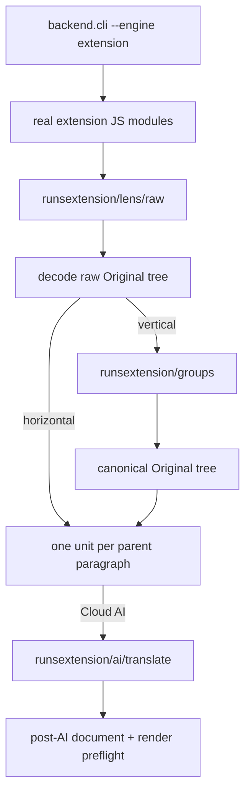
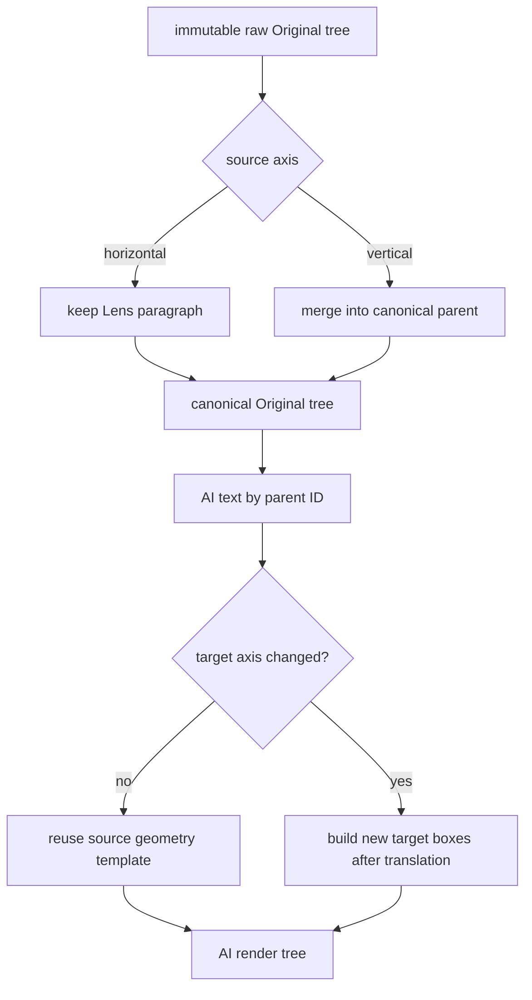
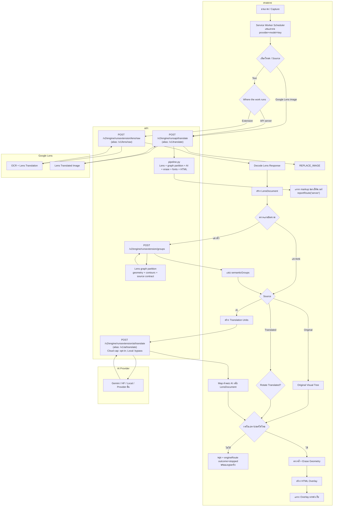
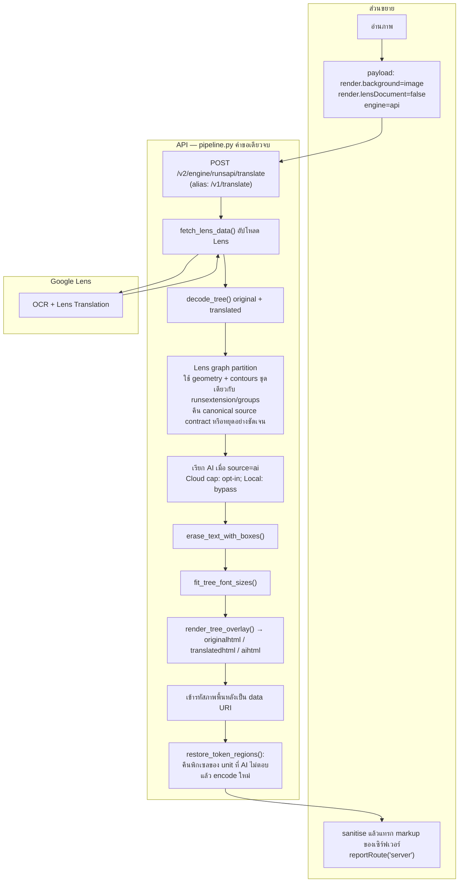

TextPhantom OCR Overlay API

## Local diagnostic CLI

The CLI supports two explicitly selected diagnostic paths. It never falls back
from one engine to the other. Run `python -m backend.cli --help` to see these
commands and the headless limitations directly in the terminal.

### Test `runs:API server`

This is the default and executes the complete Python-owned pipeline:

```powershell
python -m backend.cli 6.jpg --engine api --lang th --out-dir debug-api-6
```

### Test `runs:Extension`

Use `--engine extension` to exercise the real extension-owned JavaScript decoder,
vertical grouping decision, translation units, and canonical `runsextension`
HTTP routes. It accepts one image per invocation and requires Node.js 18+ plus
the API base URL. AI runs also require the saved style text explicitly; the CLI
does not invent or fall back to another prompt.

```powershell
python -m backend.cli 6.jpg --engine extension --api-url http://127.0.0.1:7860 `
  --lang th --source ai --ai-provider cloud-gemini --ai-model gemini-2.5-flash `
  --ai-key YOUR_KEY --ai-prompt "YOUR SAVED STYLE" --out-dir debug-extension-6
```

For an exact comparison, make the Extension path replay the Lens response saved
by the API path:

```powershell
python -m backend.cli 6.jpg --engine extension --api-url http://127.0.0.1:7860 `
  --lens-json debug-api-6/lens_raw.json --lang th --out-dir debug-extension-6
```

If the API pipeline rejects a diagnostic run (for example ambiguous grouping),
the CLI exits non-zero and still writes `lens_raw.json`, `error.json`, and
`summary.txt` to the requested output directory. This is evidence of a failed
run, not a partial successful result.

`--lens-json debug-6/lens_raw.json` replays Lens input and labels the run as a
replay. It still performs the real JavaScript decode and any required grouping;
horizontal pages record grouping as skipped. Extension artifacts are numbered
in execution order: redacted effective request, raw Lens, decode, conditional
group request/route response, translation units, safe AI client input, exact
route response, post-AI document, render preflight, timeline, and summary or
error. Credentials and image payloads are not copied into persistent artifacts.

This headless path deliberately does not claim to test browser DOM rendering,
service-worker session ownership, or insertion into a page; those fields are
reported as `not_tested_requires_browser`. Direct Local AI is also rejected
because its runtime belongs to the browser and emulating it here would not test
the real route. Use the installed extension for that boundary.



## Engine route contract

TextPhantom has two separate but behaviorally aligned engines. Translation
changes must be checked in both the JavaScript Extension engine (`src/`) and
the Python API-server engine (`api/backend/`).

| Engine | Canonical route | Compatibility alias |
|---|---|---|
| Extension Lens upload | `POST /v2/engine/runsextension/lens/raw` | `POST /v1/lens/raw` |
| Extension Lens graph grouping | `POST /v2/engine/runsextension/groups` | None |
| Extension AI transport | `POST /v2/engine/runsextension/ai/translate` | `POST /v1/ai/translate` |
| API-server full pipeline | `POST /v2/engine/runsapi/translate` | `POST /v1/translate` |
| Legacy queued pipeline | `POST /translate` | Existing queue compatibility route |

New call sites use canonical routes. Aliases remain available for older
extensions and saved configurations. A client selects v2 only when
`/v1/capabilities` advertises `engineRoutesV2=true`; it never falls back from
one engine to the other.

### Shared capacity does not merge the engines

The three API execution stages share **capacity only**. Lens, detector-free
Grouping and server-executed AI use one process-wide admission gate per stage,
so `runs:Extension`, `runs:API server`, and the legacy `/translate` carrier
compete fairly for the same physical work slots. Sharing a gate does **not**
share pipeline state, route ownership, render ownership, repair ownership,
idempotency records, or result delivery. A `runs:Extension` request never turns
into `runs:API`, and a legacy queued request remains a legacy queued request.

`runs:API` has an additional wide `capacityPipeline` dispatch gate only to bound
resident full-pipeline worker threads. It is not Lens/Grouping/AI capacity and
does not replace any of the three shared stage gates. Modern requests carrying
`context.tp_tab_session` use that same session identity across all three stages;
legacy requests carrying the same session join that same fairness bucket. Truly
old legacy clients without a tab session retain an opaque HTTP-caller bucket so
multiple users sharing one server AI key are not mistaken for one person.

Direct Local AI is the deliberate exception: in `runs:Extension` the browser
owns the local model socket, so that provider generation does not traverse the
API AI admission gate. Lens and API grouping still use their normal API routes.

The current browser build also keeps `RUNS_API_AVAILABLE=false` in
`src/shared/engine-mode.js`. That existing switch means normal extension
surfaces currently execute `runs:Extension` even if an older saved preference
says `api`; the `runs:API` HTTP route and CLI remain present and independently
testable. This shared-capacity change does not alter that product switch.

Both execution engines use the same detector-free Lens graph partition and
the same `tp.canonical-original-tree/1` contract. Raw Lens trees remain
immutable evidence for fingerprints, erasure and source rendering. For a
vertical page the API combines proved members into one parent paragraph:
`paragraph.text` owns the complete ordered OCR text, `paragraph.bounds_px` is
the member union, and every child item retains its original bounds, baseline
and rotation. Horizontal Lens paragraphs are not regrouped. The Extension
uses the returned canonical `tree` directly; it does not reconstruct groups.

Each invocation is single-pass: there is no ONNX session, detector retry,
alternate grouping fallback, `_tb_block` authority, or silent identity result.
An unresolved graph or incomplete canonical-tree conservation stops before AI.



Capability probe failures keep a structured outcome from the browser to the
public error contract. Timeout, network-unreachable, HTTP 502/503, legacy
404/405, invalid JSON, and other HTTP failures have distinct support codes.
For browser `Failed to fetch`, TextPhantom reports only that it cannot connect
and asks the user to check the server, URL, and browser permission; browsers do
not reliably distinguish CORS, DNS, TLS, and connection refusal. Compact trace
events contain only the API origin, duration, outcome, status, and error name.

## Current AI behavior

### Selected-model Thinking capability

Model-list presence proves candidate eligibility, not native reasoning controls.
When an account catalogue supplies exact reasoning metadata, TextPhantom keeps
using that provider-owned metadata. If a provider such as OpenAI does not expose
the control in its model list, the tiny generation probe feature-detects the
**selected exact model** instead of inferring support from its name: it first
tries a native Off control (`reasoning_effort=none`), then a low-cost On control
(`reasoning_effort=low`). Only controls that succeed are returned as
`model_capabilities` and persisted for that provider/account/model. A model that
rejects the control still receives an ordinary health probe and remains usable;
the popup simply does not invent a Thinking switch. For a verified levels model
with native `none` plus a non-none effort, the existing Off/On UI maps to those
verified values.

- **runs: Extension:** the browser owns translation units, AI orchestration,
  layout, and overlay. Lens/grouping and server-mediated Cloud AI use the
  `runsextension` routes; Local AI may stream directly from the browser.
- **runs: API server:** `/v2/engine/runsapi/translate` runs the complete Python
  pipeline and returns server-rendered output.
- **Legacy queue:** `/translate` remains compatible. Local generation is no
  longer cut off by the old fixed job timeout and participates in current
  telemetry/cancellation behavior. Cloud and non-AI work remain bounded for
  worker safety.

### AI wire contract (.41; unchanged from .40)

The existing System contains translator identity + the selected user Style.
The User message contains the task, target language, context, exact output
contract and source records. This release does not rewrite, summarize or
repeat the Style elsewhere.

- Confirmed native schema support selects `tp.translation.schema-object/1`.
- Otherwise new generations use `tp.translation.compact-records/1`, for example
  `<<TP_P0:translated text>>`. This is capability selection, not a second
  generation silently retried after JSON failure.
- Internal unit text / legacy decoder compatibility may use other shapes;
  these must not be confused with the provider-visible output contract.
- Each original ID remains attached to its source unit. Neither output-budget
  accounting nor caching renumbers/splits the semantic unit.
- Provider protocols are read through the authoritative terminal, including
  usage-only frames after the last content frame. Having all IDs does not prove
  that accounting data has arrived. A interrupted response with no final usage
  is not assigned fabricated zero tokens.
- Ollama uses NDJSON; OpenAI-compatible streaming uses SSE. Reasoning and
  Gemini thought parts are not translation text. `length` is recorded separately
  from a normally ended response containing invalid/missing/wrong-language text.

The Extension workload planner from .39/.40 remains unchanged. The standalone
Python API engine remains its own full-image pipeline; this release does not
silently enable the browser's cross-image workload/repair coordinator there.
Both engines invoke the same server provider adapters for server-executed AI.

### Prompt caching (.41)

Cache hints are applied at the actual provider adapter, so **both engine routes**
benefit without changing prompts or batching. The policy checks the configured
provider AND official endpoint hostname. Unknown proxies/custom endpoints are
left unchanged; `unknown` does not mean caching is unavailable.

| Path | Implemented hint / observation |
|---|---|
| OpenRouter | Stable `session_id` per account/model/System prefix for best-effort sticky routing. Explicit System `cache_control` only for Claude and the exact Alibaba model IDs currently documented by OpenRouter. Other models retain endpoint-managed caching. |
| Native OpenAI | Stable `prompt_cache_key`; automatic caching remains provider/model-dependent. No new explicit-breakpoint or TTL options are forced. |
| Native Anthropic | An explicit ephemeral cache marker on the stable System section. |
| Native Gemini / DeepSeek | Retain documented implicit/automatic behavior and read returned cache counters. No extra cache-creation API calls. |
| Ollama / Local compatible | Read prompt reuse when the runtime reports it. This is a compute metric, not a Cloud invoice discount. LM Studio/vLLM streaming request usage where supported. |
| Other / custom | No guessed cache parameter, price or capability. Report available usage; otherwise show unknown. |

Set `TP_PROMPT_CACHE=off` to disable **TextPhantom's added hints**. It cannot
turn off provider-owned implicit caching. `auto` is the default. Cache reuse
is established only by returned counters, never by the presence of a hint.
A hit depends on model/endpoint, minimum eligible prefix length, expiry and
routing. The provider's rendered prefix can include a JSON schema; changing
exact-ID schemas between batches may reduce hits even with an identical System.
Cache creation may cost more than ordinary input. No savings percentage is
promised or hardcoded. This release does not pad the prompt, change schemas,
append chat history, warm caches by extra generations, or cache translated
responses as a new feature.

### Rate, timeout, and usage

- Manual Cloud request-rate limiting is opt-in and off by default.
- Local AI always bypasses time/RPM pacing. In Auto mode the Extension does not
  turn Ollama's conservative metadata hint into a fixed 1/2-request queue; it
  starts with one safe generation, then ramps only after successful executions
  toward a bounded browser ceiling and lets the local provider schedule work.
  Safe and Manual remain explicit user-selected limits. The API-server path is
  analogously bounded by its real AI worker/admission capacity, not by an RPM
  delay. Capacity, cancellation, idempotency,
  provider `Retry-After`, and connection safety remain active.
- Provider Usage appears above Provider and shows only the current
  Provider/Model. Changing Provider or Model starts a zeroed comparison session;
  Manual Reset does the same. Old sessions may be retained internally but are
  not shown. Missing provider token data is `—`, not `0`.
- Usage records actual nullable token counters for successful, malformed,
  truncated, and terminal provider responses when available.
- Each usage delta includes content-free provenance: session, trace/request,
  engine, runtime, resolved Provider/Model, attempts, token delta, outcome, and
  timestamp. Replayed identities are deduplicated. Model discovery, selection,
  probe requests, and cancellation before provider dispatch do not add
  translation Usage.

### Trace modes

- `TP_TRACE=1` is content-free: it records engine/route identity, IDs, character
  counts, SHA-256 fingerprints, structural diagnostics, timing, finish reason,
  and numeric token counters. It does not record OCR text, prompts, translations,
  raw provider responses, credentials, or signed-URL secrets.
- For latency or token diagnosis, correlate Usage provenance with trace timing,
  `rateWaitMs`, `admissionWaitMs`, provider finish reason, unit count,
  input/output/reasoning token counters, and typed error. This distinguishes
  provider generation from model discovery and pacing from exhausted output.
- `TP_TRACE_CONTENT=1` explicitly enables content diagnostics and must be used
  only when the user accepts that traces may contain source/translation text.
  It is not enabled automatically by `TP_TRACE=1`.
- `TP_AI_WIRE_TRACE=1` enables the raw provider boundary for both
  runs:API and runs:Extension. The API writes its provider-side artifacts to
  `logs/ai-wire/<traceId>--<operationId>/`: canonical units, the effective
  system prompt, provider-native request, lossless raw response before parsing,
  readable `05_provider_response.assembled.txt`, parsed records, contract
  selection/application, validation/apply results, and timing from one dispatch
  clock (`dispatchToHeadersMs`, first byte/content, last content and terminal).
  The assembled file is derived only for
  inspection and never replaces the raw stream or affects parsing. API keys,
  Authorization/cookie headers, and credential URL parameters are redacted;
  OCR, prompts, and translations are intentionally retained. Set
  `TP_AI_WIRE_TRACE_DIR` to choose a different output directory. A write
  failure is surfaced as `AI_WIRE_TRACE_WRITE_FAILED` and is never ignored.

`TP_AI_WIRE_TRACE` belongs to the Python API process. When the selected route
is Direct Local, the extension owns the Ollama/LM Studio socket and relays each
sanitized lifecycle stage to the API's capability-protected internal endpoint.
The API therefore writes the same staged folder under `logs/ai-wire/` for both
Cloud and Direct Local, including failures before a provider response. Start the API with `$env:TP_AI_WIRE_TRACE="1"` and run the translation normally.
Wire tracing now implies the compact main E2E trace unless `TP_TRACE=0` was
explicitly set. Each new translation batch performs one coalesced fresh
`/v1/capabilities` read before routing, so a ten-minute capability cache from a
previous API process cannot silently keep trace/wire relay disabled. The API
creates `logs/ai-wire/_session-<pid>.json` at startup as process-level proof,
and split/full HTTP requests carry `X-TP-Trace-Id` so API ingress can be tied to
the same browser image trace. A Direct Local folder has `"runtime":
"direct-local"` in `00_identity.json`. No diagnostics checkbox is required. If the API is offline, Direct Local translation still
runs but on-disk API trace relay is necessarily unavailable.
The relay has a short bounded timeout, so an unavailable diagnostics endpoint
cannot hang the provider request. Unknown lifecycle stages remain rejected.
For an offline replay of a captured folder, run
`npm run replay:audit -- <path-to-logs/ai-wire>`; this invokes no Provider.

### Mandatory JS/Python parity checklist

Every AI behavior change must be reviewed and tested in both engines:

- canonical routes and compatibility aliases;
- one-line marker prompt/decoder and legacy `<<TP_END>>`/JSON read compatibility;
- Local/Cloud classification, thinking, output budget, and repair policy;
- streaming lifecycle, cancellation, retry, and timeout behavior;
- resolved Provider/Model and success/failure Usage telemetry;
- trace fields, numeric counters, and content/credential redaction.

Do not merge an engine-specific change until shared fixtures or equivalent
cross-language tests prove behavioral parity.

## Architecture and module ownership

Entry files remain composition roots. New work belongs in the smallest matching
module and must preserve the public entry point.

| Area | Composition root | Owned modules |
|---|---|---|
| Extension jobs | `src/background/jobs.js` | `background/pipeline/` for routing, preparation, enqueue and result policy |
| Popup | `src/popup/popup.js` | `popup/controllers/` for Provider/Model profiles, prompts and Usage |
| Browser renderer | `src/processors/render/renderer.js` | `processors/render/` for geometry, typography, AI layout and markup |
| API-server pipeline | `api/backend/jobs/pipeline.py` | `jobs/stages/` for payload I/O and result policy |
| Python renderer | `api/backend/render/html/` | `render/ai_tree/`, `render/lens_graph_partition/` and `render/components/` |
| API routes | `api/backend/api/routes/` | `api/backend/application/` for request validation and execution context |

Refactors must preserve endpoint, payload, rendering, retry, timeout, rate,
cancellation, Usage and marker behavior.

## AI Profiles

AI options use one canonical profile contract shared by both engines:

```text
active selection
└── Provider identity = provider + normalized endpoint
    ├── connection: endpoint + credential reference
    └── Model
        ├── thinking / token policy / temperature
        ├── prompt by language / image / memory
        └── concurrency / allowlisted provider options
```

- API keys belong to the Provider identity and are never copied into Model
  profiles. Local and loopback providers never inherit Cloud credentials.
- Behavior belongs to `Provider identity + Model`; prompts additionally include
  language. A new model starts from defaults, while returning to a model restores
  its own settings.
- Marker parsing, errors, cancellation, Usage, trace redaction, routing and ID
  association remain shared—not duplicated per Provider, Model, or engine.
- The effective profile is resolved once and frozen before a job starts. Both
  `runsextension` and `runsapi` receive that same snapshot.
- An explicitly selected Cloud Provider with a loopback/localhost endpoint is a
  configuration conflict and fails before dispatch; it never silently routes to
  Local AI. Automatic Provider selection may still classify a loopback endpoint
  as Local for backward compatibility.
- `providerOptions` and nested profile fields use strict allowlists. Unsupported
  fields are reported but are not forwarded to a provider.

Upgrade uses idempotent migration plus dual read/write of legacy flat settings
for one rollback-compatible release. Model discovery does not create profiles.
Corrupt or future schemas fall back safely; prompt history and profiles use a
bounded LRU without evicting the active profile.

Profile trace data is content-free and may include Provider, Model, runtime,
profile revision, classification reason, schema version, stable hash, source and
unsupported-field names for routing diagnostics. It never includes the full
endpoint, API key, prompt, glossary, OCR text, translation or raw response.

runs: Extension



runs: API server


Wrong-language failures include bounded, privacy-safe per-unit diagnostics in
`TP_TRACE`: target script, detected script character counts, target/foreign
character totals, and the validator decision/reason. Dialogue text and
reversible text hashes are never recorded. Both engines use the same fields.
## Translation repair and cancellation lifecycle

The **browser runs:Extension** path inherits the .40 session checkpoints and
server-owned pooled repair registry. It waits for the registered initial images,
collects only failed units, packs compatible tasks with the existing workload
planner and performs one logical repair round. Good units are not overwritten.
Cloud execution runs through the API; Direct Local execution stays in the
browser. The API stores repair claim/results in `data/repair-pool.sqlite3`.
Recovered provider receipts are counted once even when the original HTTP reply
never reached the Extension. Receiving a saved result is not a new generation.

The **standalone runs:API server** full-image pipeline and the legacy queued
carrier do **not** join the browser pooled-repair registry. Their current AI
stage enforces one provider generation per image (`repair_enabled=False`), then
validates that answer and preserves attributable partial units or returns the
typed failure. They do not silently dispatch a second provider generation.
This keeps repair ownership separate from `runs:Extension` and preserves the
one-generation-per-image contract.

Cancellation remains cooperative. Result/image delivery can be discarded after
navigation, but already-observed Provider usage must be retained. No missing
receipt is automatically interpreted as a refund or a free request.

## Usage accounting and payment boundary (.41)

### Actual data paths

```text
runs:Extension / Cloud
JS workload -> runsextension/ai/translate (or pooled Cloud repair route)
-> Provider -> server SQLite receipt -> safe response usage -> browser Usage

runs:Extension / Direct Local
JS workload -> local runtime -> observed usage -> browser Usage
The diagnostic relay is NOT a trusted customer-billing endpoint.

runs:API server / synchronous
runsapi/translate -> full Python pipeline -> Provider -> server SQLite receipt
-> validation/render -> result/error -> browser Usage -> image delivery

runs:API server / queued
/translate -> Python worker -> Provider -> server SQLite receipt
-> poll/SSE terminal result/error -> browser Usage -> image delivery
```

Receipts are recorded before post-provider validation/render and before the
browser sees a response. UI closure, a stale image, or a render failure cannot
turn a recorded upstream spend into zero. A reused render-cache response is not
counted as a new Provider generation. Request-list/model probes are excluded from
Translation Usage; probes are not a promise that the provider never charges them.

### Field definitions

| Normalized field | Meaning |
|---|---|
| `inputTokens` | Full logical prompt tokens including cache reads/writes. |
| `outputTokens` | Provider's generated tokens, including reasoning when its API counts reasoning as completion. |
| `totalTokens` | Input + output when both are known, or the reported total; inconsistent provider totals are flagged. |
| `cachedInputTokens` | Subset of input read from cache; **do not add it again** to Total. |
| `cacheWriteInputTokens` | Subset of input used to write cache; not an additional logical prompt. |
| `uncachedInputTokens` | Input minus cache read, only when both are known. Can include cache writes; not a price. |
| `thinkingTokens` | Reasoning subset, not added to Output/Total a second time. |
| `providerCostUsd` | Decimal string from a verified OpenRouter response `usage.cost`; unknown for paths that do not return authoritative cost. |
| `upstreamInferenceCostUsd` | BYOK upstream cost when supplied; not added to OpenRouter cost automatically. |
| `receiptId` | One server-created identity per actual adapter invocation, not a client-controlled debit instruction. |
| `usageStatus` | `reported`, `incomplete`, `unavailable`, or `inconsistent`. |

Native Anthropic `input_tokens` excludes its separate cache fields, so the
normalizer adds cache read and creation there. OpenAI/OpenRouter prompt totals
already include cache and must not have those fields added again. Gemini
`candidatesTokenCount` excludes `thoughtsTokenCount`; the normalized Output
includes both and retains the breakdown. Ollama uses `prompt_eval_count` and
`eval_count`. Provider counters are never estimated from text length. The comparison UI groups
explicit model aliases by the requested selection; per-generation deltas and
server receipts retain the actual serving model instead of guessing a canonical
name. Auto-model resolution keeps its existing behavior.

An aggregate with 9 known requests and 1 unknown request displays **known
subtotals with incomplete coverage**, not the price of all 10. Missing fields
are shown as `—`, not zero. Input can remain numerically high while actual
cache-read cost falls. Local tokens are runtime measurements, not an OpenRouter
charge. Decimal costs are not converted through binary floating point for sums.

### Durable server receipts

Default: `api/data/ai-usage.sqlite3` (WAL SQLite). Change the path with
`TP_USAGE_STATE_FILE`. Use a writable persistent volume for hosted/container
API deployments. Do not bundle live databases, keys, logs or backups into the
source package. Receipts contain counts/IDs/model/endpoint/phase, not source
OCR, prompt, image, translation or API key. Protect the directory and its
SQLite WAL/SHM sidecars. No automatic financial-data deletion/rotation is added.

For a deployment that must not dispatch without a durable receipt:

```powershell
# From the api/ directory; values are process environment variables.
$env:TP_PROMPT_CACHE = "auto"
$env:TP_USAGE_REQUIRED = "1"
$env:TP_USAGE_STATE_FILE = "C:\TextPhantomData\ai-usage.sqlite3"
python -m uvicorn backend.main:app --host 0.0.0.0 --port 7860
```

`TP_USAGE_REQUIRED=1` rejects dispatch when receipt storage cannot be prepared.
`TP_USAGE_RECEIPTS=off` disables storage for diagnostics, and is incompatible
with required mode. Default required mode is off; storage failure is logged and
marked non-durable, not silently called authoritative. A crash after intent but
before a final observation leaves a pending receipt. This needs reconciliation,
not an automatic retry/debit. Required mode cannot make a network call and
SQLite commit one atomic remote transaction.

From the project root, the following read-only operator tool summarizes receipts
and lists incomplete/inconsistent identities without creating a database:

```powershell
python scripts/audit-provider-usage.py --db "C:\TextPhantomData\ai-usage.sqlite3"
python scripts/audit-provider-usage.py --db "C:\TextPhantomData\ai-usage.sqlite3" --engine runsapi --require-complete
```

Exit 2 with `--require-complete` means some token observations still need review.
This command performs no network reconciliation, customer debit or refund.
It does not assert that cost is known just because token totals are complete.

### This is NOT a finished wallet/payment system

Browser `chrome.storage.local` Usage is a resettable comparison display. It is
bounded, can be cleared/edited, and cannot authorize a financial transaction.
Server receipts record **provider-side observations**, not authenticated
customer ownership, exchange rates, customer price rules, authorization,
reservations, debit/refund transactions, or invoice reconciliation. All
receipts retain `customerChargeStatus=not_assessed` and `billingEligible=false`.
Do not trust client-relayed Local usage to debit a paid account.

Before enabling money movement, bind server-verified receipts to an authenticated
customer and request, implement an idempotent wallet ledger and the agreed policy
for failed/partial/repair work, and reconcile unresolved receipts against provider
records. Provider spend and a customer's payable charge are separate facts:
a rejected pre-dispatch request must not be charged; a malformed paid provider
response still has an upstream cost but does not automatically authorize charging
the user. Cache discounts do not automatically change a fixed per-token customer
credit policy. UI Reset is not a refund and does not delete the server receipts.

### Verification and official references

`npm run test:usage-cache` exercises normalization, money precision, receipt
storage, error/recovery paths, both engine boundaries, dedupe and the UI with
mock Provider responses. It does not call a paid model or prove live cache hits.
All cache claims are limited to documentation reviewed on 2026-09-07:

- OpenRouter caching: https://openrouter.ai/docs/guides/best-practices/prompt-caching
- OpenRouter usage/cost: https://openrouter.ai/docs/cookbook/administration/usage-accounting
- OpenAI caching: https://developers.openai.com/api/docs/guides/prompt-caching
- Anthropic native cache usage: https://platform.claude.com/docs/en/build-with-claude/prompt-caching
- Gemini usage metadata: https://ai.google.dev/api/generate-content
- Ollama chat usage: https://docs.ollama.com/api/chat
- LM Studio streaming usage: https://lmstudio.ai/docs/developer/api-changelog
- vLLM streaming usage: https://docs.vllm.ai/en/latest/api/vllm/entrypoints/openai/chat_completion/serving/

## .52: accurate timing, decisions and per-image status

Extension orchestration promises start independently through laneManaged jobs.
Standalone runs:API server still has a bounded top-level admission queue; its
implementation is not identical to Extension orchestration. Initial image output
can be inserted without waiting for all other images. Only pooled repair waits
for the registered initial image pass. Restored-batch recovery is explicit in trace.

Cloud lanes are scoped to provider/model/account; Local lanes use protocol/endpoint/
model. Successful executions, real backpressure, runtime capacity hints and user
capacity changes can change the effective window. A user-enabled Cloud RPM limit
is opt-in. Local time pacing is disabled, not permission to ignore memory bounds.

The usage ledger still commits before provider HTTP. A burst is now committed in
ordered batches under the existing lock, reading/writing once per batch instead
of once per pending event. It does not bypass durable pending intent. Trace
`requestTiming` separates queue/lock/read/compute/write from actual HTTP start,
headers and response completion. Provider/server durations overlap client HTTP;
do not add nested durations twice or subtract clocks on different machines.

Typed `tp.audit/1` events record before/after workload and capacity decisions,
persistence state and bounded geometry/member snapshots. An unchanged sample is
not a new growth event even when the historical lastDecision still says growth.
Source and clean geometry are diagnostic copies only; removed ruby is not fed
back into processing. Group snapshots are capped and explicitly marked incomplete
when capped. Geometry is normalized; full OCR, prompts and credentials are not
included. Provider-internal routing that is not reported remains unknown.

Each image has one top-left expandable status derived from its existing batch/
repair owner. Pending persistence says not sent; HTTP says waiting for server;
accepted translation is not labelled placed until the content ACK is confirmed.
Partial/error summaries remain available. Status works with TP_TRACE disabled.
Same-URL images have physical target stamps; old generations cannot update a
different node, a recycled image or a new page. No extra provider calls are made
by status updates or trace retries. English and Thai status wording are supplied.

Run `npm run check:env` in the project's own activated venv. `npm test` includes
ownership/progress and test-reachability guards. Separate Chromium, actual Windows
and paid quality gates are listed in `scripts/release-gates.json`.
The provider experiment is NOT automatic; see `scripts/provider-quality-plan.md`.
No passing offline test is proof of provider meaning accuracy or every website's
layout. New site fixtures are required before claiming holdout coverage.
