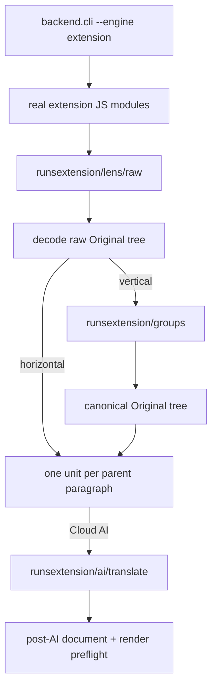
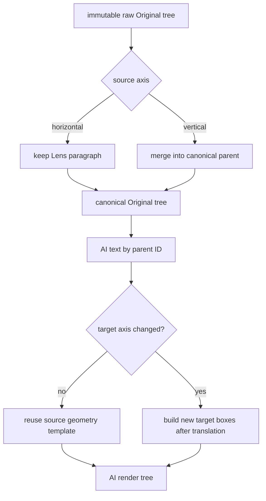
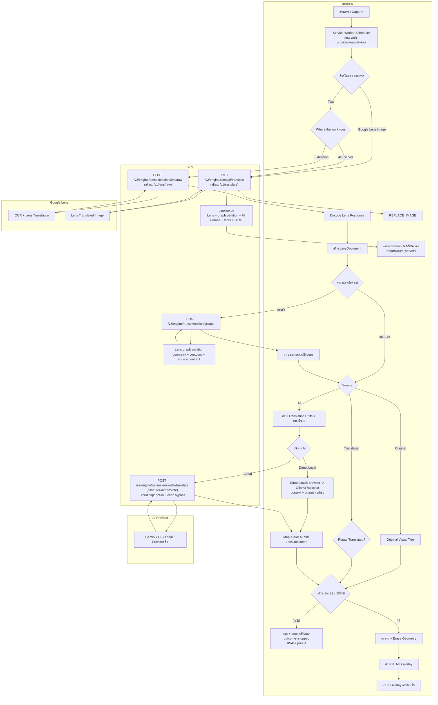
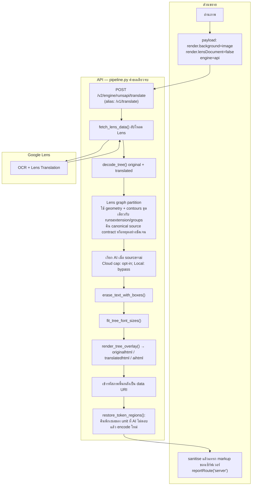

TextPhantom OCR Overlay API


## AI endpoint policy (19.19)

`TP_AI_ENDPOINT_POLICY=shared` is the default. The API can call built-in public
provider endpoints and exact operator-approved hosts from `TP_AI_EXTRA_HOSTS`.
A caller's API key no longer bypasses the server's network policy. Unknown or
private custom endpoints are rejected before discovery/probe/generation I/O.

For a **private personal API** that must call Ollama/LM Studio on that server's
loopback interface, set this before starting the API:

```powershell
$env:TP_AI_ENDPOINT_POLICY="personal"
```

For a **shared service**, retain `shared`. To explicitly authorize a custom host:

```powershell
$env:TP_AI_ENDPOINT_POLICY="shared"
$env:TP_AI_EXTRA_HOSTS="my-approved-ai.example"
```

The allowlist contains exact hostnames or IP addresses, comma-separated, not URLs
or wildcard suffixes. Authorizing a host grants access to its ports/paths; add
only operator-controlled/trusted AI hosts. Private LAN endpoints require this
explicit allowlist even in personal mode. Native Gemini uses its fixed endpoint.
Browser-owned Direct Local generation is unchanged; these settings govern
**API-owned outbound requests**, not the browser's own Local AI requests.

Personal mode and private allowlists are not authentication. Protect a shared API
with authenticated access, network controls and rate/resource limits. CORS and
a user API key alone are not server access control. This patch does not add an
authentication gateway, DNS pinning, distributed state or a public-hosting SLA.

## Conversation capacity (19.19)

History remains process-local and is cleared by restarting the API. Active
registered workflows retain history during gaps between requests, through the
existing post-main repair lifecycle. Capacity admission does not discard these
scopes. Completed/cancelled/expired workflows can be evicted under the existing
bounds. Scoped callers without a registered lifecycle retain their history
until restart rather than silently losing it; they must handle capacity errors.

`ai_conversation_capacity` means no eligible room for a new scope; no AI request
was sent. `ai_conversation_history_capacity` fences a scope whose latest turn
could not be retained: its previous committed bytes remain, but continuation is
not sent with stale history. A generation already completed before a commit
limit is still accounted for and its result is not hidden or retried. These
errors are explicit, not an instruction to retry/reset history automatically.

The existing limits (256 scopes, 1,000,000 serialized history characters per
scope and 16,000,000 in aggregate) are memory limits, **not supported user counts**.
Multiple API worker processes have separate state. Shared multi-process routing
and real production load remain separate deployment validation tasks.

## Local diagnostic CLI

The CLI supports two explicitly selected diagnostic paths. It never falls back
from one engine to the other. Run `python -m backend.cli --help` to see these
commands and the headless limitations directly in the terminal.

### Test `runs:API server`

This is the default and executes the complete Python-owned pipeline:

```powershell
python -m backend.cli 6.jpg --engine api --lang th --out-dir debug-api-6
```

### Test `runs:Extension`

Use `--engine extension` to exercise the real extension-owned JavaScript decoder,
vertical grouping decision, translation units, and canonical `runsextension`
HTTP routes. It accepts one image per invocation and requires Node.js 18+ plus
the API base URL. AI runs also require the saved style text explicitly; the CLI
does not invent or fall back to another prompt.

```powershell
python -m backend.cli 6.jpg --engine extension --api-url http://127.0.0.1:7860 `
  --lang th --source ai --ai-provider cloud-gemini --ai-model gemini-2.5-flash `
  --ai-key YOUR_KEY --ai-prompt "YOUR SAVED STYLE" --out-dir debug-extension-6
```

For an exact comparison, make the Extension path replay the Lens response saved
by the API path:

```powershell
python -m backend.cli 6.jpg --engine extension --api-url http://127.0.0.1:7860 `
  --lens-json debug-api-6/lens_raw.json --lang th --out-dir debug-extension-6
```

If the API pipeline rejects a diagnostic run (for example ambiguous grouping),
the CLI exits non-zero and still writes `lens_raw.json`, `error.json`, and
`summary.txt` to the requested output directory. This is evidence of a failed
run, not a partial successful result.

`--lens-json debug-6/lens_raw.json` replays Lens input and labels the run as a
replay. It still performs the real JavaScript decode and any required grouping;
horizontal pages record grouping as skipped. Extension artifacts are numbered
in execution order: redacted effective request, raw Lens, decode, conditional
group request/route response, translation units, safe AI client input, exact
route response, post-AI document, render preflight, timeline, and summary or
error. Credentials and image payloads are not copied into persistent artifacts.

This headless path deliberately does not claim to test browser DOM rendering,
service-worker session ownership, or insertion into a page; those fields are
reported as `not_tested_requires_browser`. Direct Local AI is also rejected
because its runtime belongs to the browser and emulating it here would not test
the real route. Use the installed extension for that boundary.



## Engine route contract

TextPhantom has two separate but behaviorally aligned engines. Translation
changes must be checked in both the JavaScript Extension engine (`src/`) and
the Python API-server engine (`api/backend/`).

| Engine | Canonical route | Compatibility alias |
|---|---|---|
| Extension Lens upload | `POST /v2/engine/runsextension/lens/raw` | `POST /v1/lens/raw` |
| Extension Lens graph grouping | `POST /v2/engine/runsextension/groups` | None |
| Extension AI transport | `POST /v2/engine/runsextension/ai/translate` | `POST /v1/ai/translate` |
| API-server full pipeline | `POST /v2/engine/runsapi/translate` | `POST /v1/translate` |
| Legacy queued pipeline | `POST /translate` | Existing queue compatibility route |

New call sites use canonical routes. Aliases remain available for older
extensions and saved configurations. A client selects v2 only when
`/v1/capabilities` advertises `engineRoutesV2=true`; it never falls back from
one engine to the other.

### Shared capacity does not merge the engines

The three API execution stages share **capacity only**. Lens, detector-free
Grouping and server-executed AI use one process-wide admission gate per stage,
so `runs:Extension`, `runs:API server`, and the legacy `/translate` carrier
compete fairly for the same physical work slots. Sharing a gate does **not**
share pipeline state, route ownership, render ownership, repair ownership,
idempotency records, or result delivery. A `runs:Extension` request never turns
into `runs:API`, and a legacy queued request remains a legacy queued request.

`runs:API` has an additional wide `capacityPipeline` dispatch gate only to bound
resident full-pipeline worker threads. It is not Lens/Grouping/AI capacity and
does not replace any of the three shared stage gates. Modern requests carrying
`context.tp_tab_session` use that same session identity across all three stages;
legacy requests carrying the same session join that same fairness bucket. Truly
old legacy clients without a tab session retain an opaque HTTP-caller bucket so
multiple users sharing one server AI key are not mistaken for one person.

Direct Local AI is the deliberate exception: in `runs:Extension` the browser
owns the local model socket, so that provider generation does not traverse the
API AI admission gate. Lens and API grouping still use their normal API routes.

### Reading `TP_DIAGNOSTICS=activity`

Activity output is a multi-user event stream, not one user's sequential trace.
Group related lines by `incidentId` for failures, then by `batchId`,
`operationId`, `imageId`, `jobId`, or `traceId`. `requestId` identifies one HTTP
attempt and therefore normally changes on retry. `tabSession`, when present, is
an irreversible short hash; the raw browser session is never logged.

The additive classification fields do not remove existing event keys:

| Field | Meaning |
|---|---|
| `owner` | Proven boundary: `textphantom`, `site_input`, `provider`, `user_config`, `cancelled`, or `unknown` |
| `outcome` | `succeeded`, `partial`, `failed`, `cancelled`, or `neutral` |
| `severity` | Operational importance: `info`, `warning`, or `error` |
| `stage` / `scope` | Where it ended and whether it affects one request, job, image, batch, or server background |
| `retryable` | Whether retrying the same operation may succeed; it is not permission for an unbounded retry loop |
| `phase` / `attempt` / `final` | Initial versus repair work, known attempt count, and whether the line is a terminal verdict at that boundary |

`owner=provider` proves that TextPhantom received failure at an upstream
provider boundary; it does not by itself prove the provider is defective. For
example, upstream HTTP 400 can also mean an unsupported model option or request
shape. Use `provider`, `model`, `providerReason`, stage and a wire trace to find
the underlying cause. A generic HTTP 400 without canonical detail remains
`owner=unknown` instead of being blamed on TextPhantom or the user.

`v1.lens.raw` with zero paragraphs is `outcome=neutral`: the image may simply
contain no readable text or be unsuitable for OCR. `http.scanner` is also
neutral internet background. Repeated lines sharing one `incidentId` are
attempts of one incident, not independent outages; count terminal lines where
`final=true` when measuring completed operations.

The current browser build also keeps `RUNS_API_AVAILABLE=false` in
`src/shared/engine-mode.js`. That existing switch means normal extension
surfaces currently execute `runs:Extension` even if an older saved preference
says `api`; the `runs:API` HTTP route and CLI remain present and independently
testable. This shared-capacity change does not alter that product switch.

Both execution engines use the same detector-free Lens graph partition and
the same `tp.canonical-original-tree/1` contract. Raw Lens trees remain
immutable evidence for fingerprints, erasure and source rendering. For a
vertical page the API combines proved members into one parent paragraph:
`paragraph.text` owns the complete ordered OCR text, `paragraph.bounds_px` is
the member union, and every child item retains its original bounds, baseline
and rotation. Horizontal Lens paragraphs are not regrouped. The Extension
uses the returned canonical `tree` directly; it does not reconstruct groups.

Each invocation is single-pass: there is no ONNX session, detector retry,
alternate grouping fallback, `_tb_block` authority, or silent identity result.
An unresolved graph or incomplete canonical-tree conservation stops before AI.



Capability probe failures keep a structured outcome from the browser to the
public error contract. Timeout, network-unreachable, HTTP 502/503, legacy
404/405, invalid JSON, and other HTTP failures have distinct support codes.
For browser `Failed to fetch`, TextPhantom reports only that it cannot connect
and asks the user to check the server, URL, and browser permission; browsers do
not reliably distinguish CORS, DNS, TLS, and connection refusal. Compact trace
events contain only the API origin, duration, outcome, status, and error name.

## Current AI behavior

### Selected-model reasoning capability

Model-list presence proves candidate eligibility and is **independent** of
reasoning/thinking controls. A usable model is never removed merely because it
does not fit one global On/Off shape. TextPhantom stores one provider-neutral
preference (`default`, `off`, `on`, or an exact effort such as `minimal`, `low`,
`medium`, `high`, `xhigh`, `max`, `ultra`) and resolves that preference only
after the exact provider/model route is known.

The selected model owns the control surface:

- unknown/provider-managed capability -> UI keeps `Lowest available`; internally it falls back to provider-managed behavior until exact capability is known;
- no reasoning control -> no reasoning selector; the model stays usable;
- native boolean/toggle -> `Lowest available`, `Thinking off`, `Thinking on`;
- native effort levels -> `Lowest available` plus only the verified levels; disable is
  a separate concrete option when the provider/model declares reasoning optional;
- mandatory reasoning -> no fake Off control; `Lowest available` and supported
  levels are shown.

`Lowest available` is not a fixed reasoning value. After exact capability
resolution it aliases the first concrete option ordered from lowest to highest:
`Off`, then `Minimal`, `Low`, `Medium`, `High`, `XHigh`, `Max`, `Ultra` as each
option actually exists for that model. Mandatory-reasoning models simply omit
`Off`; unknown capability falls back internally without inventing a level.

Provider adapters map the selected concrete preference to their own wire contract. For
example, Ollama ordinary thinking models use boolean `think`, GPT-OSS uses
`low|medium|high`, Gemini 2.5 uses `thinkingBudget` while Gemini 3 uses
`thinkingLevel`, Anthropic adaptive models use `thinking.type` plus
`output_config.effort`, and OpenRouter consumes its live per-model reasoning
metadata. Unknown capabilities omit reasoning fields instead of guessing. A stale
stored preference that the newly selected model cannot represent falls back to
**Lowest available**; if no lower control is verifiable it uses provider-managed
behavior internally, does not hide the model, and does not silently escalate to
another effort.

Where a provider does not publish exact controls in its catalogue, a selected-
model probe may retain controls that the exact account/model actually accepted.
Probe failure for a reasoning parameter does not make an otherwise healthy model
unusable. Capability evidence remains scoped to provider + endpoint + account +
model.

- **runs: Extension:** the browser owns translation units, AI orchestration,
  layout, and overlay. Lens/grouping and server-mediated Cloud AI use the
  `runsextension` routes; Local AI may stream directly from the browser.
- **runs: API server:** `/v2/engine/runsapi/translate` runs the complete Python
  pipeline and returns server-rendered output.
- **Google Lens (image) mode:** this is the deliberate exception to the browser
  engine selector. Even while the effective browser setting is
  `runs:Extension`, image mode sends the whole image to
  `/v2/engine/runsapi/translate` because the API owns its complete Lens-image
  pipeline. The engine selector controls the split/full pipeline choice for
  text mode; it does not create an Extension-owned image pipeline.
- **Legacy queue:** `/translate` remains compatible. Local generation is no
  longer cut off by the old fixed job timeout and participates in current
  telemetry/cancellation behavior. Cloud and non-AI work remain bounded for
  worker safety.


### Translation mode: Conversation / Independent (14.10)

The AI options selector is immediately below the manual AI request-rate cap
explanation. The current Extension executes **Conversation** only while
**Independent (original)** remains visible in the selector but disabled. Independent
is a frozen reference path that will be re-enabled later; its implementation,
legacy wire contract, profile value and regression fixtures are deliberately kept.
A stored Independent preference is preserved as dormant data rather than rewritten
away. Extension job activation is forced to Conversation while the UI gate is in
place, so a dormant Independent preference cannot accidentally execute. There is
no automatic fallback from a failed Conversation request into Independent.
Conversation scopes and source revisions are automatic; no manual New conversation
action is needed. Old serialized reset fields are accepted for compatibility but
ignored when selecting a scope. Jobs already in flight retain their frozen mode.

Cloud requests from both `runs:Extension` and `runs:API server` converge on
`backend/ai/translation_paths/` before the existing adapters. The run controller
and the translation mode are independent choices. Existing browser engine
availability gates are not changed by this release.

| Concern | Owner / module |
|---|---|
| Original 14.8 route | `translation_paths/independent.py` |
| Conversation history / acceptance / budgets | `translation_paths/conversation.py` |
| Private in-process history and fenced conversation lanes | `translation_paths/store.py` |
| Validated mode, caller/document/profile scope | `translation_paths/mode.py` |
| Provider-native role/image serialization | `translation_paths/messages.py` |
| API-owned prepared-page reservations / ready queue | `translation_paths/ready_registry.py` |
| API batch selection, dispatch, projection | `translation_paths/{batch_policy,ready_batch}.py` |
| Checked page/unit ownership, automatic source branching | `translation_paths/origins.py` |
| Browser reservations, made before OCR | `src/background/ai/translation-paths/order.js` |
| Browser ready batching, original request slot and dispatch | `src/background/ai/translation-paths/{ready-queue,batch-dispatch,request-slot}.js` |
| Local origin/branch logic and batch output policy | `src/shared/ai/conversation/{origins,batch-policy}.js` |
| Direct Local original/new routing | `src/background/ai/translation-paths/{independent,conversation}.js` |
| Direct Local persistent private history | `src/background/ai/translation-paths/local-history.js` |
| Direct Local history prompt/budget composition | `src/shared/ai/conversation/prompt.js` |

The shared low-level provider transports, parsers, renderers, usage ledger,
rate gate, and workload feedback are reused, not copied into a second engine.
Conversation selects from contiguous READY pages rather than one image at a time.
**Request 1 is exactly one complete source image** because it creates the immutable
prompt/history anchor. As soon as that anchor commits, **Request 2 is already a
multi-page continuation**: it may pack several complete READY images even when the
Provider has not yet reported a cache hit. `cachedInputTokens` is an accelerator and
cost/latency signal, not the switch that enables continuation.

After the immutable first-page anchor commits, Conversation continuation grows
**progressively by complete READY pages**. A learned soft output/record target may
stop before the next page; it never splits that page merely to fill a target. The
previous committed unit count bounds the next growth step, a reported cache miss
keeps growth conservative, a strong cache hit may widen the following step, and a
slow/reliability-restricted turn may cap growth. Hard provider/context/output/
application limits remain authoritative and are the only limits allowed to split a
single page at a semantic-unit boundary. Page-quality defects belong to
validation/repair rather than automatic whole-turn retry. Independent's
planner/guards are not switched to this policy. Its low-level
implementation still bypasses the conversation store and ordering lane and keeps
the old provider payload and old image-result-cache policy, while the current
Extension UI does not allow selecting it. Low-level Independent tests remain active
to prove that Conversation work did not change the frozen reference behavior.
Conversation adds typed mode evidence and never silently dispatches through
Independent.

The normal JSON body for the extension Cloud endpoint includes:

```json
{
  "translationMode": "conversation",
  "conversation": {
    "documentId": "private-document-id",
    "pageId": "image-1",
    "pageIndex": 0
  },
  "context": {"tp_tab_session": "private-caller-session"}
}
```

This is metadata only, in addition to the existing provider/source/target body.
The server rejects `history`, `messages`, `assistant`, or API keys inside the
conversation descriptor. HTTP translation defaults to Conversation. The job
API carries the same selection in `ai.translation_mode` and `ai.conversation`.
CLI exposes `--ai-translation-mode` (default conversation) and
`--ai-conversation` (stable document identifier). Low-level Python AiConfig
retains its independent default for callers that are not migrated entrypoints.
Unscoped direct callers get an explicitly logged ephemeral conversation, never
shared global history. No automatic image text is treated as a document ID.

New extensions negotiate `features.aiConversation=tp.conversation/1` and
`features.aiConversationBatch=tp.conversation_batch/1`. Cross-page requests carry
validated `origins`: pageId/pageIndex, wire unitIds, originalIds and full-page
sourceFingerprint. Original IDs are opaque document identifiers (`g0`, `p0`,
UUIDs, etc.) and are preserved exactly. They are unique within a page, not
across pages. Independent keeps current-request `P0`, `P1`, ... IDs. Conversation
uses stable document IDs `I<image>_P<unit>` (for example `I3_P7`), where `I3` is
the third reserved image in this Conversation and `P7` is unit 7 inside that
image. The mapping must cover those IDs once, in source order. Never rename the
OCR/source IDs to satisfy either wire protocol.

The request ingress validates this contract before calling the Provider.
A malformed mapping returns `ai_conversation_origin_invalid` at
`conversation_mapping` with `providerAttempts=0` and `requestDispatched=false`.
`01_conversation_origin_validation.json` records accepted/rejected status and
safe field/reason metadata without echoing invalid source values. The API HTTP
status is separate from any upstream Provider HTTP status. A stale API is
rejected before dispatch, not silently used as Independent. Update API and
extension together.

For one scope, Conversation is an append-only AI chat transcript:

```text
Request 1
System:    Style
User:      fixed task + output contract + source A
-> Assistant: B

Request 2
System:    Style
User:      fixed task + output contract + source A  # exact same first User bytes
Assistant: B                                       # canonical committed answer
User:      source C                                # only new User suffix
-> Assistant: D

Request 3
System:    Style
User:      fixed task + output contract + source A  # unchanged cached-prefix candidate
Assistant: B
User:      source C
Assistant: D
User:      source E                                # only new User suffix
-> Assistant: F
```

The first committed User message is an **immutable anchor**. It contains the
Conversation task, output contract, `I<image>_P<unit>` contract and first real
source. Conversation does **not** insert Human Bootstrap Examples. The API/browser
stores the exact provider-visible User content that was sent; later requests replay
that content byte-for-byte and append the canonical committed Assistant answer plus
the next User message. Old User turns are never reconstructed from the current
template. This is the same request shape used by stateless multi-turn chat APIs to
make the growing transcript an eligible common prefix for Provider prompt/KV
caching. Cache hits remain Provider-controlled and are not guaranteed.

For normal Conversation turns after the anchor, the **new User suffix is OCR-only**:

```text
User:
<<I2_P0:source...>>
<<I2_P1:source...>>
<<I3_P0:source...>>
```

There is no repeated task heading, target-language reminder, output contract,
example block, source heading, page-boundary prose or speaker disclaimer.
The stable image/unit ID already carries page ownership. Repair preserves the
same prefix and appends its current request and valid answer to this chat.

In the ideal cached case, Request 2 can reuse `System + first User + Assistant B`
and needs fresh input mainly for `User C`; Request 3 can reuse everything through
`Assistant D` and needs fresh input mainly for `User E`. Provider `inputTokens`
still describes the logical context and normally includes cached input. Use
`cachedInputTokens` (when the Provider reports it) to distinguish cached prefix
from fresh input; cached input is not assumed to be free. A source replay/branch,
request-profile change, or context trim may start a new anchor/cache chain.

Reasoning-heavy models have a separate Conversation budget guard. If capability
metadata says reasoning is active/mandatory **and** the Provider cannot bound hidden
reasoning tokens, Conversation may advertise up to a 16K completion allowance when
the model/context metadata also permits it. This prevents an 8K hidden-reasoning
run from consuming the entire completion before any `I#_P#` marker can be emitted.
This is capability-driven, not model-name-driven, and does not change the frozen
Independent 8K application ceiling.

Only the latest User IDs are parsed/applied. Each retained assistant message is
the exact visible provider output, never hidden reasoning. Conversation history is
a **transport/cache transcript**, not the final page-quality ledger. A terminal
marker response is structurally commit-eligible when it contains at least one
nonempty expected record and has no unknown/duplicate/ambiguous IDs or real prose
outside records. Scattered malformed, empty, missing or wrong-language units do
**not** reset or kill the dialogue: structurally valid expected nonempty records are
canonicalized and retained in history (including marker-valid records later flagged
by target-language validation), while malformed/empty/missing records are omitted
from the committed Assistant turn and owned by the existing post-batch repair pool.
A raw malformed Assistant response is never replayed as future history. LF/CRLF/spaces
between valid markers are formatting, not unexpected prose. A response with no
usable expected marker, ambiguous IDs/prose, a nonterminal provider stream,
cancellation, or a stale lease is not committed. Even then, the ready lane does not
retry the whole anchor or propagate one request failure to every queued page. Repair
appends valid user/assistant turns without rewriting prior history or promoting
generated translations into approved style examples.

Conversation history is distinct from Series memory. Story memory Off still
omits glossary/characters/story memory exactly as before; Conversation supplies
earlier turns of this document. Independent is visible but disabled, so
it cannot be selected to omit Conversation history yet. Its stored preference and
implementation remain intact for later re-enablement. In Conversation, the `Use
style examples` UI row is hidden/disabled and Human Bootstrap Examples are not sent.
Successful canonical Conversation history is the style/terminology reference. The
saved checkbox remains an Independent-mode preference. No reviewer, summarizer or
prompt-only warmup call is added.

#### Ordering, limits and cancellation

Browser and API-owned jobs reserve source order before OCR completes. OCR and
preparation stay parallel. A dispatch takes the contiguous complete pages that are already ready. It may
cover several pages, but a soft target stops before the next page instead of
consuming only part of it. A page is split at a semantic-unit boundary only when
that page cannot fit a real hard provider/context/application limit. It does not
sleep/debounce to fill a batch or wait for the whole chapter.
The first turn is a real translation, not a prompt-only warmup. While it runs,
other pages become ready for the next turn. A marker-valid first answer may become
the immutable chat anchor even when a few units are missing or fail target-script
validation; those units are repaired later rather than causing a paid whole-anchor
retry. If the first answer is structurally unusable, that request remains uncommitted
and its page is handled by the normal missing/repair/error path; TextPhantom does
not automatically resend the whole anchor and does not fail every later queued page.
The next structurally usable source turn may establish the anchor. Only turns of the
same private conversation depend on the previous answer; other scopes remain parallel.

The browser planner uses its existing learned model profile with a Conversation
batch policy; the API-owned planner uses equivalent staged output guards. Both
include framing, source, prompt, schema and output reserve. A context/image
boundary or re-submitted page stops merging. Vision attachments are not combined
into a single-image field. The final conversation builder additionally checks
retained history against context/input limits. A cached prefix still occupies
context; it is never removed from the budget merely because it might hit cache.

Conversation wire IDs are stable for the document (`I1_P0`, `I1_P1`,
`I2_P0`, ...), not renumbered per request. They map explicitly to pageId and
original unit ID. This removes the need to repeat page-boundary prose and makes
logs/repair unambiguous across multi-page turns. Page rendering, normal
partial-output handling and post-batch repair use the original components.
The provider request owns its receipt once. Browser page projections contain
shared request references, not duplicated full usage; API-owned projections
reference the same stable receipt IDs for the existing receipt-deduplicating
ledger. Later renderer errors retain these references, without issuing a new
receipt or repeating the request.

No AI slot is held while a page waits for source order or the previous turn.
Cancelling one page discards its projection; a shared request is aborted only
when no selected page still needs it. Skipped source reservations are released
so later pages cannot deadlock. A source-order gap may legitimately wait for
earlier OCR. Raw parallel API callers still enter in request-arrival order;
pageIndex alone does not sort submissions across processes or separate hosts.

Automatic replay branching uses page index/identity and full source fingerprints.
Revisiting previously translated unit IDs, changing their source, or moving back
to an earlier page retires that old turn and later turns. Disjoint chunks of the
same unchanged page continue normally. Retirement persists even if the new
answer is invalid, so a later page cannot accidentally read the old future.
Repair appends a valid turn in the same Conversation and preserves original image/unit identities. This is source-history management, not Provider-cache
expiration; the new 14.10 history policy separates old 14.9 scopes automatically.

Input/context planning includes retained history and images; output estimation
still concerns the current source, not the size of history. When limits would
be exceeded, the oldest WHOLE turns are dropped and the unchanged static prefix
is attached once at the new boundary. The current source is never truncated.
Rollover is logged and may reduce cache reuse. Unknown model context gets a
bounded internal history allowance, not a claimed Provider limit; normal adapter
budget guards and bounded Ollama num_ctx planning still apply. The original
Independent workload is unchanged. Conversation's cross-page selection uses
its own output/reliability policy and original provider limits/feedback; larger
context does not prove unlimited ID reliability.

#### Storage and privacy

Since 2026.9.19.13, Conversation, repair, usage receipts and AI rate state are
bounded **in-process memory**, starting empty whenever the API restarts.
`TP_CONVERSATION_STATE_FILE`, `TP_REPAIR_STATE_FILE`, `TP_USAGE_STATE_FILE` and
`TP_RATE_STATE_FILE` no longer select durable state files. Existing files are
not read, overwritten or deleted. Debug/wire logs remain controlled separately.

Run one API worker (the shipped Docker command already does this). Threads and
parallel independent conversations remain supported. Multiple worker processes
or replicas do not share chat, repair claims or rate state. Do not add workers
expecting the former SQLite coordination. Cloud uses each caller's own key.

The scope is HMAC of caller/document/policy/provider/endpoint/model/languages/
Style/settings/key. Raw keys are not stored in the history registry. Model or
output-protocol changes discovered after resolving an auto selection reset
incompatible retained turns with `request_profile_changed` evidence.

History contains private source text, replies and supplied images in process
memory; Provider cache is separate and is never claimed to live in `api/data`.
The store holds at most 256 sessions, 1,000,000 serialized history characters
per session and 16,000,000 total. Inactive least-recently-used records are evicted
when session or aggregate-history capacity requires it; active/current scopes
remain protected. These limits are not Provider cache TTL.
Active records use fenced renewable leases; turn completion notifies waiters
without a fixed sleep before dispatch. Capacity rejection is explicit and no
successful provider call is repeated merely because history cannot be retained.
Full wire logging may still write sensitive content when explicitly enabled.

Direct Local stays browser -> Ollama/Local socket, not routed through Cloud/API.
It uses IndexedDB `textphantom-conversations-v1` in the extension origin with
bounded private state; when unavailable it explicitly reports `local_memory`
and does not claim durability. A newly started worker cannot recover memory-only
turns. A stale persistent snapshot never replaces a newer in-memory turn after
a transient write failure. API state and Local state are intentionally separate.

Release packaging excludes SQLite/DB files, journals, and private `.env` files;
conversation state is runtime data, not a source file to distribute.

#### Route evidence

Compact logs use `tp.conversation/1`, sanitized consistently in JS and Python:
mode/path, scope hash, history turn/revision/message counts, message roles,
request/queue wait, order policy, whole-turn trim reason, static-prefix hash,
commit outcome, actual input/output and Provider cached-input status. No raw
history or keys are added to compact logs. No claim of cache readiness is inferred
from a prior answer, and unknown cache usage is not turned into zero.

With `TP_AI_WIRE_TRACE=1`, API adds `03_conversation_path.json` (final committed
status) and `03_conversation_messages.json` (history/current input and origins),
while the existing `04_provider_request.json` is the exact native request.
`06_parsed_records.json` and response metadata agree after commit. Direct Local
records its conversation evidence/history-origin hashes through the existing
contract-selection and timing relay, with native messages in the same original
wire recorder. It does not add separate relay HTTP calls just for history.
Cross-page batches also log `tp.conversation_batch/1`: planner, page/unit counts,
selection stop reason, previous-turn/source-order wait, mapping results and
`usageOwner=provider_request`. API-owned full wire includes
`03_conversation_batch.json` and `08_batch_mapping.json`; browser-owned batches
use existing trace/recorder events and `03_conversation_messages.json` origins.
Whitespace/prose counts are distinct in the conversation commit diagnostics.
The popup keeps compact token usage/history. The former `Latest AI request` panel is removed; full request diagnostics remain available in trace/wire logs when diagnostics are enabled.

Conversation mode may increase input/history tokens and same-document latency;
Provider prefix caching may discount repeated input but is not guaranteed or
free. Total still equals Input + Output, with Cached input included in Input.
There are no additional AI calls merely to open, continue or rebranch a conversation.


### Conversation provider/model parity

Conversation is provider-neutral. The same `I<image>_P<unit>` marker contract and
native append-only history are mapped by each adapter rather than by one HF-only
wire implementation. Cloud adapters cover Anthropic, DeepSeek, Featherless,
Gemini, Groq, Hugging Face, OpenAI, OpenRouter and Together. Local/API adapters
cover GPT4All, Jan, KoboldCpp, llama.cpp, llamafile, LM Studio, LocalAI, Ollama,
text-generation-webui and vLLM. Direct Local uses the same Conversation prompt
contract before its provider-specific HTTP/stream mapping.

The first Conversation User anchor contains the fixed translation task/output
contract followed by the first real `tp.translation.image-records/1` source. Human
Bootstrap Examples are not sent in Conversation. Only current
`I<number>_P<number>` IDs are output targets, and continuation User turns remain
OCR-only. Successful prior Assistant turns provide document-local style and
terminology context.

Thinking preference is resolved **after the exact model capability is known**.
`Lowest available` selects the lowest concrete option from that exact capability
instead of mapping to a predetermined effort. A verified model that supports
native Off exposes Off; a mandatory-reasoning model remains usable and simply
omits the unsupported Off choice. Unknown or
provider-managed capability keeps the model visible and shows `Lowest available`
instead of guessing. A stale saved preference that the selected model cannot
represent falls back internally to provider-managed behavior rather than hiding
or rejecting the model. Provider-specific wire fields remain inside the provider
adapter.

Ollama `done:true` is an authoritative transport terminal even when
`done_reason` is `length`. `length` is then classified as output-budget
exhaustion/incomplete translation rather than a false `provider_protocol_error`
for a missing terminal.

### Conversation progress UI

Conversation is serialized by document history, not a set of independent AI
requests. The lower-right batch toast therefore reports one active chain, for
example `Conversation turn 3 • translating 2 pages / 19 units • 7 pages ready
next • cache 82%`. Pages that have finished Lens/grouping but are waiting for the
next chat turn are counted as ready work; they are not displayed as dozens of
parallel AI requests. Repair retains its separate visible phase after the initial
Conversation turns finish.

### AI wire contract

The System contains the translator identity and selected Style exactly once
(14.6+); User holds the task, optional examples, context, output contract and
source records. Style 13.1 is unchanged. Translation-target instruction
languages remain separate from the English popup interface.

Conversation records use `tp.translation.image-records/1`. The first retained User
turn is stored as exact provider-visible bytes, including the fixed task, image/unit
contract and first source; Human Bootstrap Examples are not part of this anchor.
Subsequent normal requests replay that immutable anchor and prior canonical
user/assistant turns, then append **only the new `<<I#_P#:OCR>>` records**. The current Extension executes
Conversation while the selector still shows **Independent (original)** as disabled. Old saved Independent selections are preserved as a
dormant preference and are not destroyed by migration. The raw/server Independent
path remains internally available as a frozen reference path and keeps its legacy
`<<TP_Pn:...>>` / capability-driven schema contract. Regression tests continue to
exercise that path specifically so Conversation changes cannot silently alter it.

The current batching invariant is progressive: Request 1 is the prompt/anchor plus
exactly the first complete image; after a structurally usable anchor commits,
Request 2 may immediately include multiple complete READY images even before the
Provider reports a cache hit, but growth is capped from the previous committed
request. Cache evidence can widen a later step and a cache miss/slow turn keeps the
next step conservative. A small anchor therefore cannot jump directly to 100+
units merely because the model advertises a large window. Per-unit quality defects
never trigger an automatic whole-anchor retry; structurally valid nonempty records
are canonicalized into history, while malformed/empty/missing units are owned by
post-batch repair. Marker-valid wrong-language records may remain in canonical
history while page validation repairs their displayed translation.

For Hugging Face Router, Conversation leaves backend selection in HF's
**automatic fastest/failover routing** by default.  Live catalogue throughput/TTFT
metadata and `x-inference-provider` response headers remain diagnostics only; they
do not silently turn into a provider suffix on later turns.  An explicit
`model:<provider>` suffix chosen by the user is still honored.  This follows the
same principle as Hermes: let the HF Router move away from a slow/unavailable
backend instead of pinning a Conversation to whichever backend served an earlier
turn. There is no extra warm-up generation, cache-miss retry, sleep or hidden
duplicate request.

Conversation batching is **complete-page first**. READY pages are appended to a
request one whole page at a time. Soft learned output/record targets may stop the
request before the next page, but never halfway through that page. A page that
exceeds the current soft target is still sent whole when it fits hard provider
input/context/output limits. Only a genuine hard limit may split a page at a
semantic-unit boundary. Request 1 remains conservative because it creates the
anchor. Once the anchor is committed, later requests can use a larger dynamic
continuation target. A reported cache miss keeps growth conservative; the planner
must not jump from a small anchor directly to dozens of units merely because the
model advertises a large window. A reported cache hit allows the soft continuation
target to expand further, still by complete pages. Repair remains the single
post-batch path for missing or wrong-language units.

- Independent retains capability-selected schema/legacy compact records.
- Conversation image records deliberately use marker output only, for example
  `<<I2_P3:translated text>>`. An exact-key JSON schema changes each turn and is
  therefore not used for Conversation because it would make provider-visible
  request metadata vary at the cache boundary. There is no silent JSON/marker
  retry or second paid generation.
- Internal unit text / legacy decoder compatibility may use other shapes;
  these must not be confused with the provider-visible output contract.
- Each original ID remains attached to its source unit. Conversation IDs are
  stable image/unit IDs (`I<image>_P<unit>`) for the life of that Conversation,
  with an explicit mapping back to the original page/ID. They are not reset at
  each request. Units are not split internally or moved between owners.
- Provider protocols are read through the authoritative terminal, including
  usage-only frames after the last content frame. Having all IDs does not prove
  that accounting data has arrived. A interrupted response with no final usage
  is not assigned fabricated zero tokens.
- Ollama uses NDJSON; OpenAI-compatible streaming uses SSE. Reasoning and
  Gemini thought parts are not translation text. `length` is recorded separately
  from a normally ended response containing invalid/missing/wrong-language text.

Independent retains the original per-image plans. Conversation batches at the
prepared-data boundary of each run owner: browser ready queue for runs:Extension,
API ready queue for API-owned image pipelines. Both Cloud engines call the same
API conversation builder/provider adapters; Direct Local keeps its browser
socket. This does not create a second renderer, parser, transport or usage ledger.

### Prompt caching

Cache hints are applied at the actual provider adapter, so **both engine routes**
benefit without changing prompts or batching. The policy checks the configured
provider AND official endpoint hostname. Unknown proxies/custom endpoints are
left unchanged; `unknown` does not mean caching is unavailable.

| Path | Implemented hint / observation |
|---|---|
| OpenRouter | No app-global `session_id` is injected. OpenRouter derives Conversation stickiness from the opening messages/cache hit so unrelated documents are not pinned by the same account/model/System-only key. Explicit System `cache_control` remains limited to Claude and the exact Alibaba model IDs currently documented by OpenRouter; other models retain endpoint-managed caching. |
| Native OpenAI | Stable `prompt_cache_key`; automatic caching remains provider/model-dependent. No new explicit-breakpoint or TTL options are forced. |
| Native Anthropic | An explicit ephemeral cache marker on the stable System section. |
| Native Gemini / DeepSeek | Retain documented implicit/automatic behavior and read returned cache counters. No extra cache-creation API calls. |
| Hugging Face Router | Conversation pins one inference provider for the cache chain (`model:<provider>`) using live catalogue routing metadata when available, otherwise the first returned `x-inference-provider`. Exact provider-visible history remains append-only; cache hits are accepted only from provider usage telemetry. |
| Ollama / Local compatible | Read prompt reuse when the runtime reports it. This is a compute metric, not a Cloud invoice discount. LM Studio/vLLM streaming request usage where supported. |
| Other / custom | No guessed cache parameter, price or capability. Report available usage; otherwise show unknown. |

Set `TP_PROMPT_CACHE=off` to disable **TextPhantom's added hints**. It cannot
turn off provider-owned implicit caching. `auto` is the default. Cache reuse
is established only by returned counters, never by the presence of a hint.
A hit depends on model/endpoint, minimum eligible prefix length, expiry and
routing. The provider's rendered prefix can include a JSON schema; changing
exact-ID schemas between batches may reduce hits even with an identical System.
Cache creation may cost more than ordinary input. No savings percentage is
promised or hardcoded. The cache-coordination layer does not pad the prompt, change schemas, append an
extra copy of chat history, warm caches by extra generations, or cache translated
responses as a separate response cache. Conversation owns the one append-only
chat transcript described above.

#### Real-request prefix observation (14.8)

`auto` now observes real translations without holding followers. There is no
prefix Event wait, sleep, timer, warm-up generation, cache-miss retry or extra
provider request. Rate/admission limits still apply unchanged. Existing adapter
cache hints and prompt bytes are preserved. A leader is an observation reference,
**not** evidence of provider cache readiness.

Active leader leases and historical observations are independent:

- A real request elects a leader only if none is active for its exact namespace.
  Other requests are observers and dispatch normally. The next real request can
  lead after completion, failure, cancellation or lease expiry.
- The lease watchdog is 120 seconds, matching the common generation timeout.
  This only fences observation ownership: it does not expire provider cache,
  cancel a provider request, or send another one. Late completions cannot release
  a replacement lease or overwrite a newer request's observation.
- Completed observations use a bounded 1,024-entry LRU, **without the old
  10-minute idle expiry**. Active leases have their own 1,024-entry bound and are
  never evicted by observation pressure. At active capacity, observation can
  proceed without a leader; translation is not blocked. Housekeeping never
  creates a warm-up or a wait. Registries remain process-local.

Namespaces include a process-private HMAC of request credentials, provider/model,
endpoint, actual static prefix, source/target languages, schema, model revision
and thinking/image mode. They do not contain plaintext keys, OCR or story data.
Changing a selection does not clear other observations. Switching back can find
its earlier statistics, but that does not prove a current provider cache hit.
Multiple API workers have independent observers; no distributed lock or central
service is added, and no worker sends extra warm-up requests.

Built-in instructions/examples remain reusable public templates in their existing
modules. Private styles, memories, source and results are never appended to another
user's request to improve caching. `Provider + language` alone is not a provider
cache boundary: separate credentials/models/protocols stay separate. Provider-owned
KV cache sharing cannot be authorized or guaranteed by this registry.

`TP_PROMPT_CACHE_COORDINATION=off` disables observation only. `TP_PROMPT_CACHE=auto`
retains existing provider hints/implicit behavior. **`TP_PROMPT_CACHE_WAIT_MS` is
obsolete and ignored**; an old environment value cannot re-enable the 14.7 wait.
No undocumented HF cache/session controls are injected.

Direct Local keeps its browser-owned socket and runtime-managed caching. It uses
the same no-wait lease/observation lifecycle within its worker. No reload,
keep-alive adjustment, cache parameter or new relay call is introduced. Missing
cache counters are unknown, not zero.

`tp.cache_coordination/1` retains compatibility for old logs and adds
`coordinationPolicy=observe_no_wait`, `leaderLeaseState`, `leaderLeaseMs`,
`observationOrder`, `previousObservationAgeMs`, `observationRecorded` and
`latestObservationApplied`. Producers use leader/observer/bypass; they no longer
label registry reuse as a provider cache hit. `waitMs=waitLimitMs=0`,
`retentionMs=null`, `providerCacheTtlMs=null`, `providerCacheReady=null` and
`missReason=unknown`. Provider-reported hit/zero/not-reported stays separate from
all local lifecycle data. Statistics are ordered by request admission; a slow
older response cannot overwrite a newer observation. Every request still records
its own actual usage even if its statistics entry was evicted.

API wire writes `03_cache_coordination.json` and response diagnostics as before;
Direct Local attaches this metadata outside its native request body. Compact UI
stays English and does not add lease/statistics details. Cached tokens remain
included in Input/Total. Neither counters nor invoices are reduced artificially.

#### Request-owned Cloud keys (14.8)

Every Cloud request must carry the user's key. Translation, repair, model listing,
probe and API jobs do not fall back to `AI_API_KEY`. The old environment variable
is no longer read, even when present. Metadata reports `has_env_ai_key=false` and
`hasServerKey=false` for older clients plus the `user_required` credential policy.
Missing keys return a configuration error before any provider request; the
extension no longer queries server-key availability to authorize keyless Cloud.
CLI Cloud runs require `--ai-key`; Local remains keyless and is never sent a cloud
credential. No server key or shared billing account is required for prefix reuse.

Idempotency also scopes replay by the supplied credential when a tab/session is
unchanged. API-owned AI result caching scopes by caller, credential and complete
context, including non-frozen memory. No result or receipt is reused across those
boundaries; ordinary repeated requests in the same scope can still reuse results.
These are result-replay protections, not changes to provider prefix caching.

Cloud requests still transit the API server; BYOK does not make that server blind
to credentials or source. Session-based fairness is not authentication. Deployment
access controls and full-wire log protection remain the operator's responsibility.
This change does not introduce user authentication or a distributed tenant store.

### Rate, timeout, and usage

- Manual Cloud request-rate limiting is opt-in and off by default.
- Local AI always bypasses time/RPM pacing. In Auto mode the Extension does not
  turn Ollama's conservative metadata hint into a fixed 1/2-request queue; it
  starts with one safe generation, then ramps only after successful executions
  toward a bounded browser ceiling and lets the local provider schedule work.
  Safe and Manual remain explicit user-selected limits. The API-server path is
  analogously bounded by its real AI worker/admission capacity, not by an RPM
  delay. Capacity, cancellation, idempotency,
  provider `Retry-After`, and connection safety remain active.
- Provider Usage appears above Provider and shows only the current
  Provider/Model. Changing Provider or Model starts a zeroed comparison session;
  Manual Reset does the same. Old sessions may be retained internally but are
  not shown. Missing provider token data is `—`, not `0`.
- Usage records actual nullable token counters for successful, malformed,
  truncated, and terminal provider responses when available.
- Each usage delta includes content-free provenance: session, trace/request,
  engine, runtime, resolved Provider/Model, attempts, token delta, outcome, and
  timestamp. Replayed identities are deduplicated. Model discovery, selection,
  probe requests, and cancellation before provider dispatch do not add
  translation Usage.

### Trace modes

- `TP_TRACE=1` is content-free: it records engine/route identity, IDs, character
  counts, SHA-256 fingerprints, structural diagnostics, timing, finish reason,
  and numeric token counters. It does not record OCR text, prompts, translations,
  raw provider responses, credentials, or signed-URL secrets.
- For latency or token diagnosis, correlate Usage provenance with trace timing,
  `rateWaitMs`, `admissionWaitMs`, provider finish reason, unit count,
  input/output/reasoning token counters, and typed error. This distinguishes
  provider generation from model discovery and pacing from exhausted output.
- `TP_TRACE_CONTENT=1` explicitly enables content diagnostics and must be used
  only when the user accepts that traces may contain source/translation text.
  It is not enabled automatically by `TP_TRACE=1`.
- `TP_AI_WIRE_TRACE=1` enables the raw provider boundary for both
  runs:API and runs:Extension. The API writes its provider-side artifacts to
  `logs/ai-wire/<traceId>--<operationId>/`: canonical units, the effective
  system prompt, provider-native request, lossless raw response before parsing,
  readable `05_provider_response.assembled.txt`, parsed records, contract
  selection/application, validation/apply results, and timing from one dispatch
  clock (`dispatchToHeadersMs`, first byte/content, last content and terminal).
  The assembled file is derived only for
  inspection and never replaces the raw stream or affects parsing. API keys,
  Authorization/cookie headers, and credential URL parameters are redacted;
  OCR, prompts, and translations are intentionally retained. Set
  `TP_AI_WIRE_TRACE_DIR` to choose a different output directory. A write
  failure is surfaced as `AI_WIRE_TRACE_WRITE_FAILED` and is never ignored.

`TP_AI_WIRE_TRACE` belongs to the Python API process. When the selected route
is Direct Local, the extension owns the Ollama/LM Studio socket and relays each
sanitized lifecycle stage to the API's capability-protected internal endpoint.
The API therefore writes the same staged folder under `logs/ai-wire/` for both
Cloud and Direct Local, including failures before a provider response. Start the API with `$env:TP_AI_WIRE_TRACE="1"` and run the translation normally.
Wire tracing now implies the compact main E2E trace unless `TP_TRACE=0` was
explicitly set. Each new translation batch performs one coalesced fresh
`/v1/capabilities` read before routing, so a ten-minute capability cache from a
previous API process cannot silently keep trace/wire relay disabled. The API
creates `logs/ai-wire/_session-<pid>.json` at startup as process-level proof,
and split/full HTTP requests carry `X-TP-Trace-Id` so API ingress can be tied to
the same browser image trace. A Direct Local folder has `"runtime":
"direct-local"` in `00_identity.json`. No diagnostics checkbox is required. If the API is offline, Direct Local translation still
runs but on-disk API trace relay is necessarily unavailable.
The relay has a short bounded timeout, so an unavailable diagnostics endpoint
cannot hang the provider request. Unknown lifecycle stages remain rejected.
For an offline replay of a captured folder, run
`npm run replay:audit -- <path-to-logs/ai-wire>`; this invokes no Provider.

### Mandatory JS/Python parity checklist

Every AI behavior change must be reviewed and tested in both engines:

- canonical routes and compatibility aliases;
- one-line marker prompt/decoder and legacy `<<TP_END>>`/JSON read compatibility;
- Local/Cloud classification, thinking, output budget, and repair policy;
- streaming lifecycle, cancellation, retry, and timeout behavior;
- resolved Provider/Model and success/failure Usage telemetry;
- trace fields, numeric counters, and content/credential redaction.

Do not merge an engine-specific change until shared fixtures or equivalent
cross-language tests prove behavioral parity.

## Architecture and module ownership

Entry files remain composition roots. New work belongs in the smallest matching
module and must preserve the public entry point.

| Area | Composition root | Owned modules |
|---|---|---|
| Extension jobs | `src/background/jobs.js` | `background/pipeline/` for routing, preparation, enqueue and result policy |
| Popup | `src/popup/popup.js` | `popup/controllers/` for Provider/Model profiles, prompts and Usage |
| Browser renderer | `src/processors/render/renderer.js` | `processors/render/` for geometry, typography, AI layout and markup |
| API-server pipeline | `api/backend/jobs/pipeline.py` | `jobs/stages/` for payload I/O and result policy |
| Python renderer | `api/backend/render/html/` | `render/ai_tree/`, `render/lens_graph_partition/` and `render/components/` |
| API routes | `api/backend/api/routes/` | `api/backend/application/` for request validation and execution context |

Refactors must preserve endpoint, payload, rendering, retry, timeout, rate,
cancellation, Usage and marker behavior.

## AI Profiles

AI options use one canonical profile contract shared by both engines:

```text
active selection
└── Provider identity = provider + normalized endpoint
    ├── connection: endpoint + credential reference
    └── Model
        ├── thinking / token policy / temperature
        ├── prompt by language / image / memory
        └── concurrency / allowlisted provider options
```

- API keys belong to the Provider identity and are never copied into Model
  profiles. Local and loopback providers never inherit Cloud credentials.
- Behavior belongs to `Provider identity + Model`; prompts additionally include
  language. A new model starts from defaults, while returning to a model restores
  its own settings.
- Marker parsing, errors, cancellation, Usage, trace redaction, routing and ID
  association remain shared—not duplicated per Provider, Model, or engine.
- The effective profile is resolved once and frozen before a job starts. Both
  `runsextension` and `runsapi` receive that same snapshot.
- An explicitly selected Cloud Provider with a loopback/localhost endpoint is a
  configuration conflict and fails before dispatch; it never silently routes to
  Local AI. Automatic Provider selection may still classify a loopback endpoint
  as Local for backward compatibility.
- `providerOptions` and nested profile fields use strict allowlists. Unsupported
  fields are reported but are not forwarded to a provider.

Upgrade uses idempotent migration plus dual read/write of legacy flat settings
for one rollback-compatible release. Model discovery does not create profiles.
Corrupt or future schemas fall back safely; prompt history and profiles use a
bounded LRU without evicting the active profile.

Profile trace data is content-free and may include Provider, Model, runtime,
profile revision, classification reason, schema version, stable hash, source and
unsupported-field names for routing diagnostics. It never includes the full
endpoint, API key, prompt, glossary, OCR text, translation or raw response.

runs: Extension



runs: API server


Wrong-language failures include bounded, privacy-safe per-unit diagnostics in
`TP_TRACE`: target script, detected script character counts, target/foreign
character totals, and the validator decision/reason. Dialogue text and
reversible text hashes are never recorded. Both engines use the same fields.

## Translation repair and cancellation lifecycle

The **browser runs:Extension** path uses session checkpoints and the server-owned
pooled repair registry. It waits for the registered initial images,
collects only failed units, packs compatible tasks with the existing workload
planner and performs one logical repair round. Good units are not overwritten.
Cloud execution runs through the API; Direct Local execution stays in the
browser. The API keeps repair claims/results in a bounded temporary registry
(24-hour expiry, at most 512 runs, 64 runs per caller and 128 MiB overall).
Reads do not rewrite a database. Atomic claims, cancellation and terminal result
replay remain valid during the running process. After restart old run tokens
are unknown; old work is not restored or automatically sent to AI again.
Since19.14 the browser also stops a forgotten run as unavailable, without
registering it again. Same-process receipt recovery remains supported.
Recovered provider receipts are counted once even when the original HTTP reply
never reached the Extension. Receiving a saved result is not a new generation.

The **standalone runs:API server** full-image pipeline and the legacy queued
carrier do **not** join the browser pooled-repair registry. Their current AI
stage enforces one provider generation per image (`repair_enabled=False`), then
validates that answer and preserves attributable partial units or returns the
typed failure. They do not silently dispatch a second provider generation.
This keeps repair ownership separate from `runs:Extension` and preserves the
one-generation-per-image contract.

Cancellation remains cooperative. Result/image delivery can be discarded after
navigation, but already-observed Provider usage must be retained. No missing
receipt is automatically interpreted as a refund or a free request.

## Usage accounting and payment boundary

### Actual data paths

```text
runs:Extension / Cloud
JS workload -> runsextension/ai/translate (or pooled Cloud repair route)
-> Provider -> temporary server receipt -> safe response usage -> browser Usage

runs:Extension / Direct Local
JS workload -> local runtime -> observed usage -> browser Usage
The diagnostic relay is NOT a trusted customer-billing endpoint.

runs:API server / synchronous
runsapi/translate -> full Python pipeline -> Provider -> temporary server receipt
-> validation/render -> result/error -> browser Usage -> image delivery

runs:API server / queued
/translate -> Python worker -> Provider -> temporary server receipt
-> poll/SSE terminal result/error -> browser Usage -> image delivery
```

Receipts are recorded before post-provider validation/render and before the
browser sees a response. UI closure, a stale image, or a render failure cannot
turn a recorded upstream spend into zero. A reused render-cache response is not
counted as a new Provider generation. Request-list/model probes are excluded from
Translation Usage; probes are not a promise that the provider never charges them.

### Field definitions

| Normalized field | Meaning |
|---|---|
| `inputTokens` | Full logical prompt tokens including cache reads/writes. |
| `outputTokens` | Provider's generated tokens, including reasoning when its API counts reasoning as completion. |
| `totalTokens` | Input + output when both are known, or the reported total; inconsistent provider totals are flagged. |
| `cachedInputTokens` | Subset of input read from cache; **do not add it again** to Total. |
| `cacheWriteInputTokens` | Subset of input used to write cache; not an additional logical prompt. |
| `uncachedInputTokens` | Input minus cache read, only when both are known. Can include cache writes; not a price. |
| `thinkingTokens` | Reasoning subset, not added to Output/Total a second time. |
| `providerCostUsd` | Decimal string from a verified OpenRouter response `usage.cost`; unknown for paths that do not return authoritative cost. |
| `upstreamInferenceCostUsd` | BYOK upstream cost when supplied; not added to OpenRouter cost automatically. |
| `receiptId` | One server-created identity per actual adapter invocation, not a client-controlled debit instruction. |
| `usageStatus` | `reported`, `incomplete`, `unavailable`, or `inconsistent`. |

Native Anthropic `input_tokens` excludes its separate cache fields, so the
normalizer adds cache read and creation there. OpenAI/OpenRouter prompt totals
already include cache and must not have those fields added again. Gemini
`candidatesTokenCount` excludes `thoughtsTokenCount`; the normalized Output
includes both and retains the breakdown. Ollama uses `prompt_eval_count` and
`eval_count`. Provider counters are never estimated from text length. The comparison UI groups
explicit model aliases by the requested selection; per-generation deltas and
server receipts retain the actual serving model instead of guessing a canonical
name. Auto-model resolution keeps its existing behavior.

An aggregate with 9 known requests and 1 unknown request displays **known
subtotals with incomplete coverage**, not the price of all 10. Missing fields
are shown as `—`, not zero. Input can remain numerically high while actual
cache-read cost falls. Local tokens are runtime measurements, not an OpenRouter
charge. Decimal costs are not converted through binary floating point for sums.

### Temporary server receipts

Since 2026.9.19.13, receipts are bounded process memory: at most 1,024 records,
128 KiB each and 8 MiB overall, evicting oldest entries as needed. Returned
provider usage remains available to the browser's existing usage display.
`receiptDurable` is false; restart clears server receipts. No source OCR, prompt,
image, translation or API key is stored in a receipt. No SQLite writes occur.

`TP_USAGE_RECEIPTS=off` disables the receipt cache. `TP_USAGE_REQUIRED=1` requires
an available in-process receipt and rejects dispatch if receipts are disabled;
it no longer means durable accounting across crashes. Use default single-worker
startup, for example from `api/`:

```powershell
python -m uvicorn backend.main:app --host 0.0.0.0 --port 7860
```

`TP_USAGE_STATE_FILE` is ignored for I/O. The legacy read-only
`scripts/audit-provider-usage.py --db <old-file>` can inspect old databases but
cannot inspect the new in-process cache. Existing database files are untouched.
There is no restart recovery/reconciliation service or new financial subsystem.

### This is NOT a finished wallet/payment system

Browser `chrome.storage.local` Usage is a resettable comparison display. It is
bounded, can be cleared/edited, and cannot authorize a financial transaction.
Server receipts record **provider-side observations**, not authenticated
customer ownership, exchange rates, customer price rules, authorization,
reservations, debit/refund transactions, or invoice reconciliation. All
receipts retain `customerChargeStatus=not_assessed` and `billingEligible=false`.
Do not trust client-relayed Local usage to debit a paid account.

Before enabling money movement, bind server-verified receipts to an authenticated
customer and request, implement an idempotent wallet ledger and the agreed policy
for failed/partial/repair work, and reconcile unresolved receipts against provider
records. Provider spend and a customer's payable charge are separate facts:
a rejected pre-dispatch request must not be charged; a malformed paid provider
response still has an upstream cost but does not automatically authorize charging
the user. Cache discounts do not automatically change a fixed per-token customer
credit policy. UI Reset is not a refund and does not delete the server receipts.

### Verification and official references

`npm run test:usage-cache` exercises normalization, money precision, receipt
storage, error/recovery paths, both engine boundaries, dedupe and the UI with
mock Provider responses. It does not call a paid model or prove live cache hits.
All cache claims are limited to documentation reviewed on 2026-09-07:

- OpenRouter caching: https://openrouter.ai/docs/guides/best-practices/prompt-caching
- OpenRouter usage/cost: https://openrouter.ai/docs/cookbook/administration/usage-accounting
- OpenAI caching: https://developers.openai.com/api/docs/guides/prompt-caching
- Anthropic native cache usage: https://platform.claude.com/docs/en/build-with-claude/prompt-caching
- Gemini usage metadata: https://ai.google.dev/api/generate-content
- Ollama chat usage: https://docs.ollama.com/api/chat
- LM Studio streaming usage: https://lmstudio.ai/docs/developer/api-changelog
- vLLM streaming usage: https://docs.vllm.ai/en/latest/api/vllm/entrypoints/openai/chat_completion/serving/

## .52: accurate timing, decisions and per-image status

Extension orchestration promises start independently through laneManaged jobs.
Standalone runs:API server still has a bounded top-level admission queue; its
implementation is not identical to Extension orchestration. Initial image output
can be inserted without waiting for all other images. Only pooled repair waits
for the registered initial image pass. Restored-batch recovery is explicit in trace.

Cloud lanes are scoped to provider/model/account; Local lanes use protocol/endpoint/
model. Successful executions, real backpressure, runtime capacity hints and user
capacity changes can change the effective window. A user-enabled Cloud RPM limit
is opt-in. Local time pacing is disabled, not permission to ignore memory bounds.

The usage ledger still commits before provider HTTP. A burst is now committed in
ordered batches under the existing lock, reading/writing once per batch instead
of once per pending event. It does not bypass durable pending intent. Trace
`requestTiming` separates queue/lock/read/compute/write from actual HTTP start,
headers and response completion. Provider/server durations overlap client HTTP;
do not add nested durations twice or subtract clocks on different machines.

Typed `tp.audit/1` events record before/after workload and capacity decisions,
persistence state and bounded geometry/member snapshots. An unchanged sample is
not a new growth event even when the historical lastDecision still says growth.
Source and clean geometry are diagnostic copies only; removed ruby is not fed
back into processing. Group snapshots are capped and explicitly marked incomplete
when capped. Geometry is normalized; full OCR, prompts and credentials are not
included. Provider-internal routing that is not reported remains unknown.

Each image has one top-left expandable status derived from its existing batch/
repair owner. Pending persistence says not sent; HTTP says waiting for server;
accepted translation is not labelled placed until the content ACK is confirmed.
Partial/error summaries remain available. Status works with TP_TRACE disabled.
Same-URL images have physical target stamps; old generations cannot update a
different node, a recycled image or a new page. No extra provider calls are made
by status updates or trace retries. English and Thai status wording are supplied.

Run `npm run check:env` in the project's own activated venv. `npm test` includes
ownership/progress and test-reachability guards. Separate Chromium, actual Windows
and paid quality gates are listed in `scripts/release-gates.json`.
The provider experiment is NOT automatic; see `scripts/provider-quality-plan.md`.
No passing offline test is proof of provider meaning accuracy or every website's
layout. New site fixtures are required before claiming holdout coverage.


### 2026.9.14.2 request evidence

`03_prompt_layout.json` reports the API instruction locale, examples/memory choices,
and SHA-256 of the stable system/user prefix (not a provider cache key).
Direct Local sends the same layout in `04_contract_selection.json.promptLayout`.
`07_request_diagnostics.json` separates actual provider usage from workload
estimates, reported-zero cache from missing cache telemetry, output limit from
shared account quotas, and API mapping from later language/placement validation.
The client trace carries typed `translation_budget` / `translation_result` events
for initial and repair attempts; the popup's latest-request view is volatile and
uses the same operation ID. Full history still requires the existing trace/wire
settings. No extra provider request is made to produce diagnostics. TPM remains
unknown when no verified account/model limit is available.

### Native Ollama context planning (14.5+)

Discovery and a short model probe establish reachability, not whether the full
translation prompt fits. For `runs:Extension`, the owner remains the browser:

```text
/api/tags + /api/ps + selected /api/show -> selected model verification
-> browser workload (all prompt sections included)
-> browser /api/chat with options.num_ctx + options.num_predict
-> parse/validate -> apply; optional sanitized trace relay to the API
```

`/api/ps.context_length` is the running allocation. The native adapter also reads
the text architecture's `*.context_length` from `/api/show.model_info`, keeping
these as separate `runtimeContextTokens` and `modelContextTokens`. It never
uses a vision encoder limit as a text limit. Model `parameters.num_ctx`, when
reported, is retained separately as `configuredContextTokens`.

Only native Ollama with this metadata may request a larger context window.
The request uses the smallest fitting 4,096-token step, bounded by the model
maximum and a 16,384 automatic application ceiling (or the existing running
window when it is already larger). No machine environment or saved Modelfile
is changed. The unknown-model fallback is conservative; missing metadata is
not permission to claim a larger context. The context estimate is a heuristic,
not a tokenizer count. More allocated context can consume more memory; the
policy is not proof of spare RAM or successful model execution.

Planner and final provider guard use the selected request window, and the
actual `/api/chat` body sends that same `options.num_ctx`. Source and Style are
not truncated to fit. A budget rejection still has zero provider attempts.
Do not debug it as an offline runtime or retry the same health check endlessly.
A refresh after upgrading collects the new capability fields once; normal
translation does not add a second generation just to negotiate a window.

Content-free budget logs include `runtimeContext`, `modelContext`,
`requestedContext`, `contextCeiling`, `contextRequired`, `contextReason` and
`contextVerified:false`. The last value deliberately means a requested option
is not a fresh `/api/ps` verification. `contractSelection.contextPlan` uses an
existing Direct Local wire stage; no extra network relay is created. Rejection
logs include effective context/input/output limits even before HTTP dispatch.
The API-native Ollama adapter honors the same policy when given native runtime
metadata, but this does not turn Extension Local into an API proxy or CLI route.

Token usage and Latest AI request are collapsed English sections independent
of translation target. Usage is the current model's since-reset aggregate;
the latest request is one operation. Unknown metrics remain `—`, cached input
and reasoning remain subsets, and incomplete totals are marked partial.


### 2026.9.14.6: prompt ownership and evidence scope

The live builders compose one selected style in **System**. User contains the
current translation task, input/output contract, optional examples, filtered
memory/context, repair reason and source. No wrapper overrides the selected
style. `builtin_styles.py` remains the selected 13.1 version. Layout diagnostics
report `styleRole=system`, `systemStyleCopies=1`, `userStyleCopies=0`; the fixed
prefix contains the complete selected style and static examples, before dynamic
page data. This changes the prompt revision, not the output protocol or the
Direct Local routing described above.

`Tokens used` is input + output, including cached input. It is **not** a discounted
token balance or a bill. When receipts are missing, `Tokens recorded` shows the
observed subtotal and the missing/pending coverage. No cost is inferred from
`totalTokens - cachedInputTokens`. Local counters are runtime usage measurements.
`Latest AI request` shows the latest request's text checks and actual usage;
passing those checks does not prove fluent translation or successful placement.
Detailed budgets, hashes and operation IDs remain in the logs.

Direct Local wire `00_identity.json` distinguishes:

- `recordKind=page_summary`: aggregate validation/apply evidence for a page;
  its provider request placeholder is `not_applicable`, not `not_reached`.
  The final owner terminal lists child operation IDs and execution keys.
- `recordKind=provider_request`: one actual initial/repair operation, with
  `attemptKind=initial|repair`. Initial children include `parentOperationId`.
  A placeholder still saying `not_reached` applies to **that operation only**.

Local repair now passes the same wire recorder through its existing browser
transport. Its terminal is at text validation; `placementStatus=pending_repair_apply`
requires following the repair-pool/apply trace for placement. Relay failure is
fail-open and explicitly reported as `relayDisabled`; missing raw artifacts must
not be interpreted as zero attempts or zero tokens. No provider retry is added
for logging failures. The typed `usage_ledger` compact event uses the same model
selection key as the ledger writer and preserves before/after counters through
both sanitizers. A diagnostic snapshot is not a separate charge.

Discovery logs also separate a reused verification from a new probe. The current
refresh duration stays in `elapsedMs`; `timing.probeMs=0` means no new generation
probe ran, and `timing.evidenceAgeMs` describes the reused evidence. A cached
probe's old duration is not reported as time spent by the current refresh.
