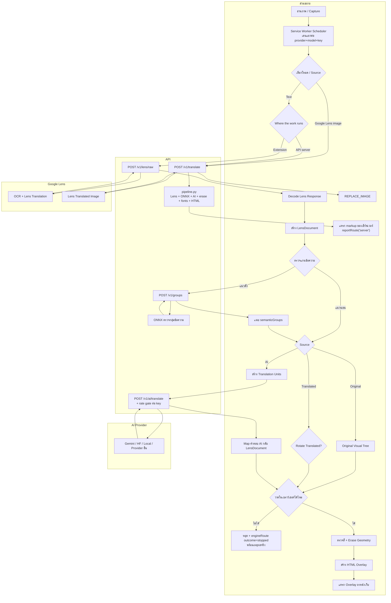
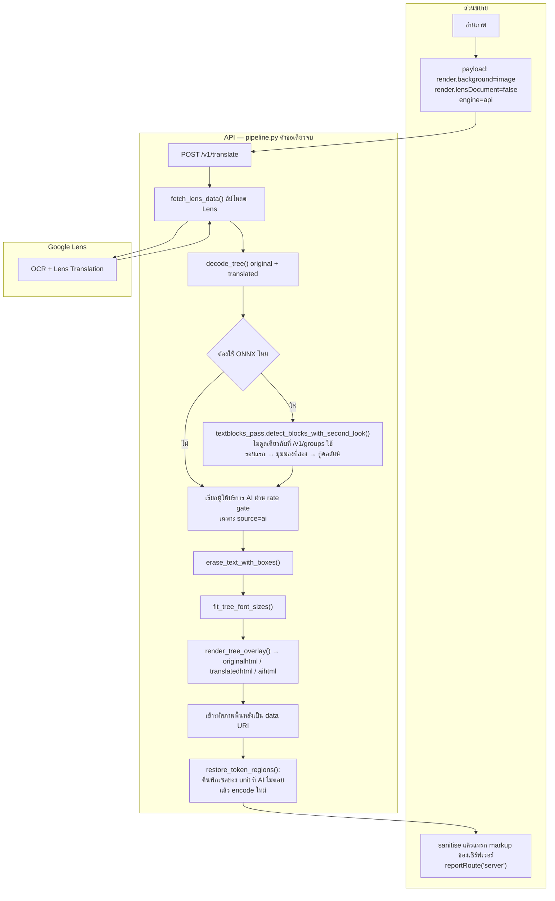

TextPhantom OCR Overlay API

runs: Extension

runs: API server

## API patch 2026.8.20.10

- Adds a conservative Lens-geometry fallback for vertical pages when ONNX returns no usable paragraph stamps.
- ONNX remains the primary grouping authority. The fallback runs only on zero-hit pages and only succeeds when every vertical paragraph relation is either strongly same-unit or provably separate.
- Any ambiguous pair keeps the existing explicit grouping failure; the API does not guess and does not translate possible sentence fragments.
- Sparse pages with one short vertical utterance per bubble can now continue without a false `ONNX: text grouping failed`.
- Strongly aligned multi-column utterances can still be reconstructed into one synthetic block.
- A strong ink wall between close columns vetoes a geometry merge.
- The same fallback is used by both `runs:Extension` (`/v1/groups`) and `runs:API server` (`pipeline.py`). No browser-extension change is required.
- Trace output now includes `geometryFallback` metadata and the API-server performance stages expose geometry-fallback counts.
- Runtime toggle: `TP_TEXTBLOCK_GEOMETRY_FALLBACK=1` (default on). `TP_TEXTBLOCK_GEOMETRY_FALLBACK_MAX_PARAGRAPHS=48` bounds the fallback's pairwise geometry check.
- This patch has no dependency on Hugging Face Dev Mode. Dev Mode may be disabled after trace/validation; normal production startup is unchanged.
