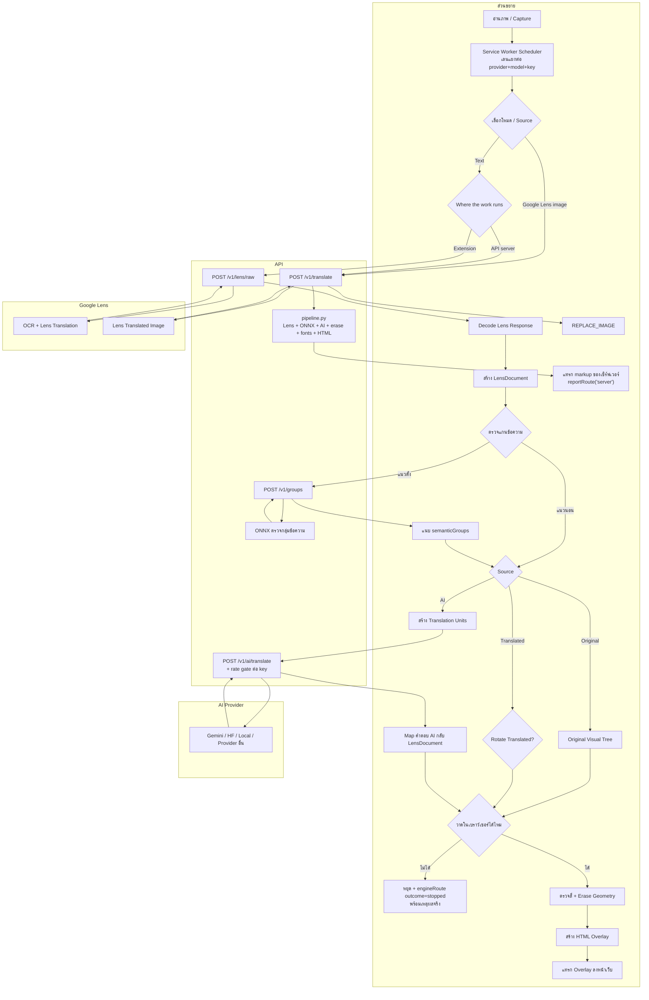

TextPhantom OCR Overlay API

ผังรวมทั้ง 4 โหมด

```mermaid
flowchart TD

subgraph EXT["ส่วนขยาย"]
    A["อ่านภาพ / Capture"]
    S["Service Worker Scheduler<br/>เลนแยกต่อ provider+model+key"]
    ENG{"Where the work runs"}
    SRC{"เลือกโหมด / Source"}

    D["Decode Lens Response"]
    E["สร้าง LensDocument"]
    AX{"ตรวจแกนข้อความ"}
    ATT["แนบ semanticGroups"]
    SRC2{"Source"}

    O1["Original Visual Tree"]
    T1{"Rotate Translated?"}
    AI1["สร้าง Translation Units"]
    AI2["Map คำตอบ AI กลับ LensDocument"]

    FID{"วาดในเบราว์เซอร์ได้ไหม"}
    STOP["หยุด + engineRoute outcome=stopped<br/>พร้อมเหตุผลจริง"]

    R["ตรวจสี + Erase Geometry"]
    H["สร้าง HTML Overlay"]
    I["แทรก Overlay ลงหน้าเว็บ"]
    SRVHTML["แทรก markup ของเซิร์ฟเวอร์<br/>reportRoute('server')"]
    IMG["REPLACE_IMAGE"]
end

subgraph API["API"]
    V1["POST /v1/translate"]
    PIPE["pipeline.py<br/>Lens + ONNX + AI + erase + fonts + HTML"]
    LR["POST /v1/lens/raw"]
    GP["POST /v1/groups"]
    ONNX["ONNX ตรวจกลุ่มข้อความ"]
    AIT["POST /v1/ai/translate<br/>+ rate gate ต่อ key"]
end

subgraph LENS["Google Lens"]
    GL1["OCR + Lens Translation"]
    GL2["Lens Translated Image"]
end

subgraph MODEL["AI Provider"]
    P["Gemini / HF / Local / Provider อื่น"]
end

A --> S
S --> SRC
SRC -->|"Google Lens image"| V1
V1 --> GL2
GL2 --> V1
V1 --> IMG

SRC -->|"Text"| ENG
ENG -->|"API server"| V1
V1 --> PIPE
PIPE --> SRVHTML

ENG -->|"Extension"| LR
LR --> GL1
GL1 --> LR
LR --> D
D --> E
E --> AX

AX -->|"แนวนอน"| SRC2
AX -->|"แนวตั้ง"| GP
GP --> ONNX
ONNX --> GP
GP --> ATT
ATT --> SRC2

SRC2 -->|"Original"| O1
SRC2 -->|"Translated"| T1
SRC2 -->|"AI"| AI1
AI1 --> AIT
AIT --> P
P --> AIT
AIT --> AI2

O1 --> FID
T1 --> FID
AI2 --> FID
FID -->|"ไม่ได้"| STOP
FID -->|"ได้"| R
R --> H
H --> I
```