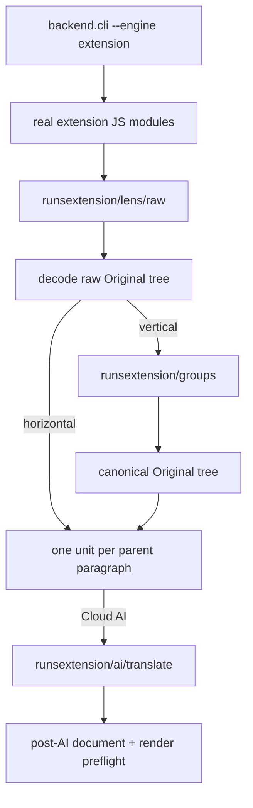
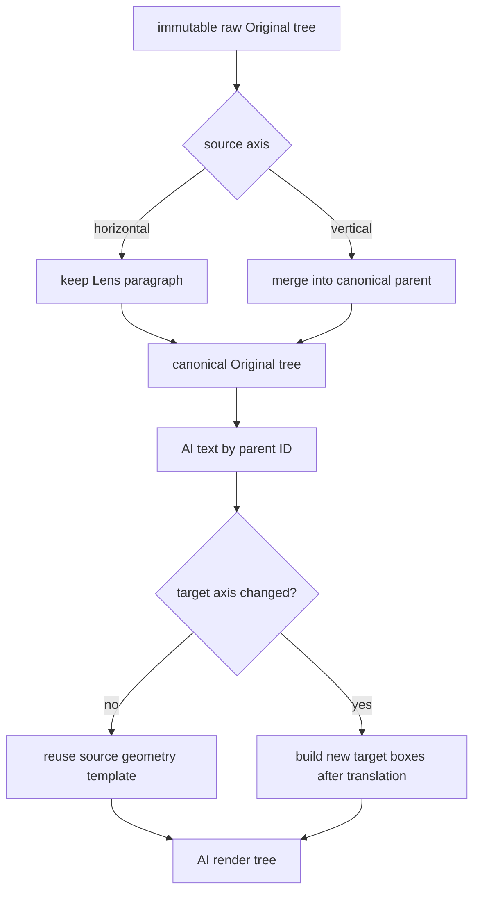
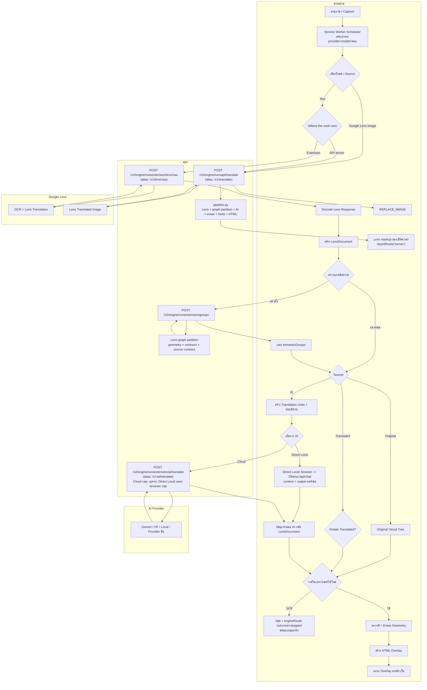
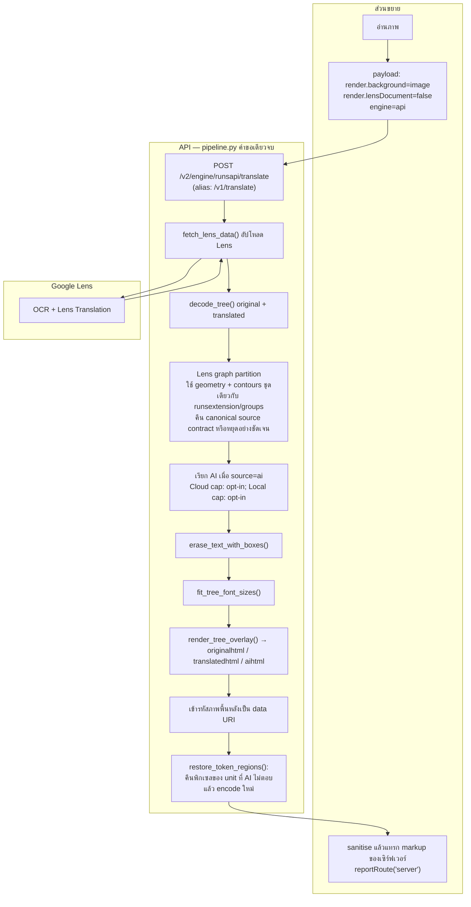

TextPhantom OCR Overlay API

<a id="download-zip-2726"></a>
## .27.26 — Download all เป็น ZIP เดียว, แปลงรูปแบบภาพ และจำค่าดาวน์โหลด

เปลี่ยนเฉพาะงานดาวน์โหลดจากฐาน ZIP `.27.25`. ไม่เปลี่ยนโค้ด AI provider, OCR, prompt,
Conversation, Independent, การซ่อม หรือ API กลาง. การดาวน์โหลดไม่เรียกบริการเหล่านี้.
รายละเอียด `.27.25` ด้านล่างเป็นประวัติของรุ่นเดิม; พฤติกรรมใหม่ในหัวข้อนี้มีผลเหนือส่วน
Download all/รูปแบบไฟล์/การจำค่าของรุ่นนั้น.

### การดาวน์โหลดและรูปแบบไฟล์

- **Download all · ZIP (N)** รวมภาพทั้งหมดที่เข้าเงื่อนไขแท็บที่เลือกและอยู่ในรายการปัจจุบัน
  เป็น ZIP เดียว แม้มีเพียงหนึ่งภาพ. ไม่มีการกดบันทึกภาพทีละไฟล์ในลูป. รายการถูกตรึงเมื่อเริ่มงาน
  และคงลำดับ logical page/DOM เดิม; การเปลี่ยนหน้า/ยกเลิกก่อน handoff จะทิ้ง ZIP ที่ยังไม่เสร็จ.
- **Individual images** ยังบันทึกภาพเดี่ยวโดยตรง ไม่สร้าง ZIP. ทั้งสองเส้นทางใช้ตัวแปลงเดียวกัน.
- **Image format: Auto · current default** เป็นค่าเริ่มต้น: Text overlay รวมกับพื้นหลังเป็น PNG
  ตามตัววาด v1.2 เดิม; raster translation, clean background และ original คง bytes/MIME เดิม.
  **PNG / JPEG (.jpg) / WebP** เป็นการ decode + encode bytes จริง ไม่ใช่เปลี่ยนนามสกุลเฉย ๆ.
  ใช้ขนาดพิกเซลเดิมและ Overlay font size ปัจจุบัน ไม่เรียกแปลหรือ erase ใหม่.
- Quality ปรับ 1–100% (เริ่ม 92%) สำหรับ JPEG/WebP เท่านั้น; PNG/Auto ไม่ลดคุณภาพตาม slider.
  JPEG เติมสีขาวใต้พื้นที่โปร่งใส. การแปลงภาพเคลื่อนไหวเป็นภาพนิ่งหนึ่ง frame และไม่รักษา metadata
  ทั้งหมด; ใช้ Auto เพื่อเก็บไฟล์ภาพเดิมโดยไม่ re-encode (ยกเว้น Text overlay ที่ต้องรวมเป็น PNG).
  ถ้า encoder ไม่รองรับและคืน PNG แทนรูปแบบที่เลือก จะรายงานผิดพลาด ไม่บันทึกไฟล์ผิดนามสกุล.

เงื่อนไขแท็บไม่เปลี่ยน: Translated ใช้ภาพแปล/Text overlay ที่มีอยู่; Text removed ใช้ clean background
จาก Text overlay เท่านั้น; Original ใช้ source ต้นฉบับไม่ใช่ raster ที่ถูกแทน. ไม่โหลดบทใหม่ ไม่ remount
ภาพที่เว็บไซต์ถอดจาก DOM และไม่เดาว่าทั้งบทดาวน์โหลดครบ. Refresh อ่านรายการเดิมหลังเลื่อนหน้า.

### ZIP, ข้อผิดพลาด และภาระเครื่อง

ZIP ใช้ STORE (ภาพมีการบีบอัดอยู่แล้ว) ไม่รับรองว่า ZIP จะเล็กกว่าผลรวมไฟล์มาก; เป้าหมายคือหนึ่งไฟล์
ดาวน์โหลด. อ่าน checksum ทีละ 1 MiB และใช้ Blob references ไม่แปลงทั้ง archive เป็น base64 หรือ
ArrayBuffer เดียว. สร้าง canvas ทีละภาพและคืนหน่วยความจำเมื่อเสร็จ; ไม่ติดตั้ง library/CDN ใหม่.
ชื่อ entry เป็น UTF-8 รองรับไทย, leaf filename ที่ปลอดภัย, กันชื่อซ้ำ และไม่เปลี่ยนลำดับภาพ.

เมื่อบางภาพอ่าน/แปลงไม่ได้: ยังรวมภาพที่สำเร็จใน **หนึ่ง ZIP ชื่อ `... - partial.zip`** และใส่
`_download-errors.txt` ภายใน ระบุหน้าที่ขาดโดยไม่ใส่ URL, คีย์หรือเนื้อหางานแปล. UI บอกจำนวนสำเร็จ/ทั้งหมด
ไม่อ้างว่าได้ครบ. หากไม่มีภาพสำเร็จ ไม่สร้าง ZIP ว่าง. ไม่ส่ง original แทน translated เมื่อผิดพลาด.
Cancel ระหว่างอ่าน/encode/CRC/ก่อนส่งออกจะไม่ปล่อย ZIP ครึ่งชุด; งานแปลไม่ถูกยกเลิก.

ZIP32 จำกัดขนาด archive ต่ำกว่า 4 GiB และจำนวน entry ต่ำกว่า 65,535 (รวมรายงาน error). หากเกิน
หยุดพร้อมข้อความชัดเจน ไม่แบ่งเป็นหลาย ZIP หรือปล่อยไฟล์ทีละภาพ. งานใหญ่มากยังขึ้นกับ RAM และ Blob
storage ของ browser; ไม่รับรองขนาดสูงสุดที่เครื่องผู้ใช้จะเก็บได้. ข้อจำกัดอ่านภาพเดิม 25 MiB และ
canvas 48 MP/ด้านละ 32,767 px ยังใช้. **Sent to browser** หมายถึง handoff หนึ่งไฟล์ ไม่ใช่ยืนยันเขียนดิสก์;
ตรวจ Downloads/Save dialog ของ browser. ไม่ต้องใช้ permission downloads ใหม่.

### การจำค่า

ใช้ **`chrome.storage.local` ของส่วนขยาย** ไม่ใช่ localStorage ของเว็บไซต์และไม่ใช้ sessionStorage:

| คีย์ | ค่าเริ่มต้น | ความหมาย |
| --- | --- | --- |
| downloadImagesEnabled | false | ตัวเลือกเปิดปุ่มใน Page actions (คงของเดิม) |
| downloadImageFormat | auto | รูปแบบไฟล์ร่วมสำหรับสามแท็บและรายภาพ/ZIP |
| downloadImageQuality | 92 | คุณภาพ JPEG/WebP |
| downloadSelectedTab | translated | แท็บล่าสุด |
| downloadIndividualExpanded | false | สถานะกาง/พับรายการรายภาพ |

เขียนเฉพาะคีย์ที่แก้ ไม่เขียนทับ settings ทั้งก้อน; รายงาน error ถ้าบันทึกไม่ได้. อ่านค่ากลับเมื่อเปิดหน้า
หรือ browser ใหม่ และรับ onChanged จากแท็บอื่น. Guard ป้องกัน startup read เก่าทับค่าที่เพิ่งเลือก.
การเปลี่ยนฟอร์มไม่พับรายการรายภาพกลับเพราะ toggle event มาทีหลัง. ไม่บันทึกภาพ, ZIP, OCR, ข้อความ,
URL, job/progress หรือ object URL ลง storage. เมนูใหญ่เริ่มพับเพื่อไม่บังการอ่าน; ไม่ resume ดาวน์โหลดเก่า.
Reset defaults ที่ผู้ใช้ยืนยันจะล้างเฉพาะ configuration keys รวมค่าดาวน์โหลด; ไม่ล้างประวัติ usage.

### แผนที่โค้ดและการทดสอบ

`src/content/download/inventory.js` คงการค้นหา/identity เดิม; `render.js` คงตัววาด v1.2.
`io.js` อ่าน/encode/handoff; `zip.js` เขียน ZIP; `job.js` รวมงานและจัดการ partial/cancel;
`preferences.js` เป็นเจ้าของคีย์และการอ่าน/เขียน; `panel.js` เป็น UI; `panel-style.js` แยก CSS.
โหลดลำดับเดียวกันใน manifest, local viewer, Auto viewer และ Thunderbird.

```sh
npm run test:release-2726
npm run test:browser-2726
npm run build
```

ชุด browser ใช้ภาพสังเคราะห์กับ production DOM/canvas/ZIP และ event ดาวน์โหลดจริง; แกะ ZIP ด้วย
Python zipfile เพื่อตรวจ CRC, ชื่อ, จำนวน, ลำดับ และตรวจ image bytes ด้วย Pillow. ทดสอบ output PNG,
JPEG, WebP, Auto, error, cancellation, disabled clean, font-scale และ pixel parity ตัววาด v1.2.
การตรวจ preference ในเครื่องนี้ใช้ **storage API fixture** ซึ่งเก็บค่าแยกไว้ในไฟล์ทดสอบและเปิด Chromium
process ใหม่เพื่อทดสอบการ hydrate; ไม่ใช่หลักฐานว่าได้ทดสอบ native chrome.storage.local หลัง restart จริง.
การติดตั้ง unpacked test extension ถูกนโยบาย administrator ของเครื่องทดสอบปฏิเสธ. สคริปต์มี
`--native-storage` สำหรับสภาพแวดล้อมที่อนุญาตโดยไม่เปลี่ยนนโยบายเครื่อง; ไม่ข้ามข้อจำกัดเพื่อทำให้ผ่าน.
ไม่มี live-site, provider หรือบัญชีผู้ใช้ถูกเรียกในแพตช์นี้; ไม่อ้างผล regression/provider ใหม่จากงานดาวน์โหลด.

เอกสารอ้างอิง API (ตรวจ 2026-09-29):
- https://developer.chrome.com/docs/extensions/reference/api/storage
- https://developer.mozilla.org/en-US/docs/Web/API/HTMLCanvasElement/toBlob


<a id="download-hf-2725"></a>
## .27.25 — ดาวน์โหลดภาพที่มีอยู่, HF route/metadata และการยืนยันแจ้งข้อผิดพลาดซ่อม

ตรวจจากฐาน `.27.24` และ `logs-27.24.zip` เมื่อ 2026-09-29. หัวข้อนี้อธิบายการเปลี่ยนแปลงใหม่;
ตัวเลขประวัติและนโยบาย Cloud Conversation / Local Independent ในหัวข้อ `.27.24` ยังเก็บไว้ด้านล่าง.
ไม่มีการย้ายบัญชี, เปลี่ยน prompt คุณภาพ, เปลี่ยนโมเดล/Thinking เงียบ ๆ หรือเพิ่มรอบซ่อม.

### Download images — งานอ่าน/บันทึกแยกจากงานแปล

เปิด **Translate → Page actions → Download images** (ค่าเริ่มต้นปิด). เมื่อเปิด จะมีปุ่ม 42 × 42 px
มุมขวาล่าง; กดเปิดเมนู 312 px แบบไม่ปิดกั้นหน้าอ่าน. รายการ Individual images พับไว้.
ตัวเลือกแต่ละชนิดมี Download all และปุ่มรายภาพ; ปุ่ม Close ย่อเมนู ไม่ยกเลิกงาน.
Cancel หรือปิด preference ยกเลิกเฉพาะการอ่าน/ส่งออกภาพของงานดาวน์โหลด ไม่แตะงานแปล.

| ชนิด | แหล่งข้อมูลที่ใช้จริง | เมื่อไม่มีแหล่งนั้น |
| --- | --- | --- |
| Translated | ภาพแปล raster ที่แสดงอยู่ หรือ clean background + `.tp-line` ที่มองเห็นใน Text overlay | แจ้ง unavailable; ไม่แอบบันทึก original แทน |
| Text removed | clean image ที่มีอยู่ใน Text overlay และมีข้อความแสดงอยู่ ไม่ใช่ raster translation | ปิดตัวเลือก ไม่เรียก erase ใหม่ |
| Original | responsive/lazy source ของภาพต้นฉบับ หรือ original identity ของ IMG ที่ TextPhantom แทน; canvas เป้าหมาย reader ที่ระบบรู้จักใช้พิกเซลเดิม | แจ้งแหล่งไม่พร้อมหรือ canvas tainted; ไม่ประกอบ/ถอดรหัสภาพใหม่ |

รายการเป็น **ภาพ/เป้าหมายที่มีอยู่ใน document ปัจจุบัน**. ภาพที่มี URL พร้อมแล้วไม่ต้องรอ browser decode;
การส่งออกอาจต้องอ่าน bytes จาก URL นั้น. ไม่เรียก GET_IMAGES ของงานแปล, ไม่ force lazy load,
ไม่ดึง manifest บทใหม่, ไม่ remount หน้า, ไม่เริ่ม Lens/OCR/AI/erase. หน้า virtualized ที่ถูกถอด DOM แล้ว
หรือ iframe อื่นไม่ถูกอ้างว่าได้ครบ; เลื่อนให้เว็บไซต์โหลด/แสดงหน้าแล้วกด Refresh. Canvas ทั่วไปที่ไม่ใช่
เป้าหมาย reader ที่ทราบไม่ถูกเดาว่าเป็นหน้ามังงะ. คงความซื่อสัตย์ของคำว่า existing images มากกว่ารวมภาพที่เดาเอา.

ลำดับใช้เลข logical `[data-page]` / `[data-tp-md-page]` เมื่อมี และ DOM order มิฉะนั้น; ไม่เรียงตามงานแปลเสร็จ.
เลขหน้าเดียวกันหลายภาพไม่ถูก merge ทิ้ง; filename เติมลำดับย่อยกันชนกัน. ชื่อไฟล์ใช้ชื่อแท็บที่ sanitize แล้ว
+ เลขหน้า + translated/clean/original + extension ตาม MIME. JPEG/WebP ต้นฉบับไม่ถูกติดนามสกุล PNG ปลอม.
PNG สำหรับ Text overlay วาดด้วยอัลกอริทึมอ้างอิง `TextPhantom-Export-Test-v1.2.txt`, อ่าน font scale/rotation/
writing-mode/style จริง ณเริ่มส่งออกภาพนั้น, ไม่วาดชั้น OCR ที่ซ่อน, ไม่ขยายกล่องเอง. ทดสอบ pixel parity
กับตัววาดอ้างอิง 48 กรณี; ไม่ใช่คำรับรองว่าการวาด Canvas เหมือน DOM/CSS ทุกชนิดที่ไม่ได้ทดสอบ.

จับ source/ตำแหน่ง/ข้อความ/สไตล์ก่อน asynchronous read; ถ้าเปลี่ยนหน้า, source, logical page หรือ unmount
ระหว่างงานจะหยุด/แจ้งไม่พร้อมแทนจับผลไปใส่ภาพใหม่. Overlay ที่คงอยู่หลังยกเลิกงานยังใช้ได้เมื่อ identity
ของภาพเดิมตรง. Original canvas ใช้พิกเซลที่มีในขณะเรียก export; ไม่มีการรับรองเนื้อหาหากเว็บไซต์วาดทับ
canvas เดิมโดยไม่เปลี่ยน identity ระหว่างนั้น.

การอ่าน HTTP(S) ใช้ page fetch ก่อน; เมื่อ CORS ปฏิเสธ ใช้ image-only broker ใน service worker ผ่าน
host permissions เดิม. ไม่ส่งภาพผ่าน API กลาง และไม่เพิ่ม permission `downloads`.
Broker ตรวจ sender/แท็บ/frame/document/request ID, จำกัดหนึ่ง read ต่อ document และไม่เกิน 32 พร้อมกัน
ทั้ง extension, 20 วินาที/25 MiB ต่อภาพ; หน้า client มี timeout/abort ของตนเอง. ไม่มี custom Referer rule
หรือการปลดข้อจำกัดเว็บไซต์แบบถาวร. ปฏิเสธ HTML/empty/oversize/error response; tainted canvas เป็น failure.
ใช้ canvas ทีละภาพ (ไม่เกิน 48 MP หรือด้านละ 32,767 px), ปิด bitmap/revoke object URL เมื่อเสร็จ.
URL สำหรับ browser download คงไว้ 10 วินาทีก่อน revoke. Native anchor handoff อาจต้องอนุญาตหลายไฟล์ใน browser.
สถานะ **Sent to browser** หมายถึงส่งให้ browser แล้ว ไม่ใช่หลักฐานว่าไฟล์เขียนถึง disk ครบ;
ตรวจรายการ Downloads ของ browser โดยเฉพาะกรณี block หลายไฟล์หรือผู้ใช้ยกเลิก Save dialog.

เจ้าของโค้ด: `src/content/download/{inventory,render,io,panel}.js`, image-only broker
`src/background/download-images.js`, popup preference และ read-only snapshot ใน overlay/mangadex owners.
ไม่มี provider adapter import ใน exporter; ไม่มี export action ใดเรียก endpoint แปลหรือ checkpoint ซ่อม.

### Log ใหม่: งานเดิมดีขึ้นที่ provider อื่น แต่ HF ยังมีปัญหา

แยก `recordKind=provider_request`, initial/repair, batch และ hash ของ `(unit ID, OCR text)`.
หก Cloud ต่อไปนี้ตรงกัน 310 หน่วย / 9,036 อักขระ / 28 ภาพ,
hash `1392dd063449fa11aee8cf96670e59791e8d2b7c910da9b12071a2ca06924316`.
ตัวเลขรวม cached input แล้ว; ไม่ใช่บิลหรือการรับรองคุณภาพความหมาย.

| Provider / โมเดลใน log | Main calls / total tokens | Repair calls / total tokens |
| --- | ---: | ---: |
| OpenAI / GPT-4.1 mini | 3 / 29,137 | 0 / 0 |
| OpenRouter / DeepSeek V3.2 | 2 / 18,071 | 1 / 14,994 |
| DeepSeek / DeepSeek Flash | 3 / 31,354 | 1 / 16,711 |
| Gemini / 3.5 Flash | 3 / 31,964* | 1 / 16,342* |
| Anthropic / Sonnet 4.6 | 3 / 46,556* | 0 / 0 |
| Hugging Face / Kimi-K3 | 11 / 148,841 | 1 / 20,184 |

`*` Native transport ไม่ใส่ usage ใน response-meta ชุดนี้; ใช้ normalized `inputActual/outputActual`
จาก request diagnostics และระบุ total ว่าคำนวณบวกสองช่อง ไม่เรียกว่า provider-reported total.
ค่าที่ขาดยังเป็น unknown ไม่ใช่ zero. การลองภาพเดี่ยว/งาน Gemini 239 หน่วย/Local คนละ source hash
ไม่ถูกนำมาบวกในตารางต้นฉบับเดียวกัน. ดูรายคำขอและ provenance ใน release evidence `log-e2e.json`.

HF แบ่งรอบหลัก [16,30,30,38,37,26,33,30,27,39,4] หน่วย; contextLimit เป็น null ในคำขอที่บันทึก.
คำตอบหลักสุดท้ายและคำตอบซ่อมมีเพียง `<<!` (output 2 tokens, finish stop), จึงไม่มีคำแปลให้ parser รับ.
หน่วยขาดคือ I27_P0/I27_P1/I28_P0/I28_P1. Replay assembled response จริง 98 คำขอด้วย production parser
และหลายขนาด stream chunks: 2,715 จาก 2,743 หน่วยอ่านได้, ไม่ต่างจากผลที่บันทึกไว้. 28 หน่วยที่ไม่อ่านได้
ไม่ถูกนับว่าผ่าน. Raw HTTP body ถูก redact ใน archive จึงไม่อ้างว่า replay HTTP bytes ต้นฉบับครบ.

**ยังไม่พิสูจน์ว่าสาเหตุของ `<<!` อยู่ที่โมเดล, prompt interaction หรือ serving upstream จุดใด**.
รุ่นนี้ไม่เปลี่ยน `<<!` ให้เป็นสำเร็จ ไม่ fabricate translation ไม่เพิ่ม generation เพื่อลอง cache.
การแก้ metadata ต่อไปนี้ช่วยเลือกขนาดงานจากหลักฐานและจัด route ให้ถูกต้อง แต่ไม่รับประกันว่าคำตอบสั้นผิดรูป
จะหายหรือ token ของงานจริงหลังแพตช์ลดลงกี่เปอร์เซ็นต์. Cache miss ระดับ serving instance ยังไม่ยืนยัน.

### Hugging Face ต้องแยก Hub model, routing policy และ upstream ที่เลือก

เทียบเอกสาร HF Router, Hermes และ SDK จริงแล้ว: OpenAI-compatible URL เป็น transport ไม่ใช่หลักฐานว่า
ทุก upstream มี context/output/Thinking เหมือนกัน. `:fastest`, `:cheapest`, `:preferred` เป็น **นโยบาย route**;
`:baseten` หรือชื่อ live provider อื่นเป็น **ผู้ใช้เลือก upstream เจาะจง**. ตัว base ที่ไม่มี suffix ยัง Auto.
Hermes รองรับ base URL และ suffix นี้; ไม่ใช่หลักฐานว่ามี magic cache/session flag ที่ต้องคัดลอก.
SDK Python/JS มี provider-specific mapping และ helper; ไม่ควรสับสน native `hf-inference` กับ Router ทั้งระบบ.

สิ่งที่แก้เฉพาะ HF:

1. แยก reserved policy suffix ออกจาก provider suffix; request model ที่ผู้ใช้เลือกส่งตามเดิม ไม่แอบ pin
   ไป upstream ก่อนหน้า. คง Auto/failover และไม่เปลี่ยน model/route ตอน error.
2. รายชื่อโมเดลคง base เดิมอยู่ก่อน และเพิ่มตัวเลือก suffix ของ policy + live upstream ที่มีชื่อไม่ซ้ำ.
   ผู้ใช้ตัดสินใจเลือกเอง; การ refresh ไม่เด้งค่ากลับ base และไม่ทำ proof ของ selected route หายเพียงเพราะ
   catalogue เดิมมีแต่ Hub ID. Thinking proof ของ base/อีก route/อีกบัญชีไม่ถูกคัดลอกข้ามกัน.
3. เมื่อ selected model ยังขาด context ให้ลอง **metadata GET** ที่เอกสารระบุ
   `https://router.huggingface.co/v1/models/{Hub repo}`. ตรวจ exact ID, response size และ endpoint;
   ไม่ดึง config.json ของ weights มาอ้างเป็น runtime context. เป็น GET metadata ไม่ใช่ AI probe/generation.
4. Cache รายละเอียดแยก credential hash + endpoint + Hub repo, success 5 นาที/failure 30 วินาที;
   ไม่เกิน 512 entries/64 in-flight reads และ share request ของบัญชีเดียวกันโดยไม่ทำ network ใต้ global lock.
   GET จำกัดเวลา read 8 วินาที/1 MiB, ไม่ตาม redirect/ไม่ retry, follower รอไม่เกิน 10 วินาที.
   Explicit refresh แยก stale in-flight ไม่ให้ตอบย้อนมาเขียน cache รุ่นใหม่. ไม่เพิ่ม metadata traffic
   ให้ provider อีก 18 ตัวและไม่สร้าง global queue รอประวัติผู้ใช้คนเดียว.
5. Auto/policy ใช้ min context เฉพาะเมื่อ **ทุก live route รายงานครบ**; named provider ใช้เฉพาะตัวเอง.
   Detail GET ที่ยังขาดข้อมูลไม่ทำให้รู้ขนาดโดยปริยาย. ถ้าชื่อซ้ำ/route ขาด context ยังใช้ unknown budget เดิม.
   ไม่ถือ route ที่รายงาน limit มากที่สุดเป็นความสามารถร่วมของ Auto. ชื่อ upstream เดียวกันยังไม่พิสูจน์ cache hit.

เจ้าของโค้ด: `huggingface_catalogue.py`, `huggingface_details.py`, `huggingface_limits.py`,
`cloud_huggingface.py`; hooks ที่ probe/translation/planner มี guard provider==huggingface.
บันทึก policy/live provider/missing-limit status เป็น diagnostics ไม่ใช่ข้อมูลอนุมัติ Thinking จาก client.
รูปแบบ generation HTTP ของ provider อื่น, prompt, usage reducer, output parser และ shared AI capacity ไม่เปลี่ยน.

### หลังซ่อม: ส่ง error notice สำเร็จ ไม่ใช่แปลสำเร็จ

พบ `repairTerminalImageError` ใน log ถูกติด outcome succeeded เพราะส่ง error notice จบ. อีกช่องโหว่ในโค้ดคือ
await enqueue แล้วถือว่าส่งสำเร็จแม้ผลเป็น `{ok:false}` หรือ stale. รุ่นนี้ต้องมี ACK `ok:true` ไม่ stale และ
`applied/errorDisplayed/toastDisplayed` จริง จึงเคลียร์ deferred notice; toast ต้องมีข้อความ error นี้ใน DOM
ไม่ใช่เพียงเรียก showToast แล้วถูกสถานะ batch อื่นกลบ; ถ้าไม่มี ACK เก็บ notice/บันทึก failure.
เมื่อแสดง notice ได้ outcome ของ **translation ยัง failed** และแยก `errorNoticeDelivered:true`.
ไม่ได้สร้าง AI retry/repair round ใหม่เพื่อส่ง notice, ไม่ถือว่า error badge คือ translated DOM acknowledgement.

Bulk repair report/claim, readiness barrier, checkpoint identity และ provider terminal/usage/history drain
ยังเหมือน `.27.24`. คำตอบหลักแสดงแล้วไม่พิสูจน์ว่างานซ่อมเสร็จ. ต้องตาม main terminal → checkpoint/report →
seal/claim → repair response → validation → DOM ACK. Trace timestamp `occurredAt/eventAt` ต่างจากเวลา ingest;
ไม่ใช้การส่ง log ช้าประมาณหนึ่งวินาทีไปตีความว่า provider ช้า. ยังไม่อ้างว่าปัญหาค้างเป็นครั้งคราวทุกแบบหายแล้ว.

### การตรวจซ้ำและข้อจำกัด

```sh
npm run test:release-2725
npm run test:browser-2725
npm run build
```

HF tests ใช้ production adapter/cache/planner และ mock HTTP; Download tests ใช้ Chromium DOM/canvas
และ native download event จริงบนภาพ fixture รวม Thai/English/Japanese, 50–200% font scale, rotation,
vertical, source MIME, logical order, hidden OCR, stale image/navigation, failure และ cancel.
Broker ทดสอบ sender/document isolation, size/MIME bounds และ abort. ไม่เรียก user key/credits สด.
19-provider model-selection regression, 18 API transports (Custom Local เป็น browser-only), 10 Local receipts,
repair isolation/rollback และเดิม release gate ยังคงทดสอบ. Replay log ไม่ใช่การติดตั้ง extension บนเว็บจริง
หรือประเมินภาษาเชิงความหมาย. Browser handoff ไม่ใช่การยืนยันไฟล์ในเครื่องผู้ใช้.

ผล broad suite เดิม 371 สคริปต์มี initial 19 failures; แก้สามรายการใหม่ (ลำดับ content scripts ของ Viewer/Auto,
การผูก npm test script และการรอ native browser download callback ใน test) แล้วเหลือ 16 ที่ fail บน `.27.24`
เช่นเดียวกัน. รายงานทั้ง initial run และ rerun แยกไว้ ไม่ใส่ skip เพื่ออ้างว่าโปรเจ็กต์เขียวทั้งหมด.
`npm test` แบบรวมยังมี environment precheck ต้องติดตั้ง budoux; การทดสอบใน release นี้รันสคริปต์แยกและ gates.

### แหล่งวิจัยภายนอก (ตรวจ 2026-09-29; ไม่ใช่หลักฐานว่ารันบัญชีจริงแล้ว)

- HF Router models/selected-model metadata และ optional limits: https://huggingface.co/docs/inference-providers/hub-api
- HF Auto/policy/named provider, Python/JS/HTTP examples: https://huggingface.co/docs/inference-providers/index
- Hermes HF integration: https://github.com/NousResearch/hermes-agent/blob/main/website/docs/integrations/providers.md
- Hermes provider implementation: https://github.com/NousResearch/hermes-agent/blob/main/hermes_cli/providers.py
- Python SDK request/stream/provider helpers: https://github.com/huggingface/huggingface_hub/blob/main/src/huggingface_hub/inference/_client.py
- JavaScript request options/provider helpers: https://github.com/huggingface/huggingface.js/blob/main/packages/inference/src/lib/makeRequestOptions.ts
- Official HF starter app (another OpenAI-compatible client integration): https://github.com/huggingface/inference-providers-starter-app

Upgrade API + extension together, restart API/reload extension/page, refresh model list, start a new translation run.
No Reset defaults, no schema/data migration. Export does not need the API server online once the page's results exist.

---

<a id="provider-efficiency-2724"></a>
## .27.24 — โทเค็นสูง, ขนาดงาน, แคช และช่วงรอซ่อม (ตรวจ 2026-09-28)

**นโยบายปัจจุบัน: Cloud ทั้ง 9 ใช้ Conversation; Local ทั้ง 10 ใช้ Independent ตามที่เลือกใน UI.**
หัวข้อรุ่นเก่าด้านล่างเป็นประวัติการออกแบบ ไม่ใช่คำสั่งให้ย้อน Local ไปใช้ Conversation.
การมี `cachedInputTokens > 0` พิสูจน์ว่าคำขอนั้นรายงาน cache hit เท่านั้น **ไม่ได้พิสูจน์ว่าทั้งงานใช้โทเค็นอย่างมีประสิทธิภาพ**.
เลข usage, เวลา, จำนวนคำขอ, คุณภาพคำแปล และยอดเงินต้องตรวจแยกกัน.

### หลักฐาน Cloud: เทียบต้นฉบับเดียวกัน ไม่รวมการลองภาพเดี่ยว

อ่าน `logs-27.22.zip` โดยจับคู่ batch/provider/model และ hash ของ `(unit ID, OCR text)`;
ต้นฉบับตรงกัน 310 หน่วย / 9,036 อักขระ / 28 ภาพ.
SHA-256 ของรายการ ID/text ที่เรียงตาม ID:
`1392dd063449fa11aee8cf96670e59791e8d2b7c910da9b12071a2ca06924316`.
ตารางเป็น **รอบหลัก** และ token ที่ provider รายงานจริง รวม cached input แล้ว ไม่ใช่ยอดบิล:

| Provider / รุ่นโมเดลใน log | Main calls | Input | Output | Total |
| --- | ---: | ---: | ---: | ---: |
| OpenRouter / DeepSeek V3.2 | 2 | 12,301 | 5,700 | 18,001 |
| Gemini / 3.5 Flash | 3 | 26,400 | 6,861 | 33,261 |
| Anthropic / Sonnet 4.6 | 3 | 36,970 | 9,958 | 46,928 |
| OpenAI / GPT-4.1 mini | 10 | 81,487 | 5,854 | 87,341 |
| HF / Kimi-K3 | 10 | 132,899 | 8,792 | 141,691 |

เมื่อคำขอแรกจบ ทั้งห้า provider มี 294 หน่วย / 27 ภาพ **พร้อมแล้ว** แต่คำขอถัดไปเลือก
294 / 251 / 174 / 30 / 42 หน่วยตามลำดับ. OpenAI/HF ไม่ได้แบ่งเล็กเพราะ OCR ยังไม่พร้อม;
ติด `conversation_page_output_target` ของ planner. HF คำขอท้ายแปล 4 หน่วย แต่ส่ง input 20,076
(cached 18,944) เพื่อรับ output 99: ประวัติถูกส่งซ้ำตาม Conversation แต่แตกคำขอมากเกินจำเป็น.
Gemini มี repair เพิ่ม 1 คำขอ / 4 หน่วย / 16,381 tokens; OpenAI เพิ่ม 1 / 1 / 14,579.
ห้ามใช้ยอดทั้งไฟล์ที่รวม single-image tests มาแทนยอด batch นี้.

### หลักฐาน Local ที่เคยใช้โทเค็นต่ำ: ไม่ใช่แคชอย่างเดียว

พบ Ollama `qwen3.5:9b` ใน `logs-26.14.zip` ซึ่งใช้ต้นฉบับเดียวกับ `.27.20–.27.22`:
310 หน่วย / 9,036 อักขระ / 28 ภาพ. Canonical hash ของ `(page index, original unit ID, OCR text)`:
`3791324f939acb4c1784b126265310b437b2db9bfc0b1e1eb4f5144ae4a4b045`.
วิธี hash ต่างจากตาราง Cloud ข้างบน จึงห้ามเทียบสองค่า hash โดยไม่จัด canonical representation ให้ตรงกัน.
อ่านเฉพาะ `recordKind=provider_request` ไม่บวก page summaries ซ้ำ;
ใช้ native response usage หรือ `aiModelWorkload` observation ที่จับคู่ **traceId + operationId**.
ทุกคำขอในตารางต่อไปนี้มี total usage ให้รวมครบ:

| Log / โมเดล | Mode จริง | Main calls / tokens | Repair calls / units / tokens | Total ทั้งงาน |
| --- | --- | ---: | ---: | ---: |
| 26.14 / Ollama Qwen 3.5 9B | Conversation | 6 / 23,898 | 1 / 2 / 6,338 | **30,236** |
| 27.20 / Ollama รุ่นเดิม | Independent | 48 / 97,656 | 1 / 3 / 2,864 | 100,520 |
| 27.21 / Ollama รุ่นเดิม | Independent | 41 / 83,592 | 2 / 4 / 4,666 | 88,258 |
| 27.22 / Ollama รุ่นเดิม | Independent | 34 / 69,548 | 1 / 2 / 2,705 | 72,253 |
| 27.20 / LM Studio Gemma 4 E4B | Independent | 28 / 72,721 | 1 / 1 / 2,465 | 75,186 |
| 27.21 / LM Studio รุ่นเดิม | Independent | 28 / 72,637 | 2 / 3 / 5,071 | 77,708 |
| 27.22 / LM Studio รุ่นเดิม | Independent | 28 / 72,707 | 0 / 0 / 0 | 72,707 |

`.26.14` รวมหลายภาพแบบ Conversation จึงมี 6 คำขอหลัก ไม่ใช่ Independent ที่ cache ดีกว่าอย่างเดียว.
System text ของกลุ่มที่เทียบยังยาว 4,923 อักขระต่อคำขอ; รุ่นล่าสุดส่งตัวอย่างที่จำกัดไว้ไม่เกิน 4 คู่
และไม่พ่วง full chat history ใน Local. Thinking/cache counters ที่ไม่รายงานยังเป็น **unknown**;
ตารางนี้ไม่ยืนยันว่าความต่างทั้งหมดมาจากโหมดเพียงอย่างเดียวหรือว่าคุณภาพความหมายเท่ากัน.
รุ่น 27.24 **ไม่ย้อน Local เป็น Conversation เพื่อให้ตัวเลขสวย**: ยังคง page order/ตัวอย่างหน้าก่อน
และลดการแตกย่อยภายในภาพเมื่อมีหลักฐานว่ารับไหว. ถ้าครบหนึ่งภาพต่อคำขอแล้ว เช่น LM Studio
28 ภาพ / 28 คำขอ จะลดเหลือ 6 คำขอโดยไม่เปลี่ยนขอบเขต Independent ไม่ได้.

ประวัติ HF ก็ยืนยันว่าต้องตรวจรอบซ่อม: `logs-14.25/14.26/14.27.zip`, โมเดล
`deepseek-ai/DeepSeek-V4-Flash-0731`, ต้นฉบับเดียวกัน **ภายในชุดเก่า** 250 หน่วย / 5,188 อักขระ,
ใช้รวม 107,859 → 38,075 → 31,011 tokens; จำนวนคำขอซ่อม 15 → 2 → 4.
ชุดนี้ไม่ใช่ต้นฉบับ 310 หน่วยข้างบน. ส่วนลด 64.7% จาก .14.25→.14.26 เกิดพร้อมการลดงานซ่อมมาก
ไม่ใช่หลักฐานว่า cache-hit ratio เพิ่มขึ้น (cached-input รวมกลับลดลง).

### เหตุผลที่ใช้โทเค็นมาก: แยกสิ่งจำเป็นออกจากข้อบกพร่อง

| ส่วนที่ใช้โทเค็น | Cloud Conversation | Local Independent | วิธีตรวจ/ลดโดยไม่บิดเบือนผล |
| --- | --- | --- | --- |
| System, สไตล์, contract | ส่งซ้ำเป็น prefix; บางส่วนอาจได้ส่วนลด cache | ส่งทุก independent request จริง | ลดคำขอที่แตกย่อยเกินเหตุ ไม่ตัดคำสั่งคุณภาพเงียบ ๆ |
| ประวัติ User/Assistant | โตตามบทและถูกส่งซ้ำในคำขอถัดไป | ไม่ส่ง full history; ส่งเฉพาะตัวอย่างที่จำกัด | ดู `historyChars`, `historyTurns`, `staticUserRepeated`, จำนวนงานใหม่ต่อคำขอ |
| schema/ID/context/ตัวอย่าง | framing + bootstrap examples และ source ของงานใหม่ | schema/current IDs และตัวอย่างไม่เกิน 4 คู่ | นับจาก provider payload จริง ไม่ใช้ OCR char count อย่างเดียว |
| ภาพแนบ | เฉพาะโมเดล/โหมดที่เปิด page-image | ตาม native image protocol | ไม่เปรียบเทียบ text-only กับ vision โดยไม่บอกความต่าง |
| Thinking | มักใช้งบ completion ร่วมกับคำแปล | native/runtime แล้วแต่โมเดล | ใช้ค่าที่ส่งจริงและ counter จริง; ไม่บวก reasoning ที่รวม output ซ้ำ |
| คำตอบผิด/ขาด/ซ่อม | ใช้โทเค็นแล้วแม้ validator ไม่รับ | เช่นเดียวกัน | แยก main/repair/failed generation; หนึ่ง repair round อาจมีหลาย requests |
| cache miss/route เปลี่ยน | อาจเพิ่ม uncached input cost แม้ prefix คงเดิม | ขึ้นกับ runtime; โหลดโมเดลค้างไม่ใช่ cache hit | ไม่เดา cache hit จาก `store`, cursor, model residency หรือชื่อ upstream |
| งบ context ไม่ทราบ/soft cap เก่า | อาจแตกคำขอเล็กแล้วส่งประวัติซ้ำมาก | อาจแยกภาพเดียวเป็นหลายชิ้น | ตรวจ ready queue และ limiter; ใช้ metadata ที่ตรง endpoint/model จริง |
| นับยอดผิด | replay ไม่ควรบวกซ้ำ | ก่อน .27.23 content-based receipt เคยทำยอดขาด | แยก generation ใหม่จาก receipt replay; ไม่ทำยอดเก่าที่ขาดให้เป็น benchmark |

จำนวนคำขอ, จำนวน token และค่าใช้จ่ายไม่ใช่ตัวชี้วัดเดียวกัน. `Total = Input + Output` ตาม usage
ที่ adapter normalize; Cached เป็นส่วนหนึ่งของ Input ไม่ใช่จำนวนเพิ่ม. อย่าลบ Cached ออกจาก context budget.
`unpriced/partial` ไม่ได้หมายถึงฟรี. ราคาประกาศ/ประมาณ USD-THB ไม่ใช่ยอดตัดจริงหลังส่วนลด/เครดิต/ภาษี;
Local API fee 0 ไม่รวมไฟ/ฮาร์ดแวร์/ค่าบริการของผู้ตั้ง endpoint.

### สิ่งที่เปลี่ยนใน 27.24 และขอบเขตที่ยังไม่ยืนยัน

**Cloud batch policy เป็นมาตรฐานร่วมตามหลักฐาน ไม่ใช่ให้ทุกโมเดลใช้ขนาดเดียวกัน.**
`src/shared/ai/workload/model.js` และ `backend/ai/translation_paths/batch_policy.py`
เปิด application completion window เดิมให้ครบ 9 Cloud เมื่อ context ยืนยันอย่างน้อย 32K,
แม้ catalogue ไม่ระบุ max output. ค่าเริ่มต้นส่วนนี้ไม่เกิน 8,192; guard เดิมของ reasoning ที่
เปิดจริงและไม่สามารถจำกัด hidden budget อาจใช้ 16K เฉพาะเส้นทางที่รองรับ. เพดาน output ที่
provider ยืนยัน, user cap, input/history headroom และ reasoning reserve ยังมาก่อน.
พื้นที่ตอบทั่วไปใช้ margin 90%; หลัง length failure ล่าสุดใช้ 75% ชั่วคราว. Unknown/small context
ยังคง fallback โดยไม่ยืมความสามารถข้าม provider. ไม่มีรอ OCR ทั้งบทหรือหยุด ready-first placement.

**HF Auto:** `backend/ai/providers/huggingface_limits.py` อ่าน `/v1/models` route ที่ `live`;
ใช้ **ค่าต่ำสุดร่วม** ได้ต่อเมื่อทุก live route มีชื่อไม่กำกวมและ context ถูกต้องครบ.
ขาด route ใด/ชื่อซ้ำ/ค่าผิด => common context unknown; explicit `model:provider` ยังใช้ค่าของ route นั้น.
ไม่แอบเติม suffix, ไม่ pin upstream, ไม่ปิด Auto failover และไม่เรียก AI เพื่อหา cache.
ข้อมูล catalogue เป็น snapshot ไม่รับรอง configuration ภายในหลังจากนั้น. Refresh AI options/model list
หลังอัปเดตเพื่อให้ client ใช้ snapshot ใหม่. Cache miss ของ HF Kimi-K3 คำขอ 2 และ 5 ใน log เดิม
ยังไม่ทราบสาเหตุระดับ cache instance; แพตช์นี้ไม่รับประกัน cache hit และไม่อ้างว่าแก้การ miss นั้นแล้ว.

**ประวัติไม่หายเพราะ delimiter เกินหนึ่งตัว:** Python/JS parser รับเฉพาะ `>` เกินหนึ่งตัว
ติดท้าย marker ที่ปิดครบ/ID ที่รู้จัก และตามด้วยท้ายบรรทัดหรือท้ายข้อความเท่านั้น.
เช่น `<<I1_P2:คำแปล>>>` ไม่เป็น prose ที่ทำให้ทิ้งทั้ง turn อีก; ค่าคำแปลเดิมไม่เปลี่ยน.
Canonicalize เฉพาะ Assistant turn ใหม่; prior prefix ไม่ถูก rewrite/sort. หลายตัวเกิน,
unknown/duplicate/nested IDs, ข้อความอธิบายจริง และภาษาเป้าหมายผิด ยังผ่านเกณฑ์เดิม.
บันทึก `redundantClosingDelimiterChars` แยกจาก `unexpectedProseChars`.
Native cursor ซึ่งไม่สามารถแทน raw transcript ฝั่ง provider ได้จะไม่รับ canonicalized transcript อย่างหลอก ๆ.

**Local ลดการแตกย่อยตามหลักฐาน:** หลังสองคำตอบที่ผ่านแล้ว สามารถใช้ bounded quarter-window
ได้เมื่อ runtime ยืนยัน Off แบบ native (Ollama `/api/show` thinking values; LM Studio loaded-instance
controls), โมเดลยืนยัน non-reasoning หรือมีสอง zero-reasoning measurements จริง.
ไม่เขียน thinkingTokens=0 แทน unknown. ขนาดเพิ่มของ context-only bootstrap ไม่เกิน 2,048 estimated
output tokens และไม่เกินหนึ่งในสี่ของ completion ที่เหลือ; user/runtime limits, observed hidden reasoning,
recent truncation, latency และ reliability ยังบังคับ. ความผิดพลาด length เก่าไม่กดขนาด Local ตลอด 64 samples;
ใช้สี่ outcome ล่าสุดในส่วนนี้. Restriction จากโครงสร้างจะคืนได้หลัง 8 คำตอบ ok ต่อเนื่องและไม่ปลดในคำขอ repair.
ไม่เปลี่ยน concurrency, เพดาน context ที่ผู้ใช้ตั้ง, RPM, จำนวน repair round หรือสลับ Thinking ให้เอง.
Batch ที่ใหญ่ขึ้นอาจใช้ context/KV cache/RAM มากขึ้นภายในนโยบายจัดสรรเดิม จึงไม่ได้รับรองว่าเพิ่มขนาดงานโดยไม่มีภาระเพิ่ม.
Local capacity จำกัดงานที่กำลังรัน; manual rate cap จำกัดความถี่เริ่ม request; dependency ของตัวอย่างหน้าก่อน
เป็นเงื่อนไขด้านข้อมูลอีกชั้น ไม่ใช่ค่าซ้ำกัน. เมื่อเปิดตัวอย่าง หน้า N+1 ยังรอผลที่ยืนยันจากหน้า N.

**ช่วงหลังแทรกรอบหลักแต่ก่อนซ่อม:** ปรับ `/repair-runs/{id}/pages` ให้รับ `{pages:[...]}`
แบบ atomic ไม่เกิน 32 ภาพ/request และ client จำกัด payload แบบ UTF-8 ไม่เกิน 1,900,000 bytes
(ต่ำกว่า HTTP guard 2 MiB). 28 ภาพปกติจึงส่งหนึ่ง request แทน 28 serial round trips.
ข้อความ OCR/hash/generation ID ไม่ถูกย่อ; ข้อมูลผิดท้ายชุด rollback ทั้งชุด. Legacy single-page body ยังรองรับ.
ส่ง chunks ตามลำดับ ไม่เปิด parallel report flood; seal และ claim <=200 หน่วย/task อยู่ใน round 1 เดิม.
ย้าย checkpoint ภาพใหญ่ทีละหน้าอย่างเดิมเพื่อไม่ทำ source ซ้ำสองชุดจน session quota เต็ม.
เก็บ stage start/end/failure เป็น `tp.audit/1`, event `repair_lifecycle`, reasons
`repair_checkpoint_merge`, `repair_ledger_reports`, `repair_ledger_seal`.
หลังงานหลักจบ สถานะที่ยังรอซ่อมกลับเป็น collecting แทนปล่อย receiving-response เก่าค้าง.
ไม่จบงานก่อน terminal usage/history หรือ repaired DOM ACK; ไม่เพิ่ม timeout เพื่อกลบเหตุ.
ยังไม่มี trace หลังแพตช์จากเครื่องผู้ใช้ที่พิสูจน์ว่า sporadic long post-display stall ทุกสาเหตุหายแล้ว.

### ครบ 19 provider หมายถึงตรวจเส้นทาง ไม่ใช่รับรองทุกโมเดล/บัญชี

| Provider | ข้อแตกต่างที่ต้องรักษาใน implementation |
| --- | --- |
| Gemini | Native generate-content, model-specific thinking/cache fields, verified input/output limits; shared ready-page planner |
| OpenAI | Native model-ID/snapshot limits, Chat Completions replay; cache key/usage เดิม; ไม่ย้ายเป็น Responses เพื่อเลี่ยงปัญหา |
| OpenRouter | Routed catalogue limits, upstream usage; fallback policy เดิม ไม่เปลี่ยน model selection |
| Anthropic | Messages, manual/adaptive thinking และ cache read/write ต้อง normalize ไม่บวก input ซ้ำ |
| Groq | Native catalogue/whitelist; unknown context ไม่ได้สิทธิ์ 8K เพียงเพราะใช้ compatible JSON |
| DeepSeek | Model/endpoint จริง, cache hit/miss และ reasoning-specific output; ราคา peak/off-peak ไม่ใช่ cache-free flag |
| Together | Model/serving metadata ของ route นี้; ไม่ยืม dedicated endpoint limits ไปใช้ serverless |
| Hugging Face | Common live-route intersection หรือ exact pinned route; Auto/failover และ upstream-specific usage/ราคา |
| Featherless | Exact serving catalogue; ไม่อนุมาน context/Thinking/cache จากชื่อโมเดล |
| Ollama | Native `/api/chat`, `num_ctx`, `think`, done counters; optional cache field เท่านั้นที่ถือเป็น cache evidence |
| LM Studio | Native `/api/v1/chat`, loaded/JIT evidence, Independent `store:false`, `chat.end` usage; ไม่มี previous response ID ใน picker |
| Jan | Named compatible adapter; verified model discovery / available context; unknown remains unknown |
| Text Generation WebUI | Adapter/model capability ของ runtime นี้ ไม่ใช้ LM Studio native fields |
| KoboldCpp | ขนาดที่ launcher จัดสรรเมื่อยืนยันได้และ model ตรง; compatible generation leaf เดิม |
| vLLM | Serving model/context ของ endpoint ปัจจุบัน; schema/cache support ขึ้นกับข้อมูลที่ส่งจริง |
| llamafile | Named local leaf; ไม่เดา cache hit จาก model residency |
| GPT4All | Named local chat leaf; ไม่ส่ง reasoning knobs ของ cloud ไปให้โดยไม่มีหลักฐาน |
| llama.cpp | Runtime props/context และ cached-token counter เมื่อมี; user cap ยังสำคัญ |
| Custom Local | Extension-only configured adapter; ไม่อ้างว่าเป็น API adapter ตัวที่ 19 |

API registry มี 18 adapters (9 Cloud + 9 named Local); UI/Direct Local มี Custom เพิ่มเป็น 19 choices.
Policy tests ใช้ครบ 19; actual HTTP serialization/usage tests mock upstream ครบ 18 API + 10 Local paths.
ไม่ใช้คีย์จริงของผู้ใช้ ไม่เรียก live AI ครบ 19 และไม่ถือว่า catalogue discovery คือทดสอบคุณภาพคำแปลแล้ว.

### API กลาง, วิธีตรวจซ้ำ และแหล่งข้อมูล

ไม่เพิ่ม global AI lock หรือปล่อยผู้ใช้หนึ่งคนยึดทุกช่อง. Conversation แยก caller/document/key/
endpoint/model/language/settings; Local learned profiles แยก endpoint/model/controls และไม่ยืม context
ที่เคยใหญ่กว่าหลัง reload. Repair run token ยังเป็น authorization boundary; multi-page transaction
ทำงานบนสำเนาสถานะและ commit เฉพาะเมื่อ valid ครบ. ข้อจำกัดต่อ run/ต่อ caller/รวมยังอยู่.
Production repair store เป็น **process memory**; filename `.sqlite` ในบาง legacy test ไม่ได้ทำให้
production กลับไปใช้ SQLite. API restart ทำ state หายตามนโยบายเดิม; ต้องใช้ single worker
หรือออกแบบ shared state แยกก่อนเพิ่ม replicas. Tokens used ใน client ไม่ใช่บัญชีตัดเครดิต Paid Center.

Run `npm run test:release-2724` สำหรับ parser/history, HF catalogue, 19-provider sizing,
Local native proof, repair transaction/authorization และ usage/source-order guards;
`npm run test:parity`, `npm run test:browser-2722`, `npm run test:stream-lifecycle` และ `npm run build`
เป็น gates เพิ่มเติม. Full-suite failures ต้องรายงานจริงและเทียบกับฐาน .27.23 ห้ามใส่ skip
หรือปิด production preflight เพื่อทำให้ทดสอบผ่าน.

หลักฐานย้อนหลังและสคริปต์ read-only `audit_local_history.py` อยู่ใน release test-evidence ZIP แยก;
ไม่ฝัง log ส่วนตัว/คีย์/ภาพของผู้ใช้ลง source package. ก่อนเทียบให้จับ workload hash แล้วแยก
main/repair/failed actual generation/undispatched preflight/receipt replay. ตรวจพร้อมกัน
`readyUnitCount`, `requestUnitCount`, `splitReason`, context/output target, history/rollover/commit,
input/cached/output/thinking, main placement→checkpoint→reports→seal→repair→DOM ACK.
ไม่เปรียบเทียบแต่บิลหรือ cache-hit รวม และไม่ใช้ยอดเก่าที่เคยนับขาดเป็นหลักฐานประหยัด.

เอกสารผู้ให้บริการที่ตรวจประกอบ (2026-09-28; ไม่ใช้แทนหลักฐานจาก log):
[OpenAI prompt caching](https://developers.openai.com/api/docs/guides/prompt-caching),
[HF routing and catalogue](https://huggingface.co/docs/inference-providers/index),
[Ollama chat usage](https://docs.ollama.com/api/chat),
[Ollama model-specific thinking](https://docs.ollama.com/capabilities/thinking),
[LM Studio terminal streaming stats](https://lmstudio.ai/docs/developer/rest/streaming-events).

## Optional Paid Center bridge (22.11 local pilot, based on 22.9)

Set `TP_CENTER_URL=http://127.0.0.1:8787` in the **API server process** before
starting this API. The value is the Control Center origin, not the extension's
API URL. The bridge targets the Center's single records workspace at `/` and
never sends the operator's OpenRouter key to the browser. The popup uses this
API's `/meta` to show `Paid` / `Manual` only when the user saved an explicit API
URL and that exact healthy API reports the Center is configured. Paid
authenticates by email OTP and selects models/credits from the Center. The
popup checks `/paid/auth/status` and shows when OTP is disabled or Resend is
not ready before letting customers request a code; Manual
preserves the existing Provider / API key / Model profile. With no env, Manual
BYOK remains available. A previously selected Paid profile remains selected
internally, while its controls stay hidden until that URL and Center are
available. A separate notice explains why the saved account cannot be used.
It is never silently replaced by Manual or allowed to dispatch with a personal
API key. The browser's cached remote default is not an explicitly saved URL.

Example on Linux/macOS (run from this extension directory after installing
`api/requirements.txt` in a project Python environment):

```sh
TP_CENTER_URL=http://127.0.0.1:8787 python -m uvicorn backend.main:app --app-dir api --host 127.0.0.1 --port 7860
```

Run Center on `127.0.0.1:8787` on the same machine, set the extension's API
URL to `http://localhost:7860`, and configure the Center at `/`.
Paid is paused there by default. This is a **local pilot**: the Center has no
Stripe checkout/webhook or automatic top-up. Its operator must add credits
after independent verification. If an inference outcome is unknown, the Center
holds the reserved credits for review. See the Center's README and
`docs/PILOT-VERIFICATION.md` in its archive before allowing customers to test.


## AI endpoint policy (19.19)

`TP_AI_ENDPOINT_POLICY=shared` is the default. The API can call built-in public
provider endpoints and exact operator-approved hosts from `TP_AI_EXTRA_HOSTS`.
A caller's API key no longer bypasses the server's network policy. Unknown or
private custom endpoints are rejected before discovery/probe/generation I/O.

For a **private personal API** that must call Ollama/LM Studio on that server's
loopback interface, set this before starting the API:

```powershell
$env:TP_AI_ENDPOINT_POLICY="personal"
```

For a **shared service**, retain `shared`. To explicitly authorize a custom host:

```powershell
$env:TP_AI_ENDPOINT_POLICY="shared"
$env:TP_AI_EXTRA_HOSTS="my-approved-ai.example"
```

The allowlist contains exact hostnames or IP addresses, comma-separated, not URLs
or wildcard suffixes. Authorizing a host grants access to its ports/paths; add
only operator-controlled/trusted AI hosts. Private LAN endpoints require this
explicit allowlist even in personal mode. Native Gemini uses its fixed endpoint.
Browser-owned Direct Local generation is unchanged; these settings govern
**API-owned outbound requests**, not the browser's own Local AI requests.

Personal mode and private allowlists are not authentication. Protect a shared API
with authenticated access, network controls and rate/resource limits. CORS and
a user API key alone are not server access control. This patch does not add an
authentication gateway, DNS pinning, distributed state or a public-hosting SLA.

## Conversation capacity (19.19)

History remains process-local and is cleared by restarting the API. Active
registered workflows retain history during gaps between requests, through the
existing post-main repair lifecycle. Capacity admission does not discard these
scopes. Completed/cancelled/expired workflows can be evicted under the existing
bounds. Scoped callers without a registered lifecycle retain their history
until restart rather than silently losing it; they must handle capacity errors.

`ai_conversation_capacity` means no eligible room for a new scope; no AI request
was sent. `ai_conversation_history_capacity` fences a scope whose latest turn
could not be retained: its previous committed bytes remain, but continuation is
not sent with stale history. A generation already completed before a commit
limit is still accounted for and its result is not hidden or retried. These
errors are explicit, not an instruction to retry/reset history automatically.

The existing limits (256 scopes, 1,000,000 serialized history characters per
scope and 16,000,000 in aggregate) are memory limits, **not supported user counts**.
Multiple API worker processes have separate state. Shared multi-process routing
and real production load remain separate deployment validation tasks.

An explicitly requested, low-level browser Local Conversation also has a 256-document IndexedDB admission
limit. A new 257th scope is rejected **before** calling a model rather than
evicting an old document without warning. There is no in-app delete-one-thread
button in this candidate: for recovery, inspect the extension's IndexedDB
database `textphantom-conversations-v1`, object store `history`, and delete an
old scope you no longer need; clearing that store discards *all* Local
Conversation cursors and starts their next requests as new threads. It does
not remove LM Studio's separately stored provider-side thread. Keep a backup
if you need the earlier browser history. The marker written before a Local
Conversation provider call prevents a worker restart from silently continuing
from older accepted turns when saving the resulting answer fails. Such a scope
stops with `ai_conversation_state_pending` rather than automatically
regenerating a visible but uncommitted translation.

## .27.23 response lifecycle, Local usage and exact model budgets

Historical release note: cache-hit/stream-tail observations alone do not explain same-page token amplification or post-placement repair delay. See the [27.24 reanalysis and changes](#provider-efficiency-2724) above.

Direct Local accounting now assigns a unique receipt to each actual generation,
not to the content/settings operation hash. Repeating the same source in a new
run is counted; replaying the resulting receipt is not. The existing durable
receipt journal remains asynchronous with respect to aggregate reduction.
Attempted failures retain the receipt; an undispatched preflight does not invent
a generation. Old undercounted history is not silently reconstructed. Native LM
Studio null/absent stats remain unknown, not zero. Wire diagnostics include only
allowlisted usage counters, never raw reasoning/cursors or secret credentials.

The progress panel distinguishes response headers (waiting for text), visible
content (generating/receiving text), and Direct Local record completion while
waiting for terminal usage. First-content status uses the existing batched
microtask update path: a 30-page request does not produce 30 full snapshots for
every chunk. No deadline was increased, no completed usage was fabricated, and
no valid/failed unit is accepted merely to make a spinner stop.

`backend/ai/providers/openai_limits.py` lists only documented native GPT-4.1,
Mini and Nano IDs and their exact 2025-04-14 snapshots. Account discovery still
owns model availability. Their confirmed context/output bounds inform the
existing conservative planner rather than an unknown-model tiny fallback.
The application output budget, history headroom, complete-ready-page policy and
single repair round remain unchanged. `+moreN` in wire-folder names abbreviates
additional page labels; it is not a source or unit cap. Unknown serving limits
(especially routed HF models) are not inferred from another upstream's model
card. Local context continues to refresh from the selected runtime instance;
manual context changes are not permission to exceed active physical bounds.

Undispatched, deterministic Thinking-control errors fence only outstanding jobs
of that exact owner/document/account/model/settings and batch. A new run or
another owner is not poisoned. A provider that reports reasoning despite Off
still cannot be certified Off: this does not silently switch mode/model or retry.
Transient provider errors and bad translations do not trigger this fence.

Prices add exact native GPT-4.1 dated snapshots, Claude Sonnet 4.6, and the exact
HF Kimi-K3/Baseten route (verified 2026-09-28). Exact live route rates and explicit
provider-reported charges remain preferable to estimates. Model names do not
borrow prices across providers. Cache is an input subset, not extra tokens or a
free-call flag. Missing rates/usage stay unpriced/partial; estimated USD/THB is
not invoice reconciliation. Local $0 denotes only the runtime API fee, not
hardware/electricity or a remote operator's charges.

`npm run test:release-2723` includes actual transport/journal reducers with
synthetic provider HTTP, exact-budget pricing, streamed status, and a real ASGI
24-account/48-request isolation fixture. The fixture now supplies an explicitly
verified non-reasoning account catalogue so it reaches admission/history logic
without disabling production Thinking preflight. It also holds user A's I/O
while B finishes and tests bounded `server_busy` when shared slots are full.
These are not a live 19-provider benchmark, Internet load test, or an
authentication/security certification. Shared endpoint policy and ownership
boundaries are unchanged. Protect the central API as described above.

Replay your already-assembled visible wire text without contacting providers:
`npm run replay:visible -- /path/to/logs/ai-wire /path/to/replay-result.json`.
This validates record grammar/IDs and logged accepted text (outer whitespace may
be trimmed); native JSON schema responses use their requested schema parser.
It does not reconstruct omitted raw transport frames or certify translation
meaning or actual reader placement.

## .27.22 provider, stream, repair and accounting corrections

The model picker persists the user's actual change before asynchronous metadata
refresh. The shared handler uses its real profile controller; stale refreshes
are guarded by a selection revision including provider/endpoint/model. Native
`<select>` choices are rendered before setting a saved reasoning value.

Provider contracts stay in their provider-owned adapters. OpenAI documented
model cards and known non-reasoning IDs are in
`backend/ai/providers/openai_reasoning.py`; account `/models` still determines
availability. A successful health probe preserves the full documented effort
ladder instead of narrowing it to two tested levels. Unknown models are not
assigned another model's controls. Anthropic's
`backend/ai/providers/anthropic_reasoning.py` separates manual
`thinking.budget_tokens` from adaptive `output_config.effort`. Manual Thinking
reserves 1,024 reasoning tokens and answer space; an obsolete cross-model
Sonnet alias was removed. No saved selected model is replaced with a newer
model merely to make a request work.

The shared streaming decoder can recover an expected marker at a new physical
line after an unclosed prior marker, matching the terminal decoder. The bad
unit remains invalid; duplicate IDs and ambiguous inline nesting remain
rejected. Replay of the supplied .27.21 DeepSeek response preserves 215 units
instead of 52, without another provider call or weaker language validation.

Repair claim planning is bounded to 200 IDs per task before budget estimation.
Larger pools split into multiple tasks within the existing single repair
round. The API claim guard, deduplication, leases and same-Conversation repair
ownership remain in place. This does not make omitted or wrong-language
provider output automatically pass validation.

Accounting distinguishes token usage from price availability. `unpriced`
means no verified complete rate/usage, not free service. A reported provider
charge (including explicit zero) is preferred. HF pricing uses the requested
Hub repo plus observed upstream rather than the response's native alias.
Exact live route rates are preferred over a dated exact-route snapshot; a
missing cache rate is not invented from ordinary input pricing. DeepSeek
direct pricing is timestamp-aware for peak/off-peak and cache-hit/miss; China
holiday peak windows are explicitly upper-bound estimates when the holiday
calendar is unavailable. Old receipts are not silently rewritten as invoices.
Local API fee $0 excludes electricity and hardware.

Tests: `npm run test:release-2722` exercises deterministic production boundaries;
`npm run test:browser-2722` separately needs Playwright plus Chromium and tests
native DOM events/selects with fixture storage/model catalogues. Neither is a
live 19-account benchmark. The 18 API leaves plus Extension-only Custom Local
are tested as separate transport surfaces.

## Local Independent memory and per-request tokens (2026.9.27.22)

The provider picker has nine Cloud routes, nine named Local routes and an
Extension-only Custom Local route. All nine Cloud choices run Conversation;
**all ten Local choices, including LM Studio, run Independent**. The native
LM Studio response ID route remains an explicit low-level Conversation
capability, but it is not selected by the picker. Independent chat endpoints
cannot be made to recall an omitted old turn
by merely setting `store`, keeping a model loaded, or naming the mode
Conversation. See the [19-provider endpoint matrix](../docs/AI_PROVIDER_MATRIX_2026_09_27.md)
for the individual image, Thinking, context and cache contracts. The bounded
accepted-example retrieval described below runs on the normal **Extension
Direct Local** path. An explicitly selected `runs:API server` Local Independent
request also sends at most four human examples when enabled, through its own
prompt builder, but does not have checkpoint-confirmed accepted-story example
retrieval; its low-level adapter tests must not
be presented as proof of this browser memory feature. Carrying accepted pairs
into that server route would change the public request contract and ownership
of browser checkpoints, and requires a separately reviewed design.

For Local Independent, each generation sends the selected System style and the
current User task/OCR. If `Use style examples` is enabled, an API-server
request and the first Direct Local request each include at most four human
examples by default. On Direct Local, after source/translation pairs pass
validation and a progress checkpoint, subsequent requests choose up
to four similar or recent accepted pairs from the most recent twenty, with a
600-character formatted example budget. Selection occurs before planning so
the request estimate and actual prompt agree. This is **retrieval of accepted
examples**, not provider KV caching, training model weights, or replay of
every old turn. Pending pages, old image bytes and unaccepted answers are not
sent as memory; only the bounded accepted source/translation pairs are eligible. The scope includes the background-issued tab session **and
translation batch** plus document/provider/model/prompt/languages. A new batch
at the same URL starts with human examples, because a private site can show a
different account's document at that URL; no site account identity is verified
here. Missing session or batch evidence reports `owner_unverified` or
`batch_unverified` and disables stored story examples. This intentionally
invalidates old example keys whose account ownership could not be proved.
Disabling style examples still disables this feature. There is
no extra AI call to make a summary, no automatic provider switch and no
silent prompt or history truncation. **The .27.22 ordering policy supersedes
.27.20's ready-first Local AI admission:** jobs reserve their source position
before OCR. On Extension Direct Local, when examples are enabled, page N+1
waits for the earlier queued page's accepted checkpoint/terminal processing
before selecting examples and planning its request. OCR and grouping remain
parallel. A failed/cancelled predecessor releases its reservation without
inventing an example. Other batches/documents do not share this dependency.
With examples disabled, provider admission is source-ordered but generations
may overlap within the Local capacity limit. Placement still shows finished
results immediately and is not held until the whole chapter completes.

This is ordering of jobs enqueued in the current logical scope, not a promise
that an image not yet discovered/enqueued can supply an earlier translation.
An explicitly selected API-server Local path still has only human examples,
as described above; the new browser checkpoint dependency is not claimed for
that separate path.

The repeated System/User instructions remain a real cost of stateless
generation. In one synthetic two-request fixture the unchanged System measured
4,923 characters, the fixed non-example User text 1,001 characters, and four
human examples 429 characters. The project's conservative input estimator
reported 7,402 for the first planned request and 7,168 with one accepted
story pair in the second. Replacing those four examples with the old twenty on
the *same fixture* raised its independent prompt estimate by approximately
957. Those are **heuristic estimates**, not measured model tokens or a live
speedup. Reducing the large static instruction further needs a separate
translation-quality comparison; it has not been silently shortened.

The following describes .27.22; .27.24 additionally accepts verified native Off/non-reasoning control plus successful answers without inventing missing reasoning counters (see above).

In .27.22 a context-only Local Independent model may expand its per-request
output target after at least two successful generations with explicit zero
reasoning evidence. The added bootstrap is bounded by one quarter of remaining
completion space and 2,048 estimated output tokens. Existing latency,
context/input/output limits, reliability failures and hidden-reasoning guards
still take precedence. This can keep more units of the same page together and
avoid repeated fixed prompts caused by unnecessarily small splits. It does
not remove the System prompt, append full history, force Thinking Off, or
establish a measured token/speed saving. Unknown telemetry stays unknown.

Each Local request has its own input/output and runtime context check; the
provider's returned usage is counted per request. A document's cumulative
usage can grow while each request remains within the selected model's current
window. If a runtime publishes a cache-read counter, it is recorded as a
subset of that request's input, not subtracted from its context. KoboldCpp
can now read the launcher-allocated window at
`/api/extra/true_max_context_length` when `/v1/models` shows one exact model;
an absent/ambiguous value stays unknown. Ollama, LM Studio, vLLM and llama.cpp
retain their separate runtime/model checks. For unknown Thinking capability,
Lowest available leaves the unproven field unset and logs
`provider_managed_unverified`; explicit Off cannot silently become On.

Offline tests use synthetic HTTP/fetch for 18 API adapters plus the Extension
Custom Local adapter. They establish bytes, parser, budget admission and error
boundaries, **not** successful live generation, a cache hit, accurate runtime
tokenization, measured speed or support for every selected model. Running an
installed model twice and comparing returned usage, accepted example counts,
input context and elapsed time remains necessary for a runtime-specific claim.

## Local diagnostic CLI

The CLI supports two explicitly selected diagnostic paths. It never falls back
from one engine to the other. Run `python -m backend.cli --help` to see these
commands and the headless limitations directly in the terminal.

### Test `runs:API server`

This is the default and executes the complete Python-owned pipeline:

```powershell
python -m backend.cli 6.jpg --engine api --lang th --out-dir debug-api-6
```

### Test `runs:Extension`

Use `--engine extension` to exercise the real extension-owned JavaScript decoder,
vertical grouping decision, translation units, and canonical `runsextension`
HTTP routes. It accepts one image per invocation and requires Node.js 18+ plus
the API base URL. AI runs also require the saved style text explicitly; the CLI
does not invent or fall back to another prompt.

```powershell
python -m backend.cli 6.jpg --engine extension --api-url http://127.0.0.1:7860 `
  --lang th --source ai --ai-provider cloud-gemini --ai-model gemini-2.5-flash `
  --ai-key YOUR_KEY --ai-prompt "YOUR SAVED STYLE" --out-dir debug-extension-6
```

For an exact comparison, make the Extension path replay the Lens response saved
by the API path:

```powershell
python -m backend.cli 6.jpg --engine extension --api-url http://127.0.0.1:7860 `
  --lens-json debug-api-6/lens_raw.json --lang th --out-dir debug-extension-6
```

If the API pipeline rejects a diagnostic run (for example ambiguous grouping),
the CLI exits non-zero and still writes `lens_raw.json`, `error.json`, and
`summary.txt` to the requested output directory. This is evidence of a failed
run, not a partial successful result.

`--lens-json debug-6/lens_raw.json` replays Lens input and labels the run as a
replay. It still performs the real JavaScript decode and any required grouping;
horizontal pages record grouping as skipped. Extension artifacts are numbered
in execution order: redacted effective request, raw Lens, decode, conditional
group request/route response, translation units, safe AI client input, exact
route response, post-AI document, render preflight, timeline, and summary or
error. Credentials and image payloads are not copied into persistent artifacts.

This headless path deliberately does not claim to test browser DOM rendering,
service-worker session ownership, or insertion into a page; those fields are
reported as `not_tested_requires_browser`. Direct Local AI is also rejected
because its runtime belongs to the browser and emulating it here would not test
the real route. Use the installed extension for that boundary.


```mermaid
flowchart TD
    CLI["backend.cli --engine extension"] --> JS["real extension JS modules"]
    JS --> LENS["runsextension/lens/raw"]
    LENS --> DEC["decode raw Original tree"]
    DEC -->|"vertical"| GROUP["runsextension/groups"]
    DEC -->|"horizontal"| UNITS["unchanged Lens paragraphs"]
    GROUP --> TREE["canonical Original tree"]
    TREE --> UNITS["one unit per parent paragraph"]
    UNITS -->|"Cloud AI"| AI["runsextension/ai/translate"]
    AI --> DOC["post-AI document + render preflight"]
```

## Engine route contract

TextPhantom has two separate but behaviorally aligned engines. Translation
changes must be checked in both the JavaScript Extension engine (`src/`) and
the Python API-server engine (`api/backend/`).

| Engine | Canonical route | Compatibility alias |
|---|---|---|
| Extension Lens upload | `POST /v2/engine/runsextension/lens/raw` | `POST /v1/lens/raw` |
| Extension Lens graph grouping | `POST /v2/engine/runsextension/groups` | None |
| Extension AI transport | `POST /v2/engine/runsextension/ai/translate` | `POST /v1/ai/translate` |
| API-server full pipeline | `POST /v2/engine/runsapi/translate` | `POST /v1/translate` |
| Legacy queued pipeline | `POST /translate` | Existing queue compatibility route |

New call sites use canonical routes. Aliases remain available for older
extensions and saved configurations. A client selects v2 only when
`/v1/capabilities` advertises `engineRoutesV2=true`; it never falls back from
one engine to the other.

### Shared capacity does not merge the engines

The three API execution stages share **capacity only**. Lens, detector-free
Grouping and server-executed AI use one process-wide admission gate per stage,
so `runs:Extension`, `runs:API server`, and the legacy `/translate` carrier
compete fairly for the same physical work slots. Sharing a gate does **not**
share pipeline state, route ownership, render ownership, repair ownership,
idempotency records, or result delivery. A `runs:Extension` request never turns
into `runs:API`, and a legacy queued request remains a legacy queued request.
An explicitly requested and accepted `x-tp-local-unlimited` local-peer call
bypasses stage admission; an enabled manual AI request-rate cap still applies.

`runs:API` has an additional wide `capacityPipeline` dispatch gate only to bound
resident full-pipeline worker threads. It is not Lens/Grouping/AI capacity and
does not replace any of the three shared stage gates. Modern requests carrying
`context.tp_tab_session` use that same session identity across all three stages;
legacy requests carrying the same session join that same fairness bucket. Truly
old legacy clients without a tab session retain an opaque HTTP-caller bucket so
multiple users sharing one server AI key are not mistaken for one person.

Direct Local AI is the deliberate exception: in `runs:Extension` the browser
owns the local model socket, so that provider generation does not traverse the
API AI admission gate. Lens and API grouping still use their normal API routes.
Local AI capacity controls simultaneous browser generations (Auto begins with
one, Safe stays at one, Manual uses the selected 1–4); server AI slot hints do
not raise that lane. The manual Local AI request-rate cap separately paces
provider POST starts, including repair. An enabled but invalid RPM blocks
dispatch rather than silently disabling the cap. These controls are not
interchangeable: Capacity=2 permits at most two concurrent generations;
RPM=30 controls how often new requests start. Neither overrides the previous
page dependency when accepted examples are enabled. Raising capacity then
mainly benefits independent batches/documents, not dependent adjacent pages.
When an LM Studio Auto request returns a generated stream with no required
terminal while this browser lane has overlapping reserved slots, Auto narrows
that lane even across a worker restart, preserving the number of completed
generations before another probe at twelve successes. The HTTP 200 terminal
failure is counted as a stream failure and capacity backoff, not a provider
rejection. A
missing terminal alone cannot establish out-of-memory. Manual and Safe, other
providers, request-rate caps, and the selected thinking level are unaffected.

Local preflight rereads LM Studio and Ollama metadata for each new batch and
before planning each unsent page or Local subrequest and each repair wave,
because the loaded context can change without changing the model ID. A failed
metadata check stops that request without using the old window. For LM Studio only
an exact loaded instance's `config.context_length` is the runtime context;
the model's `max_context_length` is not substituted for that allocation.
The Local popup checks model availability metadata before starting. This is
not a chat generation test. For LM Studio, a uniquely loaded native LLM with a
reported runtime context is selectable. A downloaded, exact native LLM which
LM Studio advertises with JIT loading may also be selected; its first real
chat requests a bounded context and must verify the resulting loaded instance
before continuing. A bare `/v1/models` row alone cannot prove that an LLM is
installed, supports chat, or has a usable runtime context. Native metadata
does not prove that every LLM supports this translation task.
For direct LM Studio translations, a streamed
response that explicitly reports a different model from the selected model
fails before its translation text can be accepted; the repair group closes on
this error instead of repeatedly using that runtime. No other model or
provider is selected automatically. The named LM Studio adapter uses its
native `/api/v1/chat` with `reasoning` set to the requested supported mode.
An explicitly selected Thinking off is rejected before dispatch unless that
exact loaded instance reports Off in its native allowed options. Lowest
available remains the user's saved policy and resolves using the loaded
model's supported levels.
LM Studio's chat REST endpoint does not provide a separate exact prompt-token
count before generation. On the first request with no measured prompt usage,
the initial budget uses a bounded heuristic, and the local runtime determines
the actual combined input/output fit. Diagnostics mark the input count as
pending instead of calling our script estimate an exact count;
the budget trace retains `inputCountStatus` and `inputSampleCount` on both
extension and API paths.
Provider-reported prompt tokens, including from a length-truncated response,
calibrate later requests. Unverified LM Studio reasoning has a bounded initial
reserve; the live context, when reported, and the user output cap remain upper
bounds. This adds no AI probe.

### Reading `TP_DIAGNOSTICS=activity`

Activity output is a multi-user event stream, not one user's sequential trace.
Group related lines by `incidentId` for failures, then by `batchId`,
`operationId`, `imageId`, `jobId`, or `traceId`. `requestId` identifies one HTTP
attempt and therefore normally changes on retry. `tabSession`, when present, is
an irreversible short hash; the raw browser session is never logged.

The additive classification fields do not remove existing event keys:

| Field | Meaning |
|---|---|
| `owner` | Proven boundary: `textphantom`, `site_input`, `provider`, `user_config`, `cancelled`, or `unknown` |
| `outcome` | `succeeded`, `partial`, `failed`, `cancelled`, or `neutral` |
| `severity` | Operational importance: `info`, `warning`, or `error` |
| `stage` / `scope` | Where it ended and whether it affects one request, job, image, batch, or server background |
| `retryable` | Whether retrying the same operation may succeed; it is not permission for an unbounded retry loop |
| `phase` / `attempt` / `final` | Initial versus repair work, known attempt count, and whether the line is a terminal verdict at that boundary |

`owner=provider` proves that TextPhantom received failure at an upstream
provider boundary; it does not by itself prove the provider is defective. For
example, upstream HTTP 400 can also mean an unsupported model option or request
shape. Use `provider`, `model`, `providerReason`, stage and a wire trace to find
the underlying cause. A generic HTTP 400 without canonical detail remains
`owner=unknown` instead of being blamed on TextPhantom or the user.

`v1.lens.raw` with zero paragraphs is `outcome=neutral`: the image may simply
contain no readable text or be unsuitable for OCR. `http.scanner` is also
neutral internet background. Repeated lines sharing one `incidentId` are
attempts of one incident, not independent outages; count terminal lines where
`final=true` when measuring completed operations.

The current browser build also keeps `RUNS_API_AVAILABLE=false` in
`src/shared/engine-mode.js`. That existing switch means normal extension
surfaces currently execute `runs:Extension` even if an older saved preference
says `api`; the `runs:API` HTTP route and CLI remain present and independently
testable. This shared-capacity change does not alter that product switch.

Both execution engines use the same detector-free Lens graph partition and
the same `tp.canonical-original-tree/1` contract. Raw Lens trees remain
immutable evidence for fingerprints, erasure and source rendering. For a
vertical page the API combines proved members into one parent paragraph:
`paragraph.text` owns the complete ordered OCR text, `paragraph.bounds_px` is
the member union, and every child item retains its original bounds, baseline
and rotation. Horizontal Lens paragraphs are not regrouped. The Extension
uses the returned canonical `tree` directly; it does not reconstruct groups.

Each invocation is single-pass: there is no ONNX session, detector retry,
alternate grouping fallback, `_tb_block` authority, or silent identity result.
An unresolved graph or incomplete canonical-tree conservation stops before AI.


```mermaid
flowchart TD
    RAW["immutable raw Original tree"] --> AXIS{"source axis"}
    AXIS -->|"horizontal"| KEEP["keep Lens paragraph"]
    AXIS -->|"vertical"| MERGE["merge into canonical parent"]
    KEEP --> SOURCE["canonical Original tree"]
    MERGE --> SOURCE
    SOURCE --> AI["AI text by parent ID"]
    AI --> DIR{"target axis changed?"}
    DIR -->|"no"| GEOM["reuse source geometry template"]
    DIR -->|"yes"| BOX["build new target boxes after translation"]
    GEOM --> RENDER["AI render tree"]
    BOX --> RENDER
```

Capability probe failures keep a structured outcome from the browser to the
public error contract. Timeout, network-unreachable, HTTP 502/503, legacy
404/405, invalid JSON, and other HTTP failures have distinct support codes.
For browser `Failed to fetch`, TextPhantom reports only that it cannot connect
and asks the user to check the server, URL, and browser permission; browsers do
not reliably distinguish CORS, DNS, TLS, and connection refusal. Compact trace
events contain only the API origin, duration, outcome, status, and error name.

## Current AI behavior

### Selected-model reasoning capability

Model-list presence proves candidate eligibility and is **independent** of
reasoning/thinking controls. A usable model is never removed merely because it
does not fit one global On/Off shape. TextPhantom stores one provider-neutral
preference (`minimum`, `off`, `on`, or an exact effort such as `minimal`, `low`,
`medium`, `high`, `xhigh`, `max`, `ultra`) and resolves that preference only
after the exact provider/model route is known.

The selected model owns the control surface:

- unknown/provider-managed capability -> UI keeps the saved choice. For the
  nine Cloud picker providers, translation first reads exact account/model
  metadata if the server cache is cold; an unresolved Lowest/Off fails before
  generation with an explicit Thinking error. Other Local adapters retain
  their own capability checks; Ollama's native Off attempt is described below;
- verified no-thinking model -> `Off` and `Lowest available` remain usable without
  inventing a native control;
- native boolean/toggle -> `Lowest available`, `Thinking off`, `Thinking on`;
- native effort levels -> `Lowest available` plus only the verified levels; disable is
  a separate concrete option when the provider/model declares reasoning optional;
- mandatory reasoning -> no fake Off control; `Lowest available` and supported
  levels are shown.

`Lowest available` is not a fixed reasoning value. After exact capability
resolution it aliases the first concrete option ordered from lowest to highest:
`Off`, then `Minimal`, `Low`, `Medium`, `High`, `XHigh`, `Max`, `Ultra` as each
option actually exists for that model. Mandatory-reasoning models simply omit
`Off`; unknown capability does not prove a concrete low setting.

Provider adapters map the selected concrete preference to their own wire contract. For
example, Ollama reads this exact model's `/api/show.thinking.values`: `false`
proves disable support, `true` enables a boolean control, and named levels must
match the listed strings. A model-defined, unfamiliar named level has unknown
rank, so `Lowest available` cannot choose a known named level ahead of it;
verified `false` remains a provable minimum. An Ollama model can be reloaded
under the same ID, so explicit Off/Lowest requests recheck read-only metadata
before generation instead of trusting an unexpired catalogue snapshot. Missing
`thinking` metadata is unknown even if a model family or older `capabilities`
list suggests a setting. For native Ollama `/api/chat` only, saved Off/Lowest
with missing Thinking metadata sends top-level `think:false` as an **unverified
request-time attempt** and records `requested_off_unverified_metadata`; it
does not claim the model advertises Off. A server rejection or observed
`message.thinking` is an error and cannot commit that turn. Verified mandatory
reasoning or an unranked set of named levels still rejects unsupported Off or
unresolvable Lowest before generation. Other Local adapters are unchanged.
Gemini 2.5 uses
`thinkingBudget` while Gemini 3 uses
`thinkingLevel`, Anthropic adaptive models use `thinking.type` plus
`output_config.effort`, and OpenRouter consumes its live per-model reasoning
metadata. Unknown Lowest omits unverified reasoning fields and labels the
applied setting unverified only on unaffected Local routes. For the nine Cloud
picker providers it now fails before a billable request when an exact lowest
control remains unverified after capability discovery. Explicit Off never
relies on an omitted control.
Selecting an active minimum on a model with
mandatory reasoning is intentional; it is not a request to turn reasoning Off.

Where a provider does not publish exact controls in its catalogue, a selected-
model probe may retain controls that the exact account/model actually accepted.
Probe failure for a reasoning parameter does not make an otherwise healthy model
unusable. Capability evidence remains scoped to provider + endpoint + account +
model.

- **runs: Extension:** the browser owns translation units, AI orchestration,
  layout, and overlay. Lens/grouping and server-mediated Cloud AI use the
  `runsextension` routes; Local AI may stream directly from the browser.
- **runs: API server:** `/v2/engine/runsapi/translate` runs the complete Python
  pipeline and returns server-rendered output.
- **Google Lens (image) mode:** this is the deliberate exception to the browser
  engine selector. Even while the effective browser setting is
  `runs:Extension`, image mode sends the whole image to
  `/v2/engine/runsapi/translate` because the API owns its complete Lens-image
  pipeline. The engine selector controls the split/full pipeline choice for
  text mode; it does not create an Extension-owned image pipeline.
- **Legacy queue:** `/translate` remains compatible. Local generation is no
  longer cut off by the old fixed job timeout and participates in current
  telemetry/cancellation behavior. Cloud and non-AI work remain bounded for
  worker safety.


### Translation mode: Cloud Conversation / all Local Independent

The AI options selector is immediately below the manual AI request-rate cap
explanation. All Cloud providers execute **Conversation**; all Local providers,
including LM Studio, execute **Independent**. The selector is read-only; users cannot switch
these paths. The mode is resolved at job start and never silently changes on
failure. Independent
sends one request per planned chunk without a chat transcript. When `Use style
examples` is on, the first requests include up to four bundled human examples
by default (an explicit configured count is respected). After a
translated unit from this story passes ID and target-script checks and its
progress checkpoint, later Independent requests select up to four relevant,
recent source/translation pairs from the most recent twenty accepted pairs;
their formatted text is at most 600 characters per request. The prompt
estimator and HTTP payload use the same selection. Missing, repeated and
ambiguous IDs are excluded. If even one valid pair cannot fit, the request
fails visibly rather than silently discarding enabled examples.
Example history is scoped by document URL, local provider, endpoint, model,
prompt and languages **within one background tab session and translation
batch**, and stored once rather than in every page checkpoint. Only a verified
MangaDex manga UUID is allowed to share examples across chapters *in that
same batch*; a site-wide or title-derived series key is not proof of story
identity. A later menu click is a new batch and starts with human examples.
Storage errors are reported explicitly; they cannot trigger another mode or
provider. Conversation never reads the Independent example pool. If the story
and document identity are missing, diagnostics report `unscoped` and only human
examples are available. Missing background session/batch reports a distinct
`owner_unverified`/`batch_unverified` status. No extra AI request is made to
build examples.
Translate-all admits Local Independent pages according to the user's Local
capacity and request-rate cap. A page does not wait for an earlier page's
first provider POST solely for example ordering: that old wait did not ensure
the earlier translation was accepted. Pages may finish in a different order;
style examples use only translations already committed when each page prepares
its prompt. An unfinished earlier page is therefore not guaranteed to become
an example in a later page. Virtual reader results
remain keyed to their logical page. A partial image owned by an active repair
round does not show a top-left image warning while repair is pending. If no
repair round owns it, its incomplete-translation notice remains visible; real
terminal image errors still use their usual image badge. Any units still
unresolved remain in the repair result and diagnostics.
When a Local Independent page needs several provider subrequests, accepted
target-script units are checkpointed and rendered cumulatively after each
completed subrequest. The temporary overlay erases only accepted paragraphs;
the final result and batch repair still own completion and unresolved units.
If an ordinary image is absent from the DOM, the preview is skipped immediately
so the next AI subrequest does not wait for a remount. Its final result retains
the existing remount policy. A Dynamic Reader stages the newest preview by
logical page and replaces it with the final result when ready.
Conversation scopes and source revisions are automatic; no manual New conversation
action is needed. Old serialized reset fields are accepted for compatibility but
ignored when selecting a scope. Jobs already in flight retain their frozen mode.

Cloud requests from both `runs:Extension` and `runs:API server` converge on
`backend/ai/translation_paths/` before the existing adapters. The run controller
and the translation mode are independent choices. Existing browser engine
availability gates are not changed by this release.

| Concern | Owner / module |
|---|---|
| Original 14.8 route | `translation_paths/independent.py` |
| Conversation history / acceptance / budgets | `translation_paths/conversation.py` |
| Private in-process history and fenced conversation lanes | `translation_paths/store.py` |
| Validated mode, caller/document/profile scope | `translation_paths/mode.py` |
| Provider-native role/image serialization | `translation_paths/messages.py` |
| API-owned prepared-page reservations / ready queue | `translation_paths/ready_registry.py` |
| API batch selection, dispatch, projection | `translation_paths/{batch_policy,ready_batch}.py` |
| Checked page/unit ownership, automatic source branching | `translation_paths/origins.py` |
| Browser reservations, made before OCR | `src/background/ai/translation-paths/order.js` |
| Browser ready batching, original request slot and dispatch | `src/background/ai/translation-paths/{ready-queue,batch-dispatch,request-slot}.js` |
| Local origin/branch logic and batch output policy | `src/shared/ai/conversation/{origins,batch-policy}.js` |
| Direct Local original/new routing | `src/background/ai/translation-paths/{independent,conversation}.js` |
| Direct Local persistent private history | `src/background/ai/translation-paths/local-history.js` |
| Direct Local history prompt/budget composition | `src/shared/ai/conversation/prompt.js` |
| Local Independent example selection/persistence | `src/background/ai/independent-example-store.js` |
| Local Independent example formatting | `src/shared/ai/independent/examples.js` |

The shared low-level provider transports, parsers, renderers, usage ledger,
rate gate, and workload feedback are reused, not copied into a second engine.
Conversation selects from contiguous READY pages rather than one image at a time.
**Request 1 can include several complete READY source images** when the model's
output/context budget fits them. Its successfully committed Assistant reply creates
the first immutable prompt/history anchor; subsequent requests can also pack
several complete READY images. `cachedInputTokens` is an accelerator and
cost/latency signal, not the switch that enables multi-page selection.

Each Conversation request grows **by complete READY pages** until the next
whole page would exceed the content/output budget. A soft target may stop
before a page; neither previous-turn unit count, cache telemetry nor elapsed
latency determines how many pages can fit. A real recent output truncation can
temporarily increase the completion safety margin. Hard provider/context/output/
application limits remain authoritative and are the only limits allowed to split a
single page at a semantic-unit boundary. Page-quality defects belong to
validation/repair rather than automatic whole-turn retry. Independent's
planner/guards are not switched to this policy. Its implementation bypasses the
conversation store and ordering lane, and the selected examples are budgeted
against the same Local request. The image-result-cache policy is unchanged.
Independent tests verify that Conversation work does not change this path.
Conversation adds typed mode evidence and never silently dispatches through
Independent.

The normal JSON body for the extension Cloud endpoint includes:

```json
{
  "translationMode": "conversation",
  "conversation": {
    "documentId": "private-document-id",
    "pageId": "image-1",
    "pageIndex": 0
  },
  "context": {"tp_tab_session": "private-caller-session"}
}
```

This is metadata only, in addition to the existing provider/source/target body.
The server rejects `history`, `messages`, `assistant`, or API keys inside the
conversation descriptor. HTTP translation defaults to Conversation. The job
API carries the same selection in `ai.translation_mode` and `ai.conversation`.
CLI exposes `--ai-translation-mode` (default conversation) and
`--ai-conversation` (stable document identifier). Low-level Python AiConfig
retains its independent default for callers that are not migrated entrypoints.
Unscoped direct callers get an explicitly logged ephemeral conversation, never
shared global history. No automatic image text is treated as a document ID.

New extensions negotiate `features.aiConversation=tp.conversation/1` and
`features.aiConversationBatch=tp.conversation_batch/1`. Cross-page requests carry
validated `origins`: pageId/pageIndex, wire unitIds, originalIds and full-page
sourceFingerprint. Original IDs are opaque document identifiers (`g0`, `p0`,
UUIDs, etc.) and are preserved exactly. They are unique within a page, not
across pages. Independent keeps current-request `P0`, `P1`, ... IDs. Conversation
uses stable document IDs `I<image>_P<unit>` (for example `I3_P7`), where `I3` is
the third reserved image in this Conversation and `P7` is unit 7 inside that
image. The mapping must cover those IDs once, in source order. Never rename the
OCR/source IDs to satisfy either wire protocol.

The request ingress validates this contract before calling the Provider.
A malformed mapping returns `ai_conversation_origin_invalid` at
`conversation_mapping` with `providerAttempts=0` and `requestDispatched=false`.
`01_conversation_origin_validation.json` records accepted/rejected status and
safe field/reason metadata without echoing invalid source values. The API HTTP
status is separate from any upstream Provider HTTP status. A stale API is
rejected before dispatch, not silently used as Independent. Update API and
extension together.

For one scope, Conversation retains accepted turns. The following is the
**stateless message-array wire shape**; LM Studio native instead sends the first
anchor once and continues using `previous_response_id`:

```text
Request 1
System:    Style
User:      fixed task + enabled human examples + output contract + source A
-> Assistant: B

Request 2
System:    Style
User:      fixed task + enabled human examples + output contract + source A  # exact same first User bytes
Assistant: B                                       # canonical committed answer
User:      source C                                # only new User suffix
-> Assistant: D

Request 3
System:    Style
User:      fixed task + enabled human examples + output contract + source A  # unchanged cached-prefix candidate
Assistant: B
User:      source C
Assistant: D
User:      source E                                # only new User suffix
-> Assistant: F
```

The first committed User message is an **immutable anchor**. It contains the
Conversation task, up to 20 enabled human translation examples for supported
target languages (`th`, `en`, `ja`), output contract, `I<image>_P<unit>` contract and first real
source. The API/browser stores the exact provider-visible User content that was
sent. Stateless routes replay that content byte-for-byte and append the canonical
committed Assistant answer plus the next User message; native LM Studio supplies
the accepted response cursor instead. Old User turns are never reconstructed
from the current template. The replay is the request shape used by stateless multi-turn chat APIs to
make the growing transcript an eligible common prefix for Provider prompt/KV
caching. Cache hits remain Provider-controlled and are not guaranteed. Compared
with the former zero-example Conversation anchor, enabled examples increase input
size. Replaying them may cost less only when the Provider actually reports a
discounted cache hit; total token counts still include cached input. A verified
context too small for this fixed anchor and the estimated answer fails with a
budget error before dispatch; Conversation does not silently remove examples.

For normal Conversation turns after the anchor, the **new User suffix is OCR-only**:

```text
User:
<<I2_P0:source...>>
<<I2_P1:source...>>
<<I3_P0:source...>>
```

There is no repeated task heading, target-language reminder, output contract,
example block, source heading, page-boundary prose or speaker disclaimer.
The stable image/unit ID already carries page ownership. Repair preserves the
same prefix and appends its current request and valid answer to this chat.

In the ideal cached case, Request 2 can reuse `System + first User + Assistant B`
for prefill and evaluate mainly `User C`; Request 3 can reuse everything through
`Assistant D` for prefill and evaluate mainly `User E`. Stateless routes still
send all those messages. Provider `inputTokens`
still describes the logical context and normally includes cached input. Use
`cachedInputTokens` (when the Provider reports it) to distinguish cached prefix
from fresh input; cached input is not assumed to be free. A source replay/branch,
request-profile change, or context trim may start a new anchor/cache chain.

Reasoning-heavy models have a separate Conversation budget guard. If capability
metadata says reasoning is active/mandatory **and** the Provider cannot bound hidden
reasoning tokens, Conversation may advertise up to a 16K completion allowance when
the model/context metadata also permits it. This prevents an 8K hidden-reasoning
run from consuming the entire completion before any `I#_P#` marker can be emitted.
This is capability-driven, not model-name-driven, and does not change the frozen
Independent 8K application ceiling.

Only the latest User IDs are parsed/applied. Each retained assistant message is
the exact visible provider output, never hidden reasoning. Conversation history is
a **transport/cache transcript**, not the final page-quality ledger. A terminal
marker response is structurally commit-eligible when it contains at least one
nonempty expected record and has no unknown/duplicate/ambiguous IDs or real prose
outside records. Scattered malformed, empty, missing or wrong-language units do
**not** reset or kill the dialogue: structurally valid expected nonempty records are
canonicalized and retained in history (including marker-valid records later flagged
by target-language validation), while malformed/empty/missing records are omitted
from the committed Assistant turn and owned by the existing post-batch repair pool.
A raw malformed Assistant response is never replayed as future history. LF/CRLF/spaces
between valid markers are formatting, not unexpected prose. Since .27.24 one redundant closing `>` at a known record line end is also a separately diagnosed, value-preserving repair; earlier stored turns are never rewritten. A response with no
usable expected marker, ambiguous IDs/prose, a nonterminal provider stream,
cancellation, or a stale lease is not committed. Even then, the ready lane does not
retry the whole anchor or propagate one request failure to every queued page. Repair
appends valid user/assistant turns without rewriting prior history or promoting
generated translations into approved style examples.

Conversation history is distinct from Series memory. Story memory Off still
omits glossary/characters/story memory exactly as before; Conversation supplies
earlier turns of this document. Local Independent omits Conversation history and
uses up to four enabled examples per request. Direct Local can select confirmed
story pairs from the same tab session and batch; the API path sends up to four
human examples. The selected count falls when the Local input window is too small.
In Conversation, the `Use style examples` UI row is hidden/disabled. Cloud UI
profiles enable human examples; direct API callers may explicitly disable them.
The first Cloud Conversation anchor includes up to 20 examples only when enabled.
Successful canonical history adds document-specific style
and terminology context. No reviewer, summarizer or
prompt-only warmup call is added.

#### Ordering, limits and cancellation

Browser and API-owned jobs reserve source order before OCR completes. OCR and
preparation stay parallel. A dispatch takes the contiguous complete pages that are already ready. It may
cover several pages, but a soft target stops before the next page instead of
consuming only part of it. A page is split at a semantic-unit boundary only when
that page cannot fit a real hard provider/context/application limit. It does not
sleep/debounce to fill a batch or wait for the whole chapter.
The first turn is a real translation, not a prompt-only warmup. While it runs,
other pages become ready for the next turn. A marker-valid first answer may become
the immutable chat anchor even when a few units are missing or fail target-script
validation; those units are repaired later rather than causing a paid whole-anchor
retry. If the first answer is structurally unusable, that request remains uncommitted
and its page is handled by the normal missing/repair/error path; TextPhantom does
not automatically resend the whole anchor and does not fail every later queued page.
The next structurally usable source turn may establish the anchor. Only turns of the
same private conversation depend on the previous answer; other scopes remain parallel.

The browser planner uses its existing learned model profile with a Conversation
batch policy; the API-owned planner uses equivalent staged output guards. Both
include framing, source, prompt, schema and output reserve. A context/image
boundary or re-submitted page stops merging. Vision attachments are not combined
into a single-image field. The final conversation builder additionally checks
retained history against context/input limits. A cached prefix still occupies
context; it is never removed from the budget merely because it might hit cache.

Native Ollama plans a bounded per-request `options.num_ctx` from its selected
model's live `/api/show` text context and `/api/ps` loaded allocation. There is
no universal 16,384-token Ollama ceiling; unknown model maximum stays unknown.
When prompt plus reserved completion leaves no space for previous turns, older
turns roll over and no longer inform the next request. Conversation history
does not train model weights. A Local provider cache hit is reported only when
the runtime supplies an actual cached-token counter.

Conversation wire IDs are stable for the document (`I1_P0`, `I1_P1`,
`I2_P0`, ...), not renumbered per request. They map explicitly to pageId and
original unit ID. This removes the need to repeat page-boundary prose and makes
logs/repair unambiguous across multi-page turns. Page rendering, normal
partial-output handling and post-batch repair use the original components.
The provider request owns its receipt once. Browser page projections contain
shared request references, not duplicated full usage; API-owned projections
reference the same stable receipt IDs for the existing receipt-deduplicating
ledger. Later renderer errors retain these references, without issuing a new
receipt or repeating the request.

No AI slot is held while a page waits for source order or the previous turn.
Cancelling one page discards its projection; a shared request is aborted only
when no selected page still needs it. Skipped source reservations are released
so later pages cannot deadlock. A source-order gap may legitimately wait for
earlier OCR. Raw parallel API callers still enter in request-arrival order;
pageIndex alone does not sort submissions across processes or separate hosts.

Automatic replay branching uses page index/identity and full source fingerprints.
Revisiting previously translated unit IDs, changing their source, or moving back
to an earlier page retires that old turn and later turns. Disjoint chunks of the
same unchanged page continue normally. Retirement persists even if the new
answer is invalid, so a later page cannot accidentally read the old future.
Repair appends a valid turn in the same Conversation and preserves original image/unit identities. This is source-history management, not Provider-cache
expiration; the new 14.10 history policy separates old 14.9 scopes automatically.

Input/context planning includes retained history and images; output estimation
still concerns the current source, not the size of history. When limits would
be exceeded, the oldest WHOLE turns are dropped and the unchanged static prefix
is attached once at the new boundary. The current source is never truncated.
Rollover is logged and may reduce cache reuse. Unknown model context gets a
bounded internal history allowance, not a claimed Provider limit; normal adapter
budget guards and bounded Ollama num_ctx planning still apply. The original
Independent retains its per-page workload planner. Conversation's cross-page selection uses
its own output/reliability policy and original provider limits/feedback; larger
context does not prove unlimited ID reliability.

#### Storage and privacy

Since 2026.9.19.13, Conversation, repair, usage receipts and AI rate state are
bounded **in-process memory**, starting empty whenever the API restarts.
`TP_CONVERSATION_STATE_FILE`, `TP_REPAIR_STATE_FILE`, `TP_USAGE_STATE_FILE` and
`TP_RATE_STATE_FILE` no longer select durable state files. Existing files are
not read, overwritten or deleted. Debug/wire logs remain controlled separately.

Run one API worker (the shipped Docker command already does this). Threads and
parallel independent conversations remain supported. Multiple worker processes
or replicas do not share chat, repair claims or rate state. Do not add workers
expecting the former SQLite coordination. Manual Cloud uses each caller's own
key; Paid Center uses its authenticated customer session and credits.

The scope is HMAC of caller/document/policy/provider/endpoint/model/languages/
Style/settings/key. Raw keys are not stored in the history registry. Model or
output-protocol changes discovered after resolving an auto selection reset
incompatible retained turns with `request_profile_changed` evidence.

History contains private source text, replies and supplied images in process
memory; Provider cache is separate and is never claimed to live in `api/data`.
The store holds at most 256 sessions, 1,000,000 serialized history characters
per session and 16,000,000 total. Inactive least-recently-used records are evicted
when session or aggregate-history capacity requires it; active/current scopes
remain protected. These limits are not Provider cache TTL.
Active records use fenced renewable leases; turn completion notifies waiters
without a fixed sleep before dispatch. Capacity rejection is explicit and no
successful provider call is repeated merely because history cannot be retained.
Full wire logging may still write sensitive content when explicitly enabled.

Direct Local stays browser -> Ollama/Local socket, not routed through Cloud/API.
It uses IndexedDB `textphantom-conversations-v1` in the extension origin with
bounded private state. In a real extension, missing IndexedDB, a failed write,
or a missing/rolled-back previously committed row returns
`ai_conversation_storage_unavailable` rather than continuing from worker memory.
If a Local Provider already completed its reply before the history write fails,
that reply and its reported usage remain visible; later turns of that scope are
fenced in the same worker. A restarted worker can only read older durable turns,
so it cannot recover the failed write. `local_memory` remains an explicitly
ephemeral non-browser fixture status, not an extension recovery path. API state
and Local state are intentionally separate.

Release packaging excludes SQLite/DB files, journals, and private `.env` files;
conversation state is runtime data, not a source file to distribute.

#### Route evidence

Compact logs use `tp.conversation/1`, sanitized consistently in JS and Python:
mode/path, scope hash, history turn/revision/message counts, message roles,
request/queue wait, order policy, whole-turn trim reason, static-prefix hash,
commit outcome, actual input/output and Provider cached-input status. No raw
history or keys are added to compact logs. No claim of cache readiness is inferred
from a prior answer, and unknown cache usage is not turned into zero.

With `TP_AI_WIRE_TRACE=1`, API adds `03_conversation_path.json` (final committed
status) and `03_conversation_messages.json` (history/current input and origins),
while the existing `04_provider_request.json` is the exact native request.
`06_parsed_records.json` and response metadata agree after commit. Direct Local
records its conversation evidence/history-origin hashes through the existing
contract-selection and timing relay, with native messages in the same original
wire recorder. It does not add separate relay HTTP calls just for history.
Cross-page batches also log `tp.conversation_batch/1`: planner, page/unit counts,
selection stop reason, previous-turn/source-order wait, mapping results and
`usageOwner=provider_request`. API-owned full wire includes
`03_conversation_batch.json` and `08_batch_mapping.json`; browser-owned batches
use existing trace/recorder events and `03_conversation_messages.json` origins.
Whitespace/prose counts are distinct in the conversation commit diagnostics.
The popup keeps compact token usage/history. The former `Latest AI request` panel is removed; full request diagnostics remain available in trace/wire logs when diagnostics are enabled.

Conversation mode may increase input/history tokens and same-document latency;
Provider prefix caching may discount repeated input but is not guaranteed or
free. Total still equals Input + Output, with Cached input included in Input.
There are no additional AI calls merely to open, continue or rebranch a conversation.


### Cloud Conversation / all Local Independent provider mapping

Cloud Conversation uses the `I<image>_P<unit>` marker contract and replays
accepted history through Anthropic, DeepSeek, Featherless, Gemini, Groq,
Hugging Face, OpenAI, OpenRouter and Together. The API owns that transcript;
provider-managed prompt caching must be verified from returned usage. Direct Local Independent uses
current-request `P<number>` IDs, a separate prompt path and completed style
examples. Its named adapters include GPT4All, Jan, KoboldCpp, llama.cpp,
llamafile, Ollama, text-generation-webui, vLLM and LM Studio. On its normal
Independent route, LM Studio uses native chat with `store:false`; the browser
or API does not send `previous_response_id` or add that response to a stored
conversation. An explicit lower-level Conversation call can still use the
native cursor, but the provider picker does not choose that mode.

For OpenAI-compatible Direct Local servers, `/v1/models` lists model IDs but
usually cannot prove a model can generate chat. The exact listed model carries
an **unverified** chat capability through background preflight; its first real
translation is the first generation request. The named LM Studio preset
requires its native `/api/v1/models` metadata and a loaded `llm` instance with
an unambiguous context; if metadata is unavailable it blocks dispatch and does
not guess from names. Model discovery is not proof that a real translation will
work. The keyless Local presets also cannot
contact runtimes configured to require an API key; authentication errors are
reported without switching providers.

The optional LM Studio native `/api/v1/chat` Conversation path sends the System and
first User anchor once with `store:true`; subsequent requests send only the
current User input and the previous accepted `response_id`. The Extension
stores that cursor with the accepted turn in IndexedDB; the API stores it in
a process-lifetime scoped lease. This is provider-owned conversation state,
not proof that its inference engine reused a KV prefix or charged fewer input
tokens. Native `reasoning:on` follows the
selected model's verified capability and counts toward the same generated-token
budget as visible translation. A valid native streamed answer ends with
`chat.end` so the client can verify the model and use real token counts. Once
all expected records are closed, the client allows up to 60 seconds for that event
(subject to the overall request limit),
then reports `provider_terminal_timeout` instead of accepting an unaccounted
answer. With normal UI settings, one native request also has a default
30-minute upper bound to prevent a
permanently open stream from holding the Local queue; other Local providers
keep their existing timeout policy. Slow CPU prompt prefill may take minutes.

The first Conversation User anchor contains the fixed translation task/output
contract, up to 20 enabled human examples, and the first real `tp.translation.image-records/1`
source. Only current
`I<number>_P<number>` IDs are output targets, and continuation User turns remain
OCR-only. Successful prior Assistant turns provide document-local style and
terminology context.

#### Audit of all 19 provider choices: context, wire bytes and cache

The supplied historical runtime ZIPs were compared separately in
[`docs/HISTORICAL_AI_LOG_REGRESSION_2026_09_28.md`](../docs/HISTORICAL_AI_LOG_REGRESSION_2026_09_28.md).
The closest Cloud baseline is `.27.13`: OpenRouter sent `reasoning.effort=none`
and reported zero reasoning tokens, while `.27.17` started generation before
server model discovery completed, omitted the control and reported 722
reasoning tokens. Ollama `.26.14` and `.27.8` sent native `think:false` and
produced translations; `.27.12` and `.27.13` omitted it and exhausted small
output windows with no visible answer. `.27.17` allocated `num_predict=8192`
for that unknown-default path and was cancelled before terminal usage was
reported. A requested output ceiling is not a count of consumed tokens.

The fixes refresh Cloud capability evidence before explicit Thinking generation,
and use native Ollama `think:false` for saved Off/Lowest when metadata is absent.
They do not assert a real provider cache hit or successful generation on each
of the 19 user accounts/runtimes; those require fresh terminal receipts.

This records the **2026.9.27.20 source paths**, checked against the linked
provider documentation on 2026-09-28. It is not a claim of a live cache hit on
every account/model/runtime. The picker has nine Cloud choices, nine named
Local choices and one Extension-only Custom Local choice. Paid Center is a
separate account route, not a twentieth picker provider. Cloud generation runs
through `backend/ai/providers/cloud_*.py`; Direct Local generation runs in
`src/shared/ai/providers/local-*.js`. An explicitly selected `runs:API server`
Local job uses the corresponding `backend/ai/providers/local_*.py` leaf.

Four mechanisms must not be conflated:

| Mechanism | What a later request contains | What it proves |
|---|---|---|
| TextPhantom history | Accepted old User/Assistant turns retained by document/profile scope | The client can reconstruct earlier context. It does not establish provider-side memory or a cache hit. |
| Stateless chat plus prefix/KV cache | Old turns **and** the new User turn on the wire | The provider can see old context. A matching cached prefix may save prefill time/cost, but all retained tokens still occupy context. A returned cache counter proves a reported hit; a provider bill establishes actual cost. |
| Provider-retained response thread | New User input plus a validated predecessor ID | Old context can be recovered by that endpoint without resending old message bytes. The prior context still consumes model input/window; reduced wire bytes do not prove fewer input tokens. |
| Cache coordination / `store` / model residency | Depends on the actual generation endpoint | A local prefix hash, `session_id`, `keep_alive`, or a `store` flag alone does not make a later stateless chat request remember unprovided turns. |

**Per-round example, excluding output and images:** Independent with 5,000
input tokens in each of two separate requests shows 10,000 in the *job total*
but 5,000 in each individual request; the second request does not know the
first answer unless it is supplied. Conversation retaining 5,000 old tokens
and adding 5,000 new tokens has roughly 10,000 logical input tokens in its
second request and roughly 15,000 across those two requests. A 5,000-token
verified cache read remains inside the 10,000 second-request input and its
context window. LM Studio's cursor can send only the new text over HTTP while
its `stats.input_tokens` still reflects retained old context. Actual counts
also include instructions, prior Assistant answers, images and output/reasoning.
See [OpenAI conversation state](https://developers.openai.com/api/docs/guides/conversation-state),
[LM Studio stateful chats](https://lmstudio.ai/docs/developer/rest/stateful-chats),
and [Anthropic context windows](https://platform.claude.com/docs/en/build-with-claude/context-windows).

**Cloud: all nine UI choices currently use Conversation.** On a continuation,
`translation_paths/conversation.py` supplies the accepted history and new OCR;
`translation_paths/messages.py` encodes **old images again** in each native
format. None of these nine current adapters sends a predecessor-response ID or
an explicit cached-content object. Each row describes the route TextPhantom
actually calls, not every API the vendor offers.

| Cloud provider | Actual endpoint / image encoding | Current cache evidence and continuation limit |
|---|---|---|
| [Google Gemini](https://ai.google.dev/gemini-api/docs/generate-content/caching?hl=en) | `models/{model}:generateContent` (or streamed form), `systemInstruction` + historical/current `contents`; image `inline_data`. | Implicit caching for eligible models; `usageMetadata.cachedContentTokenCount` if reported. No `cachedContent` object/ID in this route. GenerateContent's explicit cache would require its own object, TTL/storage cost and image/turn lifecycle; it is **not implemented**. |
| [OpenAI](https://developers.openai.com/api/docs/guides/prompt-caching) | `/v1/chat/completions`, `messages` + image `data:` URL. | Automatic prefix cache; official-host `prompt_cache_key` when enabled, `usage.prompt_tokens_details.cached_tokens` if reported. No `previous_response_id` here; the vendor's separate Responses endpoint is **not** used. Even there, an ID does not remove prior input tokens from billing. |
| [OpenRouter](https://openrouter.ai/docs/guides/best-practices/prompt-caching) | `/api/v1/chat/completions`, `messages` + image `data:` URL. | Provider/upstream-specific prefix caching and returned cache usage when present. Official-host scoped `session_id` enables sticky upstream routing, **not** historical memory; explicit System cache marker is restricted to documented model families. Routing/account changes may break reuse. |
| [Anthropic](https://platform.claude.com/docs/en/build-with-claude/prompt-caching) | `/v1/messages`, native `system` + prior/current `messages`; image `source` with base64 media type. | Eligible System sections/top-level ephemeral `cache_control` when enabled. `cache_read_input_tokens` and `cache_creation_input_tokens` are separate from fresh `input_tokens`; TextPhantom sums the three into logical input. Cache write, expiry and minimum prefix matter. No predecessor ID on this route. |
| [Groq](https://console.groq.com/docs/prompt-caching) | `/openai/v1/chat/completions`, `messages` + image `data:` URL. | Automatic prefix caching documented for specific GPT-OSS models; read nested/flat cached tokens only if returned. Other models have no proved hit; no provider-stored conversation cursor in this adapter. |
| [DeepSeek](https://api-docs.deepseek.com/guides/kv_cache/) | `/v1/chat/completions`, `messages` + image `data:` URL. | Automatic context caching on eligible requests; `usage.prompt_cache_hit_tokens` if returned. Old messages still go on the wire; no stored-response ID in this adapter. |
| [Together](https://docs.together.ai/docs/inference/chat/prompt-caching) | `/v1/chat/completions`, `messages` + image `data:` URL. | Cache eligibility depends on model; optional official-host `prompt_cache_key` keeps a scope's repeated prefix on a related route but is neither history nor a guaranteed hit. Read either `usage.prompt_tokens_details.cached_tokens` or `usage.cached_tokens` when present. Visible accepted answers are retained; hidden reasoning content is **not** reconstructed as history. |
| [Hugging Face](https://huggingface.co/docs/inference-providers/index) | Router `/v1/chat/completions`, `messages` + image `data:` URL. | Upstream may change under default fastest routing; only explicit model/provider selection pins it. Cached tokens are known only when the serving upstream reports them. Neither a catalogue hint nor a TextPhantom observation is a verified hit. |
| [Featherless](https://featherless.ai/docs/completions) | `/v1/chat/completions`, `messages` + image `data:` URL. | Generation response cache counters are used only if actually returned. The separate [request activity endpoint](https://featherless.ai/docs/api-reference-usage-activity) can report `cached_input_tokens` for billing, but TextPhantom does not call it; no per-turn hit can be inferred when generation omits the field. |

Cloud numeric limits come from the **selected account/model route**, only
when the provider actually exposes them. These sources are read by the named
`backend/ai/providers/cloud_*.py` adapters; a model-list ID alone is not a
numeric limit:

| Cloud provider | Numeric input/context and output evidence used by this build |
|---|---|
| Gemini | `/v1beta/models`: `inputTokenLimit` and `outputTokenLimit`. |
| OpenAI | `/v1/models` lists IDs without numeric input/output bounds used by this adapter; physical bounds remain unknown to its guard. |
| OpenRouter | Account `/models/user`: `context_length`, plus `per_request_limits.prompt_tokens` and `.completion_tokens` if present. |
| Anthropic | `/v1/models`: `max_input_tokens` and `max_tokens` from one unambiguous selected-model row. |
| Groq | `/models`: `context_window` and `max_completion_tokens` from one unambiguous selected-model row. |
| DeepSeek | `/models`: `context_window` and `max_output_tokens` from one unambiguous selected-model row. |
| Together | `/models`: `context_length` and `max_output_tokens` from one unambiguous selected-model row. |
| Hugging Face | Live `providers[].context_length` is usable only for an explicitly pinned `model:provider`; auto fastest/failover has no verified single numeric context/output ceiling here. |
| Featherless | Account `/models` model `context_length` combined with `/plan.max_context_length` when both are numeric; `max_completion_tokens` supplies output. If `/plan` is unreadable or omits the field, context stays unknown; an explicit `max_context_length:null` permits the model limit when present. |

`backend/ai/workload.py` accepts positive evidenced bounds and leaves absent
physical limits unknown. A requested output budget can still be bounded by
TextPhantom policy and the user's settings. It is therefore false to claim
that **all 19** selected models have a discoverable physical input *and*
output maximum. Check the source of each rejected request's bound; never
present an application completion target as the provider's model ceiling.

An image encoding in this table describes what the adapter constructs; the
selected Cloud model/upstream may still reject vision. It is not proof that
every model sold by the provider accepts an image.

**Local: the UI selects Independent for all ten choices.** Their next request has the System and
current User plus any enabled bounded style examples, **not** the accepted
Assistant chat transcript. Low-level Conversation composition exists for the
other named adapters and would replay old turns/images if selected internally;
its mocked tests are not evidence that the UI enables it or that a Local KV hit
occurred. A Local model's own desktop chat history is not the API request's
history. The URL below each name is the runtime's documentation, not proof that
the installed version/model implements every optional feature.

| Local provider | Current UI / request and image format | Runtime cache/limit evidence and gap |
|---|---|---|
| [Ollama](https://docs.ollama.com/api/chat) | Independent; native `/api/chat`, `images:[base64]` in the current User. | `prompt_eval_count`/`eval_count` are per-request input/output; `prompt_eval_cached_count` is a verified cache read **if returned**. `/api/show` model text maximum and `/api/ps` loaded allocation drive bounded per-request `options.num_ctx`; `keep_alive` only retains the loaded model. To see earlier chat via this endpoint, send earlier `messages`; there is no predecessor ID in this route. |
| [LM Studio](https://lmstudio.ai/docs/developer/rest/stateful-chats) | Independent; native `/api/v1/chat` in Extension and API server, with current System/User and optional image `data_url` each request, `store:false`, no predecessor cursor. | Validate exact loaded/JIT model, allocated context and native Thinking control. Native `stats.input_tokens` reports per-request usage; no stored conversation or KV hit is inferred. An explicit lower-level Conversation call can use `store:true` and `previous_response_id`, but the picker does not select it. |
| [Jan](https://www.jan.ai/docs/desktop/api-server) | Independent; `/v1/chat/completions`, optional current image as `image_url` data URI. | `/models` IDs do not prove a numeric context or cache hit. Read returned usage if present; Jan's server authentication/model vision are separate runtime conditions. |
| [text-generation-webui](https://github.com/oobabooga/textgen/blob/main/docs/12%20-%20OpenAI%20API.md) | Independent; `/v1/chat/completions`, optional `image_url` data URI. | Loaded backend/template and context vary; this named adapter reads model IDs but has no verified live numeric window or universal cache receipt. |
| [KoboldCpp](https://github.com/LostRuins/lite.koboldai.net/blob/main/koboldcpp_api.json) | Independent; `/v1/chat/completions`, optional `image_url` data URI. | Runtime SmartContext/ContextShift may optimize processing; they are not a TextPhantom history ID or guaranteed per-turn cached-token counter. When exactly one selected model is returned, a fresh `/api/extra/true_max_context_length` GET supplies the current numeric window; missing, ambiguous or changed evidence stays unknown or rejects a previously prepared request. |
| [vLLM](https://docs.vllm.ai/en/latest/design/prefix_caching/) | Independent; `/v1/chat/completions`, optional `image_url` data URI. | Exact selected model's `/models.max_model_len` may supply context. Server-configured automatic prefix caching is distinct from Conversation; this route uses neither the separate Responses API nor its optional response store. Cached-token receipt depends on actual response. |
| [llamafile](https://github.com/mozilla-ai/llamafile/blob/main/docs/quickstart.md) | Independent; `/v1/chat/completions`, optional `image_url` data URI. | On compatible server versions, valid `timings.cache_n` is read if `prompt_tokens` exists and no authoritative usage cache field supersedes it; no verified numeric context in this named adapter. Prefix reuse is not old-chat memory. |
| [GPT4All](https://docs.gpt4all.io/gpt4all_api_server/home.html) | Independent; `/v1/chat/completions`, optional `image_url` data URI. | `/models` IDs do not give this adapter a verified numeric context or cache hit. Its desktop chat session and API request must not be assumed to share history. |
| [llama.cpp](https://github.com/ggml-org/llama.cpp/blob/master/tools/server/README.md) | Independent; `/v1/chat/completions`, optional `image_url` data URI. | Runtime prefix KV reuse depends on matching prompt/slot; `timings.cache_n` is accepted only with valid prompt usage and no stronger cache field. Selected model `/models.meta.n_ctx`, or sole-model `/props` runtime setting, may supply numeric context. Still must send old turns for old-chat context on this route. |
| Custom Local adapter | Independent; **Extension only**. User-selected `protocol:ollama` or `protocol:openai` plus custom local endpoint/paths; inherits that selected wire/image/usage shape. | Arbitrary runtime: no independent TextPhantom API provider, numeric model ceiling, stateful endpoint or KV hit may be presumed. Check the selected server's own protocol and returned usage. |

The OpenAI-compatible Local image field is an encoding choice, **not** proof
that the selected runtime/model supports vision. In Independent, splitting one
page into multiple Local generation requests can submit the **same image for
each subrequest** (`src/background/pipeline/page-translation.js`); enabled
examples are also selected and sent again for each request. The input planner's
image estimate is a heuristic, while the runtime tokenizes the real image.
These paths can explain Local input larger than expected; the user's exact
model needs a two-turn live wire/usage check before assigning a measured cause.

The numeric budget is per **generation**, not a running sum of previous
requests. `maxOutputTokens`/`max_tokens` describe reserved/generated output;
context/input and output must fit the same runtime window where known. The
Local Independent 8,192 output ceiling is an **application policy**, not a
discovered 8,192-token model context limit. Ollama, LM Studio, KoboldCpp,
vLLM and llama.cpp have selected-model/runtime metadata paths; other named OpenAI-compatible
Local `/models` responses commonly provide IDs but no verified numeric window.
The Conversation builder's 32,768-token allowance when context is unknown is a
history-retention policy, **not** a provider/model maximum. Missing limits stay
unknown; report the actual source (`model`, `runtime`, `application policy`, or
`unknown`) in a budget diagnosis. Do not interpret repeated `/v1/models` and
`/api/v1/models` GETs as translation POSTs or a prompt-cache miss.

**Provider-owned Conversation boundary (implemented policy, existing routes):**
the API provider declarations in `backend/ai/providers/cloud_*.py` and
`local_*.py` now explicitly name `conversation_transport` for their selected
endpoint (`message_replay` or `native_response_cursor`). The nine named Local
Extension leaves likewise declare `continuationStrategy`. These values describe
the endpoint's capability on an explicitly requested Conversation route; they
do not set the picker mode. The popup, profile activation and background routes
select Independent for every Local choice. Custom Local remains an Extension-only
stateless adapter. One document/account/model scope and accepted-turn contract
remain shared; each named provider controls its own text/image wire format,
cache hints, thinking fields, usage parsing and model/context discovery. The
LM Studio leaf validates its cursor for explicit Conversation, and validates
the native terminal without a cursor for Independent. Both runtimes expose the
content-free `continuationTransport` field in Conversation diagnostics. This
change does not create a cache hit or move any Cloud route
to a provider-retained endpoint. Do not
map `store:true`, OpenRouter `session_id`, a Local model remaining loaded, or
an observation registry to a conversation cursor. Do not silently swap routes,
models, thinking modes or providers when a cursor expires or a request exceeds
context: report the exact failure and already-incurred usage. Moving a provider
to a new stateful/explicit-cache endpoint changes retention, cost, image and
response contracts and needs its own two-turn integration check before changing
the UI. [Hermes' server response store](https://github.com/NousResearch/hermes-agent/blob/main/gateway/platforms/api_server.py)
illustrates that an application can keep its own conversation ID while an
underlying stateless provider still needs the context supplied; its
[cache/compaction guide](https://github.com/NousResearch/hermes-agent/blob/main/website/docs/developer-guide/context-compression-and-caching.md)
also treats prefix stability, compression and upstream caching separately.

The Local mode selection at `src/shared/ai-profile-activation.js`,
`src/popup/controllers/ai-profile-controller.js`,
`src/background/ai-profile-resolver.js` and `src/background/context-menu.js`
now reads the Local leaf policy. The shared accepted-turn replay composer
remains in `src/shared/ai/conversation/prompt.js` and
`backend/ai/translation_paths/conversation.py`. Five Cloud leaves build ordinary
Chat Completions through `backend/ai/providers/openai_provider_runtime.py`, and
the named OpenAI-compatible Local leaves share serialization; leaf-specific
thinking, model limits and cache receipts must still be checked independently.
Do **not** duplicate the private document scope, turn-acceptance and repair
ledger nineteen times. Ownership of each provider's **wire continuation** is
the necessary separation. A provider whose selected endpoint has no
validated state cursor cannot satisfy a delta-only follow-up merely by
choosing the name Conversation; it can use replay plus an observed cache, or
report that this goal is unsupported by that endpoint.

| Decision log | Evidence / rejected alternative | Impact and next owner |
|---|---|---|
| Keep document-scoped accepted turns shared; give each provider its own continuation policy. | Common history/repair is already scoped; a single generic replay policy reattaches old images. Nineteen independent stores would duplicate acceptance/repair and risk divergence. | The `.17` API and Extension policies specify cursor or replay in provider leaves; both runtimes and the diagnostic trace are covered by offline tests. Provider owners must validate any later endpoint changes. |
| Keep all ten Local picker choices Independent. | Full transcript replay grows Local input, and LM Studio's response cursor does not reduce logical retained input tokens. The picker sends `store:false` for LM Studio. | Saved mode values remain stored but resolve through the current provider picker policy. Cloud remains Conversation. Explicit lower-level API/CLI calls may still use Conversation. |
| Retain the LM Studio native cursor for explicit lower-level Conversation calls only. | Native `/api/v1/chat` supports `previous_response_id`, yet its input usage includes prior messages. Applying `store:true` to unrelated Chat Completions endpoints would not reproduce this contract. | Independent accepts a terminal without a response ID; explicit Conversation requires a valid cursor. Keep usage and reported cache counters separate. |
| Label 8,192 output and 32,768 unknown-context history as application policies, and remove the stale Ollama 16,384 ceiling. | Workload/Conversation source and live Ollama metadata distinguish these from model maxima. A fixed model-wide ceiling would reject supported requests. | Future model discovery may improve unknown limits; current errors must identify whether model/runtime or app policy imposed a constraint. |
| No automatic Cloud endpoint migration to stateful Responses/Interactions or explicit Gemini cache. | Different image/stream contracts, server retention, expiry and possible storage charges; a cursor does not guarantee a token saving. | A future per-provider migration needs an explicit privacy/cost decision and live model-specific acceptance before changing user-visible behavior. |

Verification gate for each provider/model/endpoint/account: capture the first
and second native request **without persisting source text, images, keys or
private cursors**; record whether old messages/images actually went over the
wire, accepted-turn/cursor continuity, provider-reported prompt/cached/output/
reasoning tokens (missing is `unknown`, reported zero is zero), requested versus
loaded context, time to first token, and real account cost if available. Test
explicit Off and Lowest with the selected model's capability, image handling,
stream terminal, branch/trim, failure and restart. A mocked payload test proves
serialization, **not** live caching, model readiness or a guaranteed saving.
Use redacted structure, byte counts and hashes for that comparison. The
existing opt-in `TP_AI_WIRE_TRACE=1` writes the effective prompt/native request
and visible content to disk; it is **not** the content-free capture described
here and needs separate private handling.

Thinking preference is resolved **after the exact model capability is known**.
`Lowest available` selects the lowest concrete option from that exact capability
instead of mapping to a predetermined effort. A verified model that supports
native Off exposes Off; a mandatory-reasoning model remains usable and simply
omits the unsupported Off choice. Unknown or provider-managed capability does
not prove a disabled or minimum effort. A saved Off preference must not be
silently changed to Low; Local LM Studio and Ollama reject unsupported Off
before dispatch. For unknown Lowest the Cloud API uses the provider-managed
setting and reports that limitation; it rejects unverified explicit Off.
Provider-specific wire
fields remain inside each adapter; inspect response reasoning-token counters
separately when the provider reports them.

The UI offers **Lowest available** as the default, plus Off and documented
per-model levels. Earlier saved `default`/`auto` choices migrate to Lowest
available. If this model has no verified lower control, Lowest leaves native
reasoning fields unset and reports `provider_managed_unverified`; it may think
and consume output tokens. An unverified explicit Off returns a configuration
error instead of silently enabling Thinking.

Ollama `done:true` is an authoritative transport terminal even when
`done_reason` is `length`. `length` is then classified as output-budget
exhaustion/incomplete translation rather than a false `provider_protocol_error`
for a missing terminal.

### Conversation progress UI

Conversation is serialized by document history, not a set of independent AI
requests. The lower-right batch toast therefore reports one active chain, for
example `Conversation turn 3 • translating 2 pages / 19 units • 7 pages ready
next • cache 82%`. Pages that have finished Lens/grouping but are waiting for the
next chat turn are counted as ready work; they are not displayed as dozens of
parallel AI requests. Repair retains its separate visible phase after the initial
Conversation turns finish.

### AI wire contract

The System contains the translator identity and selected Style exactly once
(14.6+); User holds the task, optional examples, context, output contract and
source records. Style 13.1 is unchanged. Translation-target instruction
languages remain separate from the English popup interface.

Conversation records use `tp.translation.image-records/1`. The first retained User
turn is stored as exact provider-visible bytes, including the fixed task, image/unit
contract, up to 20 enabled human examples, and first source. Enabled examples
are part of the anchor. Subsequent stateless normal requests replay that immutable
anchor and prior canonical user/assistant turns, then append **only the new
`<<I#_P#:OCR>>` records**; explicitly requested low-level native LM Studio
Conversation instead sends only the new records and its validated predecessor ID. Cloud
keeps Conversation. Local Independent retains its legacy
`<<TP_Pn:...>>` / capability-driven schema contract. Regression tests continue to
exercise that path specifically so Conversation changes cannot silently alter it.

The current batching invariant is content-based: Request 1 includes the
prompt/anchor plus as many complete READY images as fit the verified model
output/context budget; later requests use the same whole-page policy with
retained history in their input estimate. An unverified or small window uses a
conservative fallback target. Cache evidence and prior response latency are
telemetry, not input to page-count selection. Per-unit quality defects
never trigger an automatic whole-anchor retry; structurally valid nonempty records
are canonicalized into history, while malformed/empty/missing units are owned by
post-batch repair. Marker-valid wrong-language records may remain in canonical
history while page validation repairs their displayed translation.

For Hugging Face Router, Conversation leaves backend selection in HF's
**automatic fastest/failover routing** by default.  Live catalogue throughput/TTFT
metadata and `x-inference-provider` response headers remain diagnostics only; they
do not silently turn into a provider suffix on later turns.  An explicit
`model:<provider>` suffix chosen by the user is still honored.  This follows the
same principle as Hermes: let the HF Router move away from a slow/unavailable
backend instead of pinning a Conversation to whichever backend served an earlier
turn. There is no extra warm-up generation, cache-miss retry, sleep or hidden
duplicate request.

Conversation batching is **complete-page first**. READY pages are appended to a
request one whole page at a time. Soft output/content targets may stop the
request before the next page, but never halfway through that page. A page that
exceeds the current soft target is still sent whole when it fits hard provider
input/context/output limits. Only a genuine hard limit may split a page at a
semantic-unit boundary. The first request uses the same budget selection rule
as continuations, though a confirmed large completion window and an unknown
window have different safe targets. Cache hits do not expand selection and
cache misses do not shrink it. Repair remains the single
post-batch path for missing or wrong-language units.

- Independent retains capability-selected schema/legacy compact records.
- Conversation image records deliberately use marker output only, for example
  `<<I2_P3:translated text>>`. An exact-key JSON schema changes each turn and is
  therefore not used for Conversation because it would make provider-visible
  request metadata vary at the cache boundary. There is no silent JSON/marker
  retry or second paid generation.
- Internal unit text / legacy decoder compatibility may use other shapes;
  these must not be confused with the provider-visible output contract.
- Each original ID remains attached to its source unit. Conversation IDs are
  stable image/unit IDs (`I<image>_P<unit>`) for the life of that Conversation,
  with an explicit mapping back to the original page/ID. They are not reset at
  each request. Units are not split internally or moved between owners.
- Provider protocols are read through the authoritative terminal, including
  usage-only frames after the last content frame. Having all IDs does not prove
  that accounting data has arrived. A interrupted response with no final usage
  is not assigned fabricated zero tokens.
- Ollama uses NDJSON; OpenAI-compatible streaming uses SSE. Reasoning and
  Gemini thought parts are not translation text. `length` is recorded separately
  from a normally ended response containing invalid/missing/wrong-language text.

Independent retains the original per-image plans. Conversation batches at the
prepared-data boundary of each run owner: browser ready queue for runs:Extension,
API ready queue for API-owned image pipelines. Both Cloud engines call the same
API conversation builder/provider adapters; Direct Local keeps its browser
socket. This does not create a second renderer, parser, transport or usage ledger.

### Prompt caching

Cache hints are applied at the actual provider adapter, so **both engine routes**
benefit without changing prompts or batching. The policy checks the configured
provider AND official endpoint hostname. Unknown proxies/custom endpoints are
left unchanged; `unknown` does not mean caching is unavailable.

| Path | Implemented hint / observation |
|---|---|
| OpenRouter | On the official `openrouter.ai` endpoint, Conversation with an available private scope and `TP_PROMPT_CACHE` enabled adds a stable **scope-specific** `session_id` derived from Provider, Model and that scope. Independent, custom endpoints and cache hints off omit it. It is never a single account-wide/System-only session. The official route also sets `provider.allow_fallbacks=false` to prevent switching upstream after a failed request; the initial upstream remains dynamically selected, and separate BYOK account settings may affect routing. Explicit System `cache_control` remains limited to Claude and the exact Alibaba model IDs currently documented by OpenRouter; other models retain endpoint-managed caching. |
| Native OpenAI | Stable `prompt_cache_key`; automatic caching remains provider/model-dependent. No new explicit-breakpoint or TTL options are forced. |
| Native Anthropic | An explicit ephemeral cache marker on the stable System section. |
| Native Gemini / DeepSeek | Retain documented implicit/automatic behavior and read returned cache counters. No extra cache-creation API calls. |
| Hugging Face Router | By default HF chooses the upstream per request (`:fastest` / auto with provider failover), so an unchanged Conversation prefix does not guarantee a hit. Only an explicitly selected `model:<provider>` pins an upstream. Catalogue routing data is a hint; cache hits require returned usage counters. |
| LM Studio native | `store:true` and `previous_response_id` retain a conversation on this endpoint. Its `stats.input_tokens` includes retained earlier messages; a smaller request body is not a verified KV-cache hit or token discount. |
| Ollama / Local compatible | Read prompt reuse when the runtime reports it. This is a compute metric, not a Cloud invoice discount. vLLM streaming request usage where supported. |
| Other / custom | No guessed cache parameter, price or capability. Report available usage; otherwise show unknown. |

Set `TP_PROMPT_CACHE=off` to disable **TextPhantom's added hints**. It cannot
turn off provider-owned implicit caching. `auto` is the default. Cache reuse
is established only by returned counters, never by the presence of a hint.
A hit depends on model/endpoint, minimum eligible prefix length, expiry and
routing. The provider's rendered prefix can include a JSON schema; changing
exact-ID schemas between batches may reduce hits even with an identical System.
Cache creation may cost more than ordinary input. No savings percentage is
promised or hardcoded. The cache-coordination layer does not pad the prompt, change schemas, append an
extra copy of chat history, warm caches by extra generations, or cache translated
responses as a separate response cache. Conversation owns the one append-only
chat transcript described above.

#### Real-request prefix observation (14.8)

`auto` now observes real translations without holding followers. There is no
prefix Event wait, sleep, timer, warm-up generation, cache-miss retry or extra
provider request. Rate/admission limits still apply unchanged. Existing adapter
cache hints and prompt bytes are preserved. A leader is an observation reference,
**not** evidence of provider cache readiness.

Active leader leases and historical observations are independent:

- A real request elects a leader only if none is active for its exact namespace.
  Other requests are observers and dispatch normally. The next real request can
  lead after completion, failure, cancellation or lease expiry.
- The lease watchdog is 120 seconds, matching the common generation timeout.
  This only fences observation ownership: it does not expire provider cache,
  cancel a provider request, or send another one. Late completions cannot release
  a replacement lease or overwrite a newer request's observation.
- Completed observations use a bounded 1,024-entry LRU, **without the old
  10-minute idle expiry**. Active leases have their own 1,024-entry bound and are
  never evicted by observation pressure. At active capacity, observation can
  proceed without a leader; translation is not blocked. Housekeeping never
  creates a warm-up or a wait. Registries remain process-local.

Namespaces include a process-private HMAC of request credentials, provider/model,
endpoint, actual static prefix, source/target languages, schema, model revision
and thinking/image mode. They do not contain plaintext keys, OCR or story data.
Changing a selection does not clear other observations. Switching back can find
its earlier statistics, but that does not prove a current provider cache hit.
Multiple API workers have independent observers; no distributed lock or central
service is added, and no worker sends extra warm-up requests.

Built-in instructions/examples remain reusable public templates in their existing
modules. Private styles, memories, source and results are never appended to another
user's request to improve caching. `Provider + language` alone is not a provider
cache boundary: separate credentials/models/protocols stay separate. Provider-owned
KV cache sharing cannot be authorized or guaranteed by this registry.

`TP_PROMPT_CACHE_COORDINATION=off` disables observation only. `TP_PROMPT_CACHE=auto`
retains existing provider hints/implicit behavior. **`TP_PROMPT_CACHE_WAIT_MS` is
obsolete and ignored**; an old environment value cannot re-enable the 14.7 wait.
No undocumented HF cache/session controls are injected.

Direct Local keeps its browser-owned socket and runtime-managed caching. It uses
the same no-wait lease/observation lifecycle within its worker. No reload,
keep-alive adjustment, cache parameter or new relay call is introduced. Missing
cache counters are unknown, not zero.

`tp.cache_coordination/1` retains compatibility for old logs and adds
`coordinationPolicy=observe_no_wait`, `leaderLeaseState`, `leaderLeaseMs`,
`observationOrder`, `previousObservationAgeMs`, `observationRecorded` and
`latestObservationApplied`. Producers use leader/observer/bypass; they no longer
label registry reuse as a provider cache hit. `waitMs=waitLimitMs=0`,
`retentionMs=null`, `providerCacheTtlMs=null`, `providerCacheReady=null` and
`missReason=unknown`. Provider-reported hit/zero/not-reported stays separate from
all local lifecycle data. Statistics are ordered by request admission; a slow
older response cannot overwrite a newer observation. Every request still records
its own actual usage even if its statistics entry was evicted.

API wire writes `03_cache_coordination.json` and response diagnostics as before;
Direct Local attaches this metadata outside its native request body. Compact UI
stays English and does not add lease/statistics details. Cached tokens remain
included in Input/Total. Neither counters nor invoices are reduced artificially.

#### Request-owned Cloud keys (14.8)

Every **Manual/BYOK Cloud** request must carry the user's key. Translation, repair, model listing,
probe and API jobs do not fall back to `AI_API_KEY`. The old environment variable
is no longer read, even when present. Metadata reports `has_env_ai_key=false` and
`hasServerKey=false` for older clients plus the `user_required` credential policy.
Missing Manual Cloud keys return a configuration error before any provider request; the
extension no longer queries server-key availability to authorize keyless Cloud.
The separately selected Paid Center path uses authenticated Center sessions and
credits rather than a Manual Provider API key; unavailable Paid never silently
turns into Manual BYOK.
CLI Cloud runs require `--ai-key`; Local remains keyless and is never sent a cloud
credential. No server key or shared billing account is required for prefix reuse.

Idempotency also scopes replay by the supplied credential when a tab/session is
unchanged. API-owned AI result caching scopes by caller, credential and complete
context, including non-frozen memory. No result or receipt is reused across those
boundaries; ordinary repeated requests in the same scope can still reuse results.
These are result-replay protections, not changes to provider prefix caching.

Cloud requests still transit the API server; BYOK does not make that server blind
to credentials or source. Session-based fairness is not authentication. Deployment
access controls and full-wire log protection remain the operator's responsibility.
This change does not introduce user authentication or a distributed tenant store.

### Rate, timeout, and usage

- Manual Cloud and Local request-rate limits are separate, opt-in, and off by default.
  Cloud's manual cap counts combined Conversation requests and repairs, not tokens/minute;
  Local's cap paces direct browser requests and repairs by provider/endpoint/model.
- Enabling either manual cap requires a valid positive **RPM and burst** in that
  selected profile. Clearing one field turns the popup switch off; a stored
  enabled but incomplete/invalid cap fails with `invalid_manual_rate_cap` before
  Provider dispatch rather than substituting a default or silently disabling
  pacing. On API AI requests, malformed enabled/shape values return HTTP 400;
  legacy non-AI queue jobs do not validate an AI rate object. The
  browser persists the visible RPM/burst in the same write that turns a cap on.
- The synchronous `runsextension` and `runsapi` routes apply an explicit cap
  even if automatic proactive gating is disabled or a trusted local API peer
  bypasses ordinary shared pipeline admission. The public legacy `/translate`
  queue likewise validates before enqueue and applies an explicit cap with
  `TP_RATE_GATE=0`; **without** an explicit rate object it retains the legacy
  server-owned `TP_RATE_GATE` default. The automatic gate is distinct from the
  user's opt-in cap.
- The `runsextension` AI route acquires one rate token before each first/repair
  provider generation; conversation and AI admission may still follow before
  HTTP dispatch. Synchronous `runsapi` takes a rate token at full-pipeline
  ingress before Lens/grouping; legacy `/translate` paces AI worker jobs before
  those stages and possible cache/no-text outcomes. A paced job can therefore
  start before actual Provider HTTP dispatch. This cap cannot
  enforce a Provider's separate tokens-per-minute or account-wide quota.
  Shared API rate buckets use Provider, resolved Model and Cloud API key; two
  concurrent sessions with that same key/model and different selected RPMs can
  reconfigure the shared bucket. Local API buckets also include endpoint and
  selected RPM/burst. Different models and API worker processes do
  not share an account-wide RPM/TPM budget. Do not treat this cap as a guaranteed
  per-user or account-wide quota on a shared deployment. Backend TPM admission
  is not implemented; diagnostics report an unknown TPM limit.
- With the Local cap off, Local AI bypasses time/RPM pacing. In Auto mode the Extension does not
  turn Ollama's conservative metadata hint into a fixed 1/2-request queue; it
  starts with one safe generation, then ramps only after successful executions
  toward a bounded browser ceiling and lets the local provider schedule work.
  Safe and Manual remain explicit user-selected limits. The API-server path is
  analogously bounded by its real AI worker/admission capacity; an explicitly
  enabled Local cap adds an RPM delay there too. Capacity, cancellation, idempotency,
  provider `Retry-After`, and connection safety remain active.
- Provider Usage appears above Provider and shows only the current
  Provider/Model. Changing Provider or Model starts a zeroed comparison session;
  Manual Reset does the same. The History dialog shows earlier Provider/Model
  sessions; only the collapsed current Usage follows the active selection.
  Missing provider token data is `—`, not `0`.
- Usage records actual nullable token counters for successful, malformed,
  truncated, and terminal provider responses when available.
- Each usage delta includes content-free provenance: session, trace/request,
  engine, runtime, resolved Provider/Model, attempts, token delta, outcome, and
  timestamp. Replayed identities are deduplicated. Model discovery, selection,
  probe requests, and cancellation before provider dispatch do not add
  translation Usage.

### Trace modes

- `TP_TRACE=1` is content-free: it records engine/route identity, IDs, character
  counts, SHA-256 fingerprints, structural diagnostics, timing, finish reason,
  and numeric token counters. It does not record OCR text, prompts, translations,
  raw provider responses, credentials, or signed-URL secrets.
- For latency or token diagnosis, correlate Usage provenance with trace timing,
  `rateWaitMs`, `admissionWaitMs`, provider finish reason, unit count,
  input/output/reasoning token counters, and typed error. This distinguishes
  provider generation from model discovery and pacing from exhausted output.
- `TP_TRACE_CONTENT=1` explicitly enables content diagnostics and must be used
  only when the user accepts that traces may contain source/translation text.
  It is not enabled automatically by `TP_TRACE=1`.
- `TP_AI_WIRE_TRACE=1` enables provider-boundary diagnostics for both
  runs:API and runs:Extension. The API writes its provider-side artifacts to
  `logs/ai-wire/<traceId>--<operationId>/`: canonical units, the effective
  system prompt, provider-native request, response status and event counts,
  decoded visible `05_provider_response.assembled.txt`, parsed records, contract
  selection/application, validation/apply results, and timing from one dispatch
  clock (`dispatchToHeadersMs`, first byte/content, last content and terminal).
  The raw response body and SSE chunks are omitted on disk because a provider
  can return private reasoning text in arbitrary fields or split it across
  chunks. This diagnostic rule does not change response parsing. API keys,
  Authorization/cookie headers, and credential URL parameters are redacted;
  OCR, prompts, and visible translations are intentionally retained. Set
  `TP_AI_WIRE_TRACE_DIR` to choose a different output directory. A write
  failure is surfaced as `AI_WIRE_TRACE_WRITE_FAILED` and is never ignored.

`TP_AI_WIRE_TRACE` belongs to the Python API process. When the selected route
is Direct Local, the extension owns the Ollama/LM Studio socket and relays each
sanitized lifecycle stage to the API's capability-protected internal endpoint.
The API therefore writes the same staged folder under `logs/ai-wire/` for both
Cloud and Direct Local, including failures before a provider response. Start the API with `$env:TP_AI_WIRE_TRACE="1"` and run the translation normally.
Wire tracing now implies the compact main E2E trace unless `TP_TRACE=0` was
explicitly set. Each new translation batch performs one coalesced fresh
`/v1/capabilities` read before routing, so a ten-minute capability cache from a
previous API process cannot silently keep trace/wire relay disabled. The API
creates `logs/ai-wire/_session-<pid>.json` at startup as process-level proof,
and split/full HTTP requests carry `X-TP-Trace-Id` so API ingress can be tied to
the same browser image trace. A Direct Local folder has `"runtime":
"direct-local"` in `00_identity.json`. No diagnostics checkbox is required. If the API is offline, Direct Local translation still
runs but on-disk API trace relay is necessarily unavailable.
The relay has a short bounded timeout, so an unavailable diagnostics endpoint
cannot hang the provider request. Unknown lifecycle stages remain rejected.
Older captures that retained raw responses can be replayed offline with
`npm run replay:audit -- <path-to-logs/ai-wire>` without contacting a provider.
New privacy-sanitized captures cannot replay the omitted provider body; inspect
their decoded translation, status, error code, usage and timing instead.

### Mandatory JS/Python parity checklist

Every AI behavior change must be reviewed and tested in both engines:

- canonical routes and compatibility aliases;
- one-line marker prompt/decoder and legacy `<<TP_END>>`/JSON read compatibility;
- Local/Cloud classification, thinking, output budget, and repair policy;
- streaming lifecycle, cancellation, retry, and timeout behavior;
- resolved Provider/Model and success/failure Usage telemetry;
- trace fields, numeric counters, and content/credential redaction.

Do not merge an engine-specific change until shared fixtures or equivalent
cross-language tests prove behavioral parity.

## Architecture and module ownership

Entry files remain composition roots. New work belongs in the smallest matching
module and must preserve the public entry point.

| Area | Composition root | Owned modules |
|---|---|---|
| Extension jobs | `src/background/jobs.js` | `background/pipeline/` for routing, preparation, enqueue and result policy |
| Popup | `src/popup/popup.js` | `popup/controllers/` for Provider/Model profiles, prompts and Usage |
| Browser renderer | `src/processors/render/renderer.js` | `processors/render/` for geometry, typography, AI layout and markup |
| API-server pipeline | `api/backend/jobs/pipeline.py` | `jobs/stages/` for payload I/O and result policy |
| Python renderer | `api/backend/render/html/` | `render/ai_tree/`, `render/lens_graph_partition/` and `render/components/` |
| API routes | `api/backend/api/routes/` | `api/backend/application/` for request validation and execution context |

Refactors must preserve endpoint, payload, rendering, retry, timeout, rate,
cancellation, Usage and marker behavior.

## AI Profiles

AI options use one canonical profile contract shared by both engines:

```text
active selection
└── Provider identity = provider + normalized endpoint
    ├── connection: endpoint + credential reference
    └── Model
        ├── thinking / token policy / temperature
        ├── prompt by language / image / memory
        └── concurrency / allowlisted provider options
```

- API keys belong to the Provider identity and are never copied into Model
  profiles. Local and loopback providers never inherit Cloud credentials.
- Behavior belongs to `Provider identity + Model`; prompts additionally include
  language. A new model starts from defaults, while returning to a model restores
  its own settings.
- Marker parsing, errors, cancellation, Usage, trace redaction, routing and ID
  association remain shared—not duplicated per Provider, Model, or engine.
- The effective profile is resolved once and frozen before a job starts. Both
  `runsextension` and `runsapi` receive that same snapshot.
- An explicitly selected Cloud Provider with a Local/private-network endpoint is a
  configuration conflict (`ai_provider_endpoint_conflict`) and fails before
  image collection or Provider dispatch; it never silently routes to
  Local AI. Automatic Provider selection may still classify a loopback endpoint
  as Local for backward compatibility.
- Custom Local requires an explicitly selected `openai` or `ollama` adapter
  protocol and a nonempty `baseUrl`. An incomplete Custom Local configuration
  fails rather than silently selecting an LM Studio preset; it runs from the
  Extension, not the API engine. Its saved JSON belongs to Custom Local:
  selecting a named Local Provider derives that Provider's own adapter without
  overwriting Custom JSON. Returning to a Custom profile restores the JSON
  automatically only if its saved owner and endpoint match. JSON saved before
  the ownership marker was introduced stays visible as an **editable draft**,
  even if it looks valid or shares a URL with a named preset; it is not used
  for translation or automatic model discovery until the user reviews it and
  saves/connects Custom Local explicitly. A saved adapter with a different
  URL is likewise a draft, and a slow old Save/Connect finishes before a new
  Provider transition commits. Equivalent URL host letter case is accepted.
- `providerOptions` and nested profile fields use strict allowlists. Unsupported
  fields are reported but are not forwarded to a provider.

Upgrade uses idempotent migration plus dual read/write of legacy flat settings
for one rollback-compatible release. Model discovery does not create profiles.
An absent canonical profile migrates the legacy flat values. A corrupt or
future canonical schema fails visibly rather than selecting a stale legacy
Provider; prompt history and profiles use a bounded LRU without evicting the
active profile.

Profile trace data is content-free and may include Provider, Model, runtime,
profile revision, classification reason, schema version, stable hash, source and
unsupported-field names for routing diagnostics. It never includes the full
endpoint, API key, prompt, glossary, OCR text, translation or raw response.

runs: Extension


```mermaid
flowchart TD

subgraph EXT["ส่วนขยาย"]
    A["อ่านภาพ / Capture"]
    S["Service Worker Scheduler<br/>เลนแยกต่อ provider+model+key"]
    ENG{"Where the work runs"}
    SRC{"เลือกโหมด / Source"}

    D["Decode Lens Response"]
    E["สร้าง LensDocument"]
    AX{"ตรวจแกนข้อความ"}
    ATT["แนบ semanticGroups"]
    SRC2{"Source"}

    O1["Original Visual Tree"]
    T1{"Rotate Translated?"}
    AI1["สร้าง Translation Units + ประเมินงบ"]
    AIR{"เส้นทาง AI"}
    LOC["Direct Local: browser -> Ollama /api/chat<br/>context + output ต่อคำขอ"]
    AI2["Map คำตอบ AI กลับ LensDocument"]

    FID{"วาดในเบราว์เซอร์ได้ไหม"}
    STOP["หยุด + engineRoute outcome=stopped<br/>พร้อมเหตุผลจริง"]

    R["ตรวจสี + Erase Geometry"]
    H["สร้าง HTML Overlay"]
    I["แทรก Overlay ลงหน้าเว็บ"]
    SRVHTML["แทรก markup ของเซิร์ฟเวอร์<br/>reportRoute('server')"]
    IMG["REPLACE_IMAGE"]
end

subgraph API["API"]
    V1["POST /v2/engine/runsapi/translate<br/>(alias: /v1/translate)"]
    PIPE["pipeline.py<br/>Lens + graph partition + AI + erase + fonts + HTML"]
    LR["POST /v2/engine/runsextension/lens/raw<br/>(alias: /v1/lens/raw)"]
    GP["POST /v2/engine/runsextension/groups"]
    GRAPH["Lens graph partition<br/>geometry + contours + source contract"]
    AIT["POST /v2/engine/runsextension/ai/translate<br/>(alias: /v1/ai/translate)<br/>Cloud cap: opt-in; Direct Local uses browser cap"]
end

subgraph LENS["Google Lens"]
    GL1["OCR + Lens Translation"]
    GL2["Lens Translated Image"]
end

subgraph MODEL["AI Provider"]
    P["Gemini / HF / Local / Provider อื่น"]
end

A --> S
S --> SRC
SRC -->|"Google Lens image"| V1
V1 --> GL2
GL2 --> V1
V1 --> IMG

SRC -->|"Text"| ENG
ENG -->|"API server"| V1
V1 --> PIPE
PIPE --> SRVHTML

ENG -->|"Extension"| LR
LR --> GL1
GL1 --> LR
LR --> D
D --> E
E --> AX

AX -->|"แนวนอน"| SRC2
AX -->|"แนวตั้ง"| GP
GP --> GRAPH
GRAPH --> GP
GP --> ATT
ATT --> SRC2

SRC2 -->|"Original"| O1
SRC2 -->|"Translated"| T1
SRC2 -->|"AI"| AI1
AI1 --> AIR
AIR -->|Cloud| AIT
AIR -->|Direct Local| LOC
LOC --> AI2
AIT --> P
P --> AIT
AIT --> AI2

O1 --> FID
T1 --> FID
AI2 --> FID
FID -->|"ไม่ได้"| STOP
FID -->|"ได้"| R
R --> H
H --> I
```

runs: API server


```mermaid
flowchart TD

subgraph EXT["ส่วนขยาย"]
    A["อ่านภาพ"]
    PAY["payload: render.background=image<br/>render.lensDocument=false<br/>engine=api"]
    INS["sanitise แล้วแทรก markup ของเซิร์ฟเวอร์<br/>reportRoute('server')"]
end

subgraph API["API — pipeline.py คำขอเดียวจบ"]
    V1["POST /v2/engine/runsapi/translate<br/>(alias: /v1/translate)"]
    L["fetch_lens_data() อัปโหลด Lens"]
    TREE["decode_tree() original + translated"]
    GRAPH["Lens graph partition<br/>ใช้ geometry + contours ชุดเดียวกับ runsextension/groups<br/>คืน canonical source contract หรือหยุดอย่างชัดเจน"]
    AICALL["เรียก AI เมื่อ source=ai<br/>Cloud cap: opt-in; Local cap: opt-in"]
    ER["erase_text_with_boxes()"]
    RESTORE["restore_token_regions():<br/>คืนพิกเซลของ unit ที่ AI ไม่ตอบ<br/>แล้ว encode ใหม่"]
    FIT["fit_tree_font_sizes()"]
    RENDER["render_tree_overlay() → originalhtml / translatedhtml / aihtml"]
    PNG["เข้ารหัสภาพพื้นหลังเป็น data URI"]
end

subgraph LENS["Google Lens"]
    C["OCR + Lens Translation"]
end

A --> PAY
PAY --> V1
V1 --> L
L --> C
C --> L
L --> TREE
TREE --> GRAPH
GRAPH --> AICALL
AICALL --> ER
ER --> FIT
FIT --> RENDER
RENDER --> PNG
PNG --> RESTORE
RESTORE --> INS
```
Wrong-language failures include bounded, privacy-safe per-unit diagnostics in
`TP_TRACE`: target script, detected script character counts, target/foreign
character totals, and the validator decision/reason. Dialogue text and
reversible text hashes are never recorded. Both engines use the same fields.

## Translation repair and cancellation lifecycle

The **browser runs:Extension** path uses session checkpoints and the server-owned
pooled repair registry. It waits for the registered initial images,
collects only failed units, packs compatible tasks with the existing workload
planner and performs one logical repair round. Good units are not overwritten.
Cloud execution runs through the API; Direct Local execution stays in the
browser. The API keeps repair claims/results in a bounded temporary registry
(24-hour expiry, at most 512 runs, 64 runs per caller and 128 MiB overall).
Reads do not rewrite a database. Atomic claims, cancellation and terminal result
replay remain valid during the running process. After restart old run tokens
are unknown; old work is not restored or automatically sent to AI again.
Since19.14 the browser also stops a forgotten run as unavailable, without
registering it again. Same-process receipt recovery remains supported.
Recovered provider receipts are counted once even when the original HTTP reply
never reached the Extension. Receiving a saved result is not a new generation.

The **standalone runs:API server** full-image pipeline and the legacy queued
carrier do **not** join the browser pooled-repair registry. Their current AI
stage enforces one provider generation per image (`repair_enabled=False`), then
validates that answer and preserves attributable partial units or returns the
typed failure. They do not silently dispatch a second provider generation.
This keeps repair ownership separate from `runs:Extension` and preserves the
one-generation-per-image contract.

Cancellation remains cooperative. Result/image delivery can be discarded after
navigation, but already-observed Provider usage must be retained. No missing
receipt is automatically interpreted as a refund or a free request.

## Usage accounting and payment boundary

### Actual data paths

```text
runs:Extension / Cloud
JS workload -> runsextension/ai/translate (or pooled Cloud repair route)
-> Provider -> temporary server receipt -> safe response usage -> browser Usage

runs:Extension / Direct Local
JS workload -> local runtime -> observed usage -> browser Usage
The diagnostic relay is NOT a trusted customer-billing endpoint.

runs:API server / synchronous
runsapi/translate -> full Python pipeline -> Provider -> temporary server receipt
-> validation/render -> result/error -> browser Usage -> image delivery

runs:API server / queued
/translate -> Python worker -> Provider -> temporary server receipt
-> poll/SSE terminal result/error -> browser Usage -> image delivery
```

Receipts are recorded before post-provider validation/render and before the
browser sees a response. UI closure, a stale image, or a render failure cannot
turn a recorded upstream spend into zero. A reused render-cache response is not
counted as a new Provider generation. Request-list/model probes are excluded from
Translation Usage; probes are not a promise that the provider never charges them.

### Field definitions

| Normalized field | Meaning |
|---|---|
| `inputTokens` | Full logical prompt tokens including cache reads/writes. |
| `outputTokens` | Provider's generated tokens, including reasoning when its API counts reasoning as completion. |
| `totalTokens` | Input + output when both are known, or the reported total; inconsistent provider totals are flagged. |
| `cachedInputTokens` | Subset of input read from cache; **do not add it again** to Total. |
| `cacheWriteInputTokens` | Subset of input used to write cache; not an additional logical prompt. |
| `uncachedInputTokens` | Input minus cache read, only when both are known. Can include cache writes; not a price. |
| `thinkingTokens` | Reasoning subset, not added to Output/Total a second time. |
| `providerCostUsd` | Decimal string from a verified OpenRouter response `usage.cost`; unknown for paths that do not return authoritative cost. |
| `upstreamInferenceCostUsd` | BYOK upstream cost when supplied; not added to OpenRouter cost automatically. |
| `isByok` | OpenRouter reports an upstream-owned key. Here `providerCostUsd` is a separate OpenRouter fee and `upstreamInferenceCostUsd` may describe separately billed upstream inference. Neither value alone verifies the customer's complete bill. |
| `receiptId` | One server-created identity per actual adapter invocation, not a client-controlled debit instruction. |
| `usageStatus` | `reported`, `incomplete`, `unavailable`, or `inconsistent`. |

Native Anthropic `input_tokens` excludes its separate cache fields, so the
normalizer adds cache read and creation there. OpenAI/OpenRouter prompt totals
already include cache and must not have those fields added again. Gemini
`candidatesTokenCount` excludes `thoughtsTokenCount`; the normalized Output
includes both and retains the breakdown. Ollama uses `prompt_eval_count` and
`eval_count`. Provider counters are never estimated from text length. The comparison UI groups
explicit model aliases by the requested selection; per-generation deltas and
server receipts retain the actual serving model instead of guessing a canonical
name. Auto-model resolution keeps its existing behavior.

An aggregate with 9 known requests and 1 unknown request displays **known
subtotals with incomplete coverage**, not the price of all 10. Missing fields
are shown as `—`, not zero. Input can remain numerically high while actual
cache-read cost falls. Local tokens are runtime measurements, not an OpenRouter
charge. OpenRouter `isByok` requests remain excluded from a complete USD/THB
aggregate even if both fee and upstream inference figures are reported; the
popup shows them separately. Decimal costs are not converted through binary
floating point for sums.

### Temporary server receipts

Since 2026.9.19.13, receipts are bounded process memory: at most 1,024 records,
128 KiB each and 8 MiB overall, evicting oldest entries as needed. Returned
provider usage remains available to the browser's existing usage display.
`receiptDurable` is false; restart clears server receipts. No source OCR, prompt,
image, translation or API key is stored in a receipt. No SQLite writes occur.

`TP_USAGE_RECEIPTS=off` disables the receipt cache. `TP_USAGE_REQUIRED=1` requires
an available in-process receipt and rejects dispatch if receipts are disabled;
it no longer means durable accounting across crashes. Use default single-worker
startup, for example from `api/`:

```powershell
python -m uvicorn backend.main:app --host 0.0.0.0 --port 7860
```

`TP_USAGE_STATE_FILE` is ignored for I/O. The legacy read-only
`scripts/audit-provider-usage.py --db <old-file>` can inspect old databases but
cannot inspect the new in-process cache. Existing database files are untouched.
There is no restart recovery/reconciliation service or new financial subsystem.

### This is NOT a finished wallet/payment system

Browser `chrome.storage.local` Usage is a resettable comparison display. It is
bounded, can be cleared/edited, and cannot authorize a financial transaction.
Server receipts record **provider-side observations**, not authenticated
customer ownership, exchange rates, customer price rules, authorization,
reservations, debit/refund transactions, or invoice reconciliation. All
receipts retain `customerChargeStatus=not_assessed` and `billingEligible=false`.
Do not trust client-relayed Local usage to debit a paid account.

Before enabling money movement, bind server-verified receipts to an authenticated
customer and request, implement an idempotent wallet ledger and the agreed policy
for failed/partial/repair work, and reconcile unresolved receipts against provider
records. Provider spend and a customer's payable charge are separate facts:
a rejected pre-dispatch request must not be charged; a malformed paid provider
response still has an upstream cost but does not automatically authorize charging
the user. Cache discounts do not automatically change a fixed per-token customer
credit policy. UI Reset is not a refund and does not delete the server receipts.

### Verification and official references

`npm run test:usage-cache` exercises normalization, money precision, receipt
storage, error/recovery paths, both engine boundaries, dedupe and the UI with
mock Provider responses. It does not call a paid model or prove live cache hits.
All cache claims are limited to documentation reviewed on 2026-09-07:

- OpenRouter caching: https://openrouter.ai/docs/guides/best-practices/prompt-caching
- OpenRouter usage/cost: https://openrouter.ai/docs/cookbook/administration/usage-accounting
- OpenAI caching: https://developers.openai.com/api/docs/guides/prompt-caching
- Anthropic native cache usage: https://platform.claude.com/docs/en/build-with-claude/prompt-caching
- Gemini usage metadata: https://ai.google.dev/api/generate-content
- Ollama chat usage: https://docs.ollama.com/api/chat
- LM Studio streaming usage: https://lmstudio.ai/docs/developer/api-changelog
- vLLM streaming usage: https://docs.vllm.ai/en/latest/api/vllm/entrypoints/openai/chat_completion/serving/

## .52: accurate timing, decisions and per-image status

Extension orchestration promises start independently through laneManaged jobs.
Standalone runs:API server still has a bounded top-level admission queue; its
implementation is not identical to Extension orchestration. Initial image output
can be inserted without waiting for all other images. Only pooled repair waits
for the registered initial image pass. Restored-batch recovery is explicit in trace.

Cloud lanes are scoped to provider/model/account; Local lanes use protocol/endpoint/
model. Successful executions, real backpressure, runtime capacity hints and user
capacity changes can change the effective window. A user-enabled Cloud RPM limit
is opt-in. Local time pacing is opt-in separately; with it off, memory bounds still apply.

The usage ledger still commits before provider HTTP. A burst is now committed in
ordered batches under the existing lock, reading/writing once per batch instead
of once per pending event. It does not bypass durable pending intent. Trace
`requestTiming` separates queue/lock/read/compute/write from actual HTTP start,
headers and response completion. Provider/server durations overlap client HTTP;
do not add nested durations twice or subtract clocks on different machines.

Typed `tp.audit/1` events record before/after workload and capacity decisions,
persistence state and bounded geometry/member snapshots. An unchanged sample is
not a new growth event even when the historical lastDecision still says growth.
Source and clean geometry are diagnostic copies only; removed ruby is not fed
back into processing. Group snapshots are capped and explicitly marked incomplete
when capped. Geometry is normalized; full OCR, prompts and credentials are not
included. Provider-internal routing that is not reported remains unknown.

Each image has one top-left expandable status derived from its existing batch/
repair owner. Pending persistence says not sent; HTTP says waiting for server;
accepted translation is not labelled placed until the content ACK is confirmed.
Partial/error summaries remain available. Status works with TP_TRACE disabled.
Same-URL images have physical target stamps; old generations cannot update a
different node, a recycled image or a new page. No extra provider calls are made
by status updates or trace retries. English and Thai status wording are supplied.

Run `npm run check:env` in the project's own activated venv. `npm test` includes
ownership/progress and test-reachability guards. Separate Chromium, actual Windows
and paid quality gates are listed in `scripts/release-gates.json`.
The provider experiment is NOT automatic; see `scripts/provider-quality-plan.md`.
No passing offline test is proof of provider meaning accuracy or every website's
layout. New site fixtures are required before claiming holdout coverage.


### 2026.9.14.2 request evidence

`03_prompt_layout.json` reports the API instruction locale, examples/memory choices,
and SHA-256 of the stable system/user prefix (not a provider cache key).
Direct Local sends the same layout in `04_contract_selection.json.promptLayout`.
`07_request_diagnostics.json` separates actual provider usage from workload
estimates, reported-zero cache from missing cache telemetry, output limit from
shared account quotas, and API mapping from later language/placement validation.
The client trace carries typed `translation_budget` / `translation_result` events
for initial and repair attempts, correlated by operation ID. Full request
diagnostics require the existing trace/wire settings; the former popup
`Latest AI request` panel was removed. No extra provider request is made to
produce diagnostics. Backend TPM admission and a verified account/model TPM
limit are not available; diagnostics report TPM as unknown.

### Native Ollama context planning (14.5+)

Discovery and a short model probe establish reachability, not whether the full
translation prompt fits. For `runs:Extension`, the owner remains the browser:

```text
/api/tags + /api/ps + selected /api/show -> selected model verification
-> browser workload (all prompt sections included)
-> browser /api/chat with options.num_ctx + options.num_predict
-> parse/validate -> apply; optional sanitized trace relay to the API
```

`/api/ps.context_length` is the running allocation. The native adapter also reads
the text architecture's `*.context_length` from `/api/show.model_info`, keeping
these as separate `runtimeContextTokens` and `modelContextTokens`. It never
uses a vision encoder limit as a text limit. Model `parameters.num_ctx`, when
reported, is retained separately as `configuredContextTokens`.

Only native Ollama with this metadata may request a larger context window.
The request uses the smallest fitting 4,096-token step, bounded by the model
maximum when known; an existing running allocation is the starting point, not
the architectural ceiling. Missing model-maximum metadata is not replaced by a
fixed provider ceiling; the requested window must still be accepted by Ollama.
No machine environment or saved Modelfile is changed. The context estimate is a heuristic,
not a tokenizer count. More allocated context can consume more memory; the
policy is not proof of spare RAM or successful model execution.

Planner and final provider guard use the selected request window, and the
actual `/api/chat` body sends that same `options.num_ctx`. Source and Style are
not truncated to fit. A budget rejection still has zero provider attempts.
Do not debug it as an offline runtime or retry the same health check endlessly.
A refresh after upgrading collects the new capability fields once; normal
translation does not add a second generation just to negotiate a window.

Content-free budget logs include `runtimeContext`, `modelContext`,
`requestedContext`, `contextCeiling`, `contextRequired`, `contextReason` and
`contextVerified:false`. The last value deliberately means a requested option
is not a fresh `/api/ps` verification. `contractSelection.contextPlan` uses an
existing Direct Local wire stage; no extra network relay is created. Rejection
logs include effective context/input/output limits even before HTTP dispatch.
The API-native Ollama adapter honors the same policy when given native runtime
metadata, but this does not turn Extension Local into an API proxy or CLI route.

The collapsed `Tokens used` summary and the History dialog are independent of
translation target. The current Provider/Model session starts from zero on
selection or Reset; History preserves earlier sessions. Per-request details are
available in the usage detail view. Unknown metrics remain `—`, cached input
and reasoning remain subsets, and incomplete totals are marked partial. The
former `Latest AI request` popup panel is no longer present.


### 2026.9.14.6: prompt ownership and evidence scope

The live builders compose one selected style in **System**. User contains the
current translation task, input/output contract, optional examples, filtered
memory/context, repair reason and source. No wrapper overrides the selected
style. `builtin_styles.py` remains the selected 13.1 version. Layout diagnostics
report `styleRole=system`, `systemStyleCopies=1`, `userStyleCopies=0`; the fixed
prefix contains the complete selected style and static examples, before dynamic
page data. This changes the prompt revision, not the output protocol or the
Direct Local routing described above.

`Tokens used` is input + output, including cached input. It is **not** a discounted
token balance or a bill. When receipts are missing, `Tokens recorded` shows the
observed subtotal and the missing/pending coverage. No cost is inferred from
`totalTokens - cachedInputTokens`. Local counters are runtime usage measurements.
Per-request usage details show accounting; trace/wire logs contain text checks
and placement evidence. Passing text checks does not prove fluent translation or
successful placement. Detailed budgets, hashes and operation IDs remain in logs.

Direct Local wire `00_identity.json` distinguishes:

- `recordKind=page_summary`: aggregate validation/apply evidence for a page;
  its provider request placeholder is `not_applicable`, not `not_reached`.
  The final owner terminal lists child operation IDs and execution keys.
- `recordKind=provider_request`: one actual initial/repair operation, with
  `attemptKind=initial|repair`. Initial children include `parentOperationId`.
  A placeholder still saying `not_reached` applies to **that operation only**.

Local repair now passes the same wire recorder through its existing browser
transport. Its terminal is at text validation; `placementStatus=pending_repair_apply`
requires following the repair-pool/apply trace for placement. Relay failure is
fail-open and explicitly reported as `relayDisabled`; missing raw artifacts must
not be interpreted as zero attempts or zero tokens. No provider retry is added
for logging failures. The typed `usage_ledger` compact event uses the same model
selection key as the ledger writer and preserves before/after counters through
both sanitizers. A diagnostic snapshot is not a separate charge.

Discovery logs also separate a reused verification from a new probe. The current
refresh duration stays in `elapsedMs`; `timing.probeMs=0` means no new generation
probe ran, and `timing.evidenceAgeMs` describes the reused evidence. A cached
probe's old duration is not reported as time spent by the current refresh.
